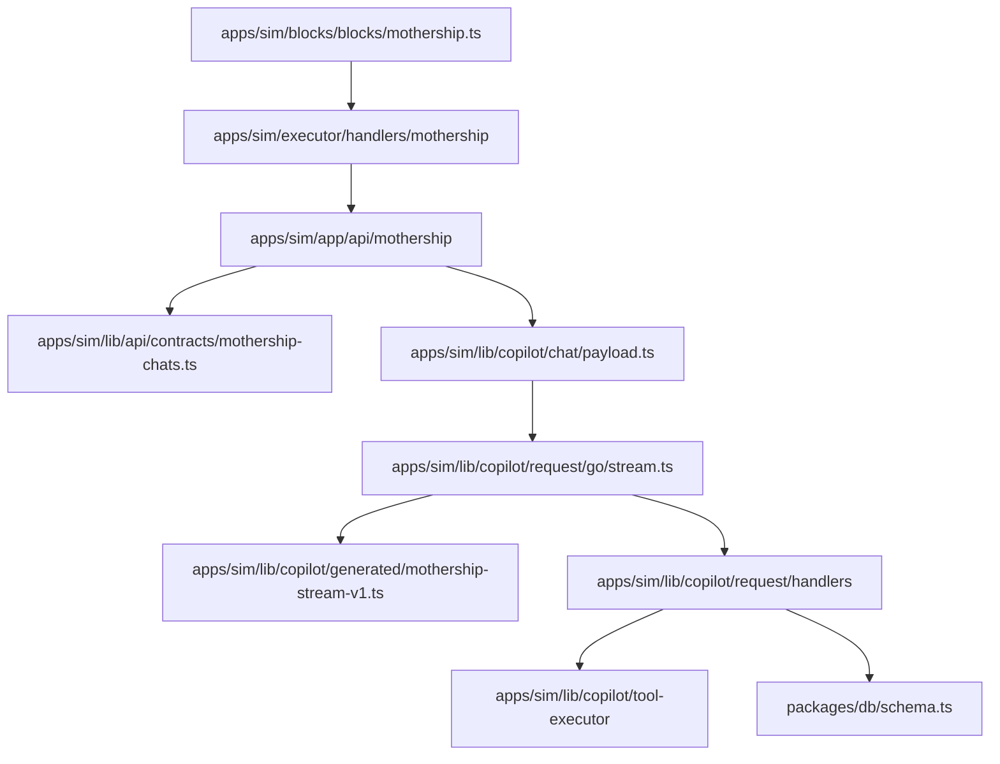

# Sim Mothership Adapter Contract

`nfbs2000/speaky-sim` 코드에서 확인되는 Mothership adapter 흐름을 정리한 문서입니다.

읽는 축은 네 가지입니다.

1. request: route가 어떤 body를 받고 payload를 어떻게 조립하는가
2. stream: event가 어떤 형태로 들어오고 어떻게 dispatch되는가
3. tool: tool call이 Sim 쪽 executor와 어떻게 연결되는가
4. projection: stream 결과가 DB, UI, workflow output, usage 관점으로 어떻게 남는가

## Overview


## Read This As Code Map

이 문서는 설명보다 경로를 먼저 봅니다.



## Pages

- [1. Adapter Identity](/mothership-contract/01-adapter-identity)
- [2. Request Payload](/mothership-contract/02-request-payload)
- [3. Stream v1](/mothership-contract/03-stream-v1)
- [4. Tool Execution Bridge](/mothership-contract/04-tool-execution-bridge)
- [5. Persistence Projection](/mothership-contract/05-persistence-projection)
- [6. Role / Permission Projection](/mothership-contract/06-role-projection)
- [7. Completion Gaps](/mothership-contract/07-completion-gaps)
- [8. Audit / Observability](/mothership-contract/08-audit-observability)
- [9. Compatibility Matrix](/mothership-contract/09-compatibility-matrix)

## Snapshot

```text
nfbs2000/speaky-sim @ db47da58d
```
