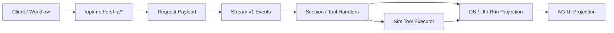
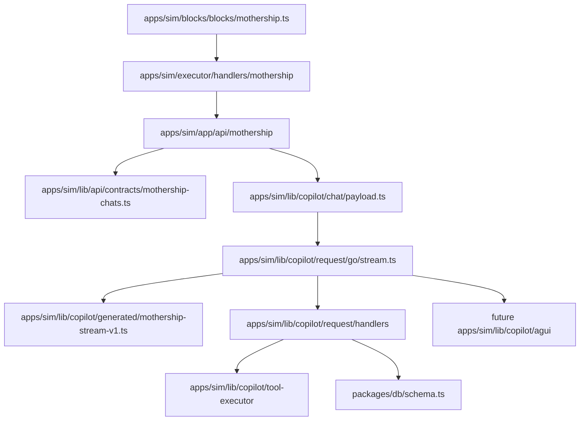

# Sim Mothership Adapter 계약

`nfbs2000/speaky-sim` 코드에서 확인되는 Mothership adapter 흐름을 정리한 문서입니다.

읽는 축은 다섯 가지입니다.

1. request: route가 어떤 body를 받고 payload를 어떻게 조립하는가
2. stream: event가 어떤 형태로 들어오고 어떻게 dispatch되는가
3. tool: tool call이 Sim 쪽 executor와 어떻게 연결되는가
4. projection: stream 결과가 DB, UI, workflow output, usage 관점으로 어떻게 남는가
5. AG-UI: Mothership stream을 표준 UI protocol로 어떻게 투영할 수 있는가

## 개요



## 코드 지도처럼 읽기

이 문서는 설명보다 경로를 먼저 봅니다.



## 페이지

- [1. Adapter 정체성](/mothership-contract/01-adapter-identity)
- [2. Request Payload](/mothership-contract/02-request-payload)
- [3. Stream v1](/mothership-contract/03-stream-v1)
- [4. Tool Execution Bridge](/mothership-contract/04-tool-execution-bridge)
- [5. Persistence Projection](/mothership-contract/05-persistence-projection)
- [6. Role / Permission Projection](/mothership-contract/06-role-projection)
- [7. Completion Gap](/mothership-contract/07-completion-gaps)
- [8. Audit / Observability](/mothership-contract/08-audit-observability)
- [9. Compatibility Matrix](/mothership-contract/09-compatibility-matrix)
- [10. AG-UI 포지셔닝](/mothership-contract/10-agui-positioning)
- [11. AG-UI 이벤트 매핑](/mothership-contract/11-agui-event-map)
- [12. Tool Result 소유권](/mothership-contract/12-tool-result-ownership)
- [13. AG-UI 구현 계획](/mothership-contract/13-agui-implementation-plan)

## AG-UI Projection 읽는 법

AG-UI 관련 장은 “CopilotKit을 붙인다”보다 한 단계 아래의 runtime 경계를 다룹니다.

| 장 | 핵심 질문 |
| --- | --- |
| [10. AG-UI 포지셔닝](/mothership-contract/10-agui-positioning) | AG-UI가 runtime인가, projection인가 |
| [11. AG-UI 이벤트 매핑](/mothership-contract/11-agui-event-map) | `MothershipStreamV1` event를 어떤 AG-UI event로 바꿀 것인가 |
| [12. Tool Result 소유권](/mothership-contract/12-tool-result-ownership) | tool result를 UI가 먹지 않고 Mothership loop로 돌려보내려면 무엇을 지켜야 하는가 |
| [13. AG-UI 구현 계획](/mothership-contract/13-agui-implementation-plan) | read-only projection부터 run endpoint까지 어떤 순서로 구현할 것인가 |

핵심 원칙은 단순합니다. AG-UI는 Mothership을 대체하지 않습니다. `MothershipStreamV1`을 표준 UI protocol로 투영하고, tool result와 checkpoint resume의 소유권은 Mothership runtime에 남깁니다.

## Snapshot

```text
nfbs2000/speaky-sim @ db47da58d
```
