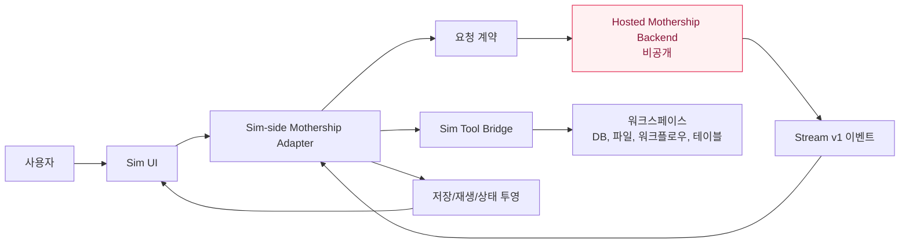
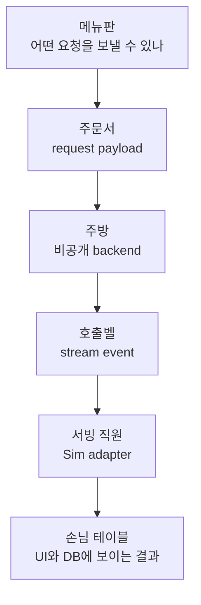

# Sim Mothership Adapter Contract

`nfbs2000/speaky-sim` fork에서 공개 소스로 확인 가능한 Mothership adapter 계약을 정리한 문서입니다.

이 문서는 Mothership의 숨겨진 hosted backend 내부를 설명하지 않습니다. 대신 공개된 Sim-side 코드가 보여주는 요청 형식, stream event, tool 실행 연결, 저장과 재생, workflow block의 입출력 경계를 설명합니다.

<div class="contract-callout">
  <strong>핵심 관점:</strong> 본체는 감춰져 있어도, 본체와 Sim이 주고받는 계약은 공개 adapter 코드에 남습니다. 계약은 내부 생각을 보여주지는 않지만, 무엇을 받을 수 있고, 무엇을 내보내며, 어떤 상태를 보장하는지는 보여줍니다.
</div>

## 한 장으로 보는 구조



## 일반인을 위한 비유

Mothership을 식당 주방이라고 보면, hosted backend는 주방 안쪽입니다. 주방 안에서 어떤 순서로 요리하는지는 보이지 않습니다. 하지만 주문서, 호출벨, 영수증, 서빙 규칙은 밖에서도 볼 수 있습니다.

이 문서에서 말하는 contract는 그 주문서와 서빙 규칙입니다.



## 문서 구성

- [전체 개요](/mothership-contract/)
- [공개 범위와 경계](/mothership-contract/01-scope-and-boundary)
- [코드 지도](/mothership-contract/02-source-map)
- [요청 계약](/mothership-contract/03-request-contract)
- [Stream v1 계약](/mothership-contract/04-stream-v1-contract)
- [Tool Bridge](/mothership-contract/05-tool-execution-bridge)
- [저장과 재생](/mothership-contract/06-persistence-and-replay)
- [Workflow Block 계약](/mothership-contract/07-workflow-block-contract)
- [테스트 매트릭스](/mothership-contract/08-test-matrix)

## 공개 고지

This is an independent technical analysis of public source code in a fork of `simstudioai/sim`. It is not an official SimStudio document and does not describe private hosted backend internals.

분석 기준 snapshot:

```text
nfbs2000/speaky-sim @ db47da58d
```
