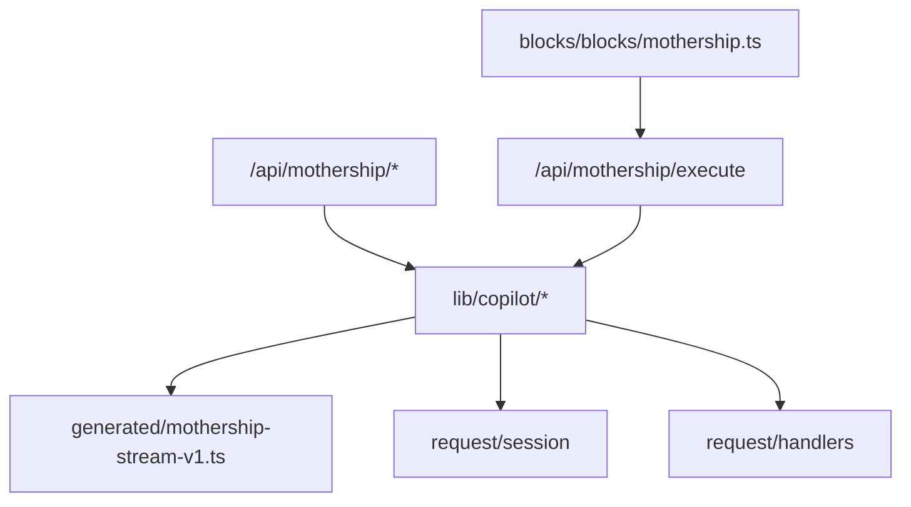
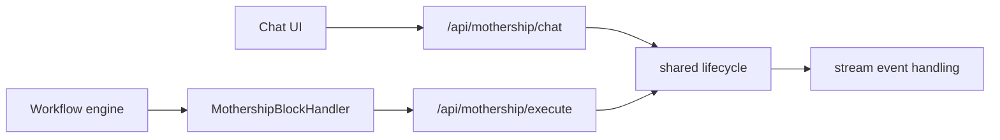
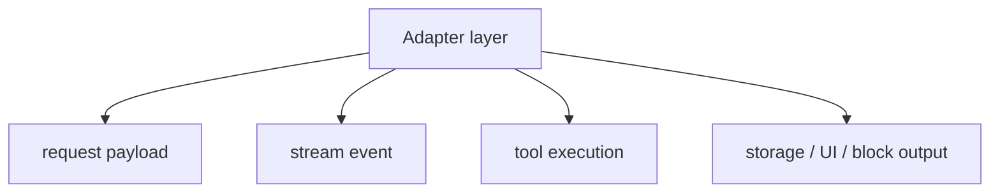

# 1. Adapter Identity

이 repo에서 읽히는 Mothership 관련 코드는 Sim app 안의 adapter 계층입니다. 핵심은 `/api/mothership/*` route가 `lib/copilot/*`의 공통 lifecycle과 generated stream type을 재사용한다는 점입니다.

## Code Identity

## Naming In Code

| Name in code | Where it appears | What it does |
| --- | --- | --- |
| `mothership` | route path, block type, generated stream types | feature-facing identifier |
| `copilot` | shared lifecycle, DB tables, request handlers | reused runtime path |
| `Sim` | block display name | UI label for workflow block |

[`MothershipBlock`](https://github.com/nfbs2000/speaky-sim/blob/db47da58d/apps/sim/blocks/blocks/mothership.ts)는 `type: 'mothership'`이지만 `name: 'Sim'`으로 표시됩니다. 이 block은 prompt, conversation id, files를 입력으로 받고 content, model, conversationId, tokens, toolCalls, cost를 출력합니다.

## Two Entrances

## Route Surface

| Route area | Role |
| --- | --- |
| `/api/mothership/chat` | interactive chat ingress |
| `/api/mothership/chat/stream` | stream read path |
| `/api/mothership/chat/abort` | active stream abort |
| `/api/mothership/chat/stop` | stop request |
| `/api/mothership/chat/resources` | chat resource list changes |
| `/api/mothership/chats` | chat list/create |
| `/api/mothership/chats/[chatId]` | chat detail/update/delete |
| `/api/mothership/chats/[chatId]/fork` | fork chat up to message |
| `/api/mothership/chats/read` | read marker |
| `/api/mothership/execute` | workflow block execution |

## Identity Summary

이 페이지에서 말하는 adapter identity는 “어떤 이름을 붙였나”가 아니라 “어떤 코드 묶음이 같은 실행 흐름을 만든다”입니다.
