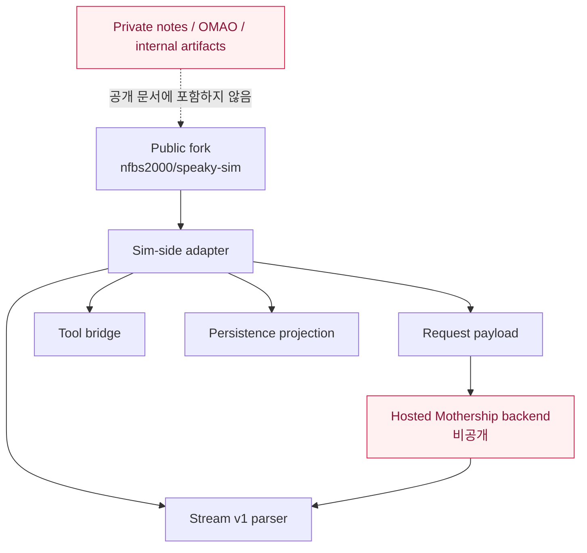
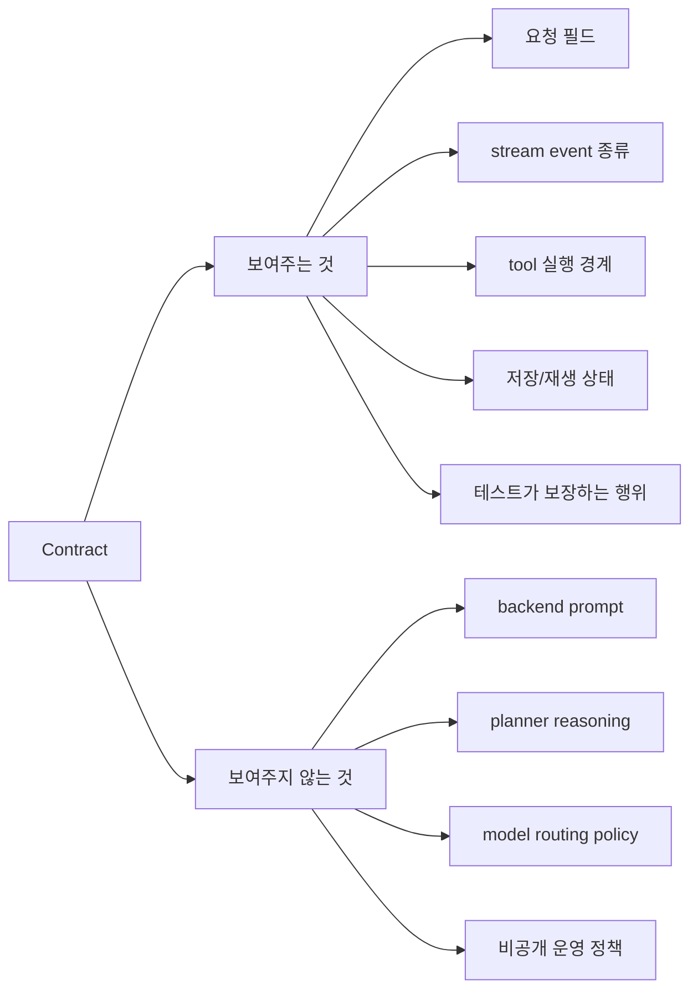

# 1. 공개 범위와 경계

이 문서의 가장 중요한 원칙은 단순합니다.

```text
공개 코드로 확인 가능한 것만 공개 문서에 쓴다.
비공개 backend 내부는 추정해서 단정하지 않는다.
```

## 좋은 설명과 위험한 설명

| 구분 | 좋은 표현 | 위험한 표현 |
| --- | --- | --- |
| 범위 | 공개 Sim-side adapter contract 분석 | 진짜 Mothership 본체 분석 |
| backend | hosted backend 내부는 범위 밖 | 숨겨진 backend는 이렇게 동작한다 |
| prompt | system prompt는 공개 소스에 없다 | 내부 프롬프트는 이렇다 |
| 목적 | interoperability와 adapter contract 이해 | 본체 복제 |
| 증거 | public source file과 test로 확인 | private Notion, private repo, proof artifact |

## Public / Private Boundary



## 공개해도 되는 것

- 공개 repo의 파일 경로와 GitHub 링크
- 공개 코드에서 확인되는 request/response shape
- generated schema와 generated TypeScript 타입
- route, parser, handler, test가 보여주는 동작
- Mermaid 다이어그램으로 표현한 공개 adapter 흐름
- "이 commit에서는 이렇게 관찰된다"는 제한된 분석

## 공개하지 말아야 할 것

- private repo 구현
- 내부 Notion 원문
- 실제 token, endpoint, productId, workspaceId, email
- proof artifact 경로
- hosted backend system prompt 추정
- planner 내부 알고리즘 단정
- SimStudio 공식 문서처럼 보이는 표현

## Contract가 보여주는 것과 보여주지 않는 것



## 이 사이트의 고지 문구

모든 공개 페이지에는 다음 관점을 유지합니다.

```text
This is an independent technical analysis of public source code in a fork of simstudioai/sim.
It is not an official SimStudio document and does not describe private hosted backend internals.
```

한국어로 풀면 다음과 같습니다.

```text
이 문서는 simstudioai/sim fork의 공개 소스 코드를 바탕으로 한 독립 기술 분석입니다.
SimStudio 공식 문서가 아니며, 비공개 hosted backend 내부를 설명하지 않습니다.
```
