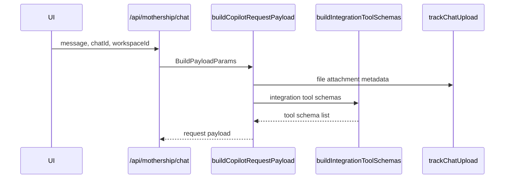
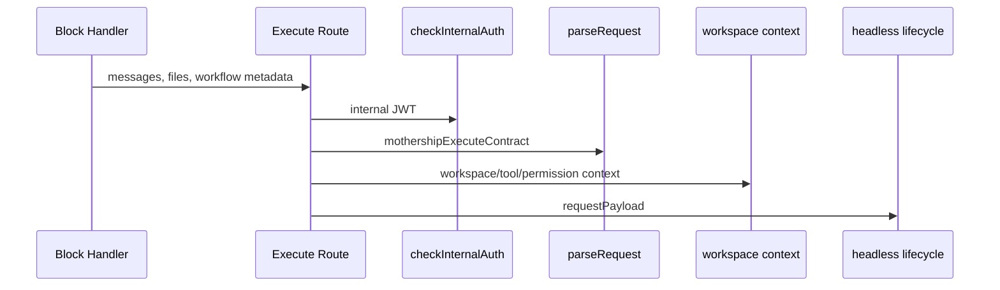
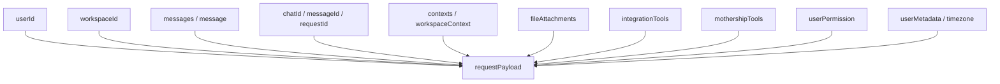
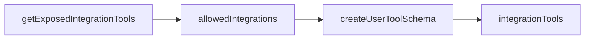

# 2. Request Payload

요청 payload는 사용자의 문장만 담지 않습니다. workspace, user, chat, file, context, tool schema, permission 정보가 함께 들어갑니다.

## Chat Path

[`buildCopilotRequestPayload`](https://github.com/nfbs2000/speaky-sim/blob/db47da58d/apps/sim/lib/copilot/chat/payload.ts#L247)는 interactive chat path에서 request body를 조립합니다.

## Execute Path

[`/api/mothership/execute`](https://github.com/nfbs2000/speaky-sim/blob/db47da58d/apps/sim/app/api/mothership/execute/route.ts)는 workflow block용 ingress입니다. route는 internal auth를 확인하고 [`mothershipExecuteContract`](https://github.com/nfbs2000/speaky-sim/blob/db47da58d/apps/sim/lib/api/contracts/mothership-chats.ts#L339)로 body를 검증합니다.

## Execute Body

[`mothershipExecuteBodySchema`](https://github.com/nfbs2000/speaky-sim/blob/db47da58d/apps/sim/lib/api/contracts/mothership-chats.ts#L71)는 이 필드를 받습니다.

| Field | Role |
| --- | --- |
| `messages` | system/user/assistant message array |
| `responseFormat` | optional output shape |
| `workspaceId` | workspace scope |
| `userId` | usage and permission actor |
| `chatId` | conversation continuation |
| `messageId` | stream/message id |
| `requestId` | request trace id |
| `fileAttachments` | base64 file payloads |
| `contexts` | scheduled task or mention context |
| `workflowId` | workflow scope |
| `executionId` | workflow execution scope |
| `userMetadata` | name/timezone metadata |

## Payload Fields Built In Code

## Tool Schema Injection

[`buildIntegrationToolSchemas`](https://github.com/nfbs2000/speaky-sim/blob/db47da58d/apps/sim/lib/copilot/chat/payload.ts#L75) reads exposed integration tools and filters them by workspace permission config when available.

## Request Summary

The request payload is a workspace-aware agent invocation. It binds message content to user, workspace, files, available tools, and permission context before the stream lifecycle starts.
