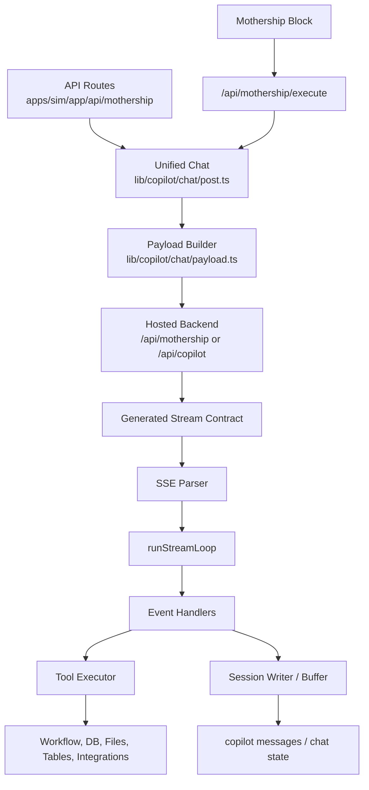
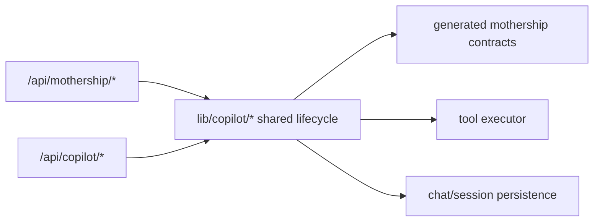
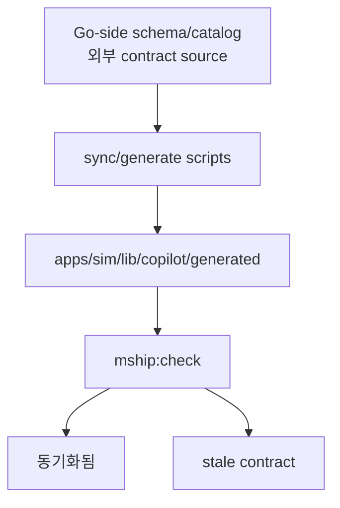

# 2. 코드 지도

Mothership contract는 한 군데에 모여 있지 않습니다. route, payload builder, generated schema, stream parser, tool handler, persistence layer, tests를 함께 읽어야 합니다.

## 전체 지도



## 소스 파일별 역할

| 역할 | 파일 |
| --- | --- |
| stream 타입 생성물 | [`apps/sim/lib/copilot/generated/mothership-stream-v1.ts`](https://github.com/nfbs2000/speaky-sim/blob/db47da58d/apps/sim/lib/copilot/generated/mothership-stream-v1.ts) |
| runtime stream schema | [`apps/sim/lib/copilot/generated/mothership-stream-v1-schema.ts`](https://github.com/nfbs2000/speaky-sim/blob/db47da58d/apps/sim/lib/copilot/generated/mothership-stream-v1-schema.ts) |
| contract generator | [`scripts/sync-mothership-stream-contract.ts`](https://github.com/nfbs2000/speaky-sim/blob/db47da58d/scripts/sync-mothership-stream-contract.ts) |
| 전체 Mothership generator/check | [`scripts/generate-mship-contracts.ts`](https://github.com/nfbs2000/speaky-sim/blob/db47da58d/scripts/generate-mship-contracts.ts) |
| route boundary contract | [`apps/sim/lib/api/contracts/mothership-chats.ts`](https://github.com/nfbs2000/speaky-sim/blob/db47da58d/apps/sim/lib/api/contracts/mothership-chats.ts) |
| interactive route shim | [`apps/sim/app/api/mothership/chat/route.ts`](https://github.com/nfbs2000/speaky-sim/blob/db47da58d/apps/sim/app/api/mothership/chat/route.ts) |
| stream route shim | [`apps/sim/app/api/mothership/chat/stream/route.ts`](https://github.com/nfbs2000/speaky-sim/blob/db47da58d/apps/sim/app/api/mothership/chat/stream/route.ts) |
| headless execute route | [`apps/sim/app/api/mothership/execute/route.ts`](https://github.com/nfbs2000/speaky-sim/blob/db47da58d/apps/sim/app/api/mothership/execute/route.ts) |
| unified chat lifecycle | [`apps/sim/lib/copilot/chat/post.ts`](https://github.com/nfbs2000/speaky-sim/blob/db47da58d/apps/sim/lib/copilot/chat/post.ts) |
| request payload builder | [`apps/sim/lib/copilot/chat/payload.ts`](https://github.com/nfbs2000/speaky-sim/blob/db47da58d/apps/sim/lib/copilot/chat/payload.ts) |
| SSE line parser | [`apps/sim/lib/copilot/request/go/parser.ts`](https://github.com/nfbs2000/speaky-sim/blob/db47da58d/apps/sim/lib/copilot/request/go/parser.ts) |
| stream loop | [`apps/sim/lib/copilot/request/go/stream.ts`](https://github.com/nfbs2000/speaky-sim/blob/db47da58d/apps/sim/lib/copilot/request/go/stream.ts) |
| Mothership block config | [`apps/sim/blocks/blocks/mothership.ts`](https://github.com/nfbs2000/speaky-sim/blob/db47da58d/apps/sim/blocks/blocks/mothership.ts) |
| Mothership block handler | [`apps/sim/executor/handlers/mothership/mothership-handler.ts`](https://github.com/nfbs2000/speaky-sim/blob/db47da58d/apps/sim/executor/handlers/mothership/mothership-handler.ts) |

## 이름이 Copilot인 파일도 Mothership contract에 포함되는 이유

현재 code path에는 과거 Copilot 이름과 새로운 Mothership 이름이 함께 남아 있습니다. `/api/mothership/*` route가 `/api/copilot/*`의 일부 lifecycle을 재사용하고, generated contract도 `lib/copilot/generated` 아래에 있습니다.



## Drift Guard 위치

`package.json`에는 Mothership contract drift를 확인하는 스크립트가 있습니다.

```text
bun run mship-contracts:check
bun run mship-tools:check
bun run mship:check
```


