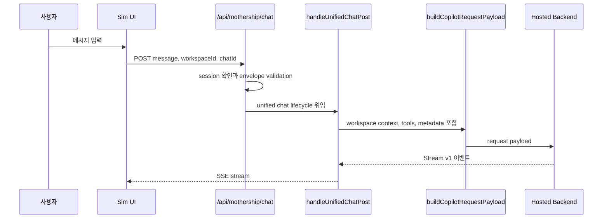
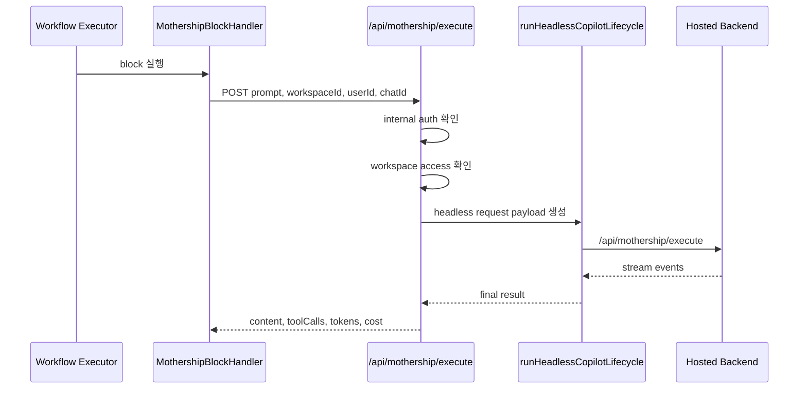
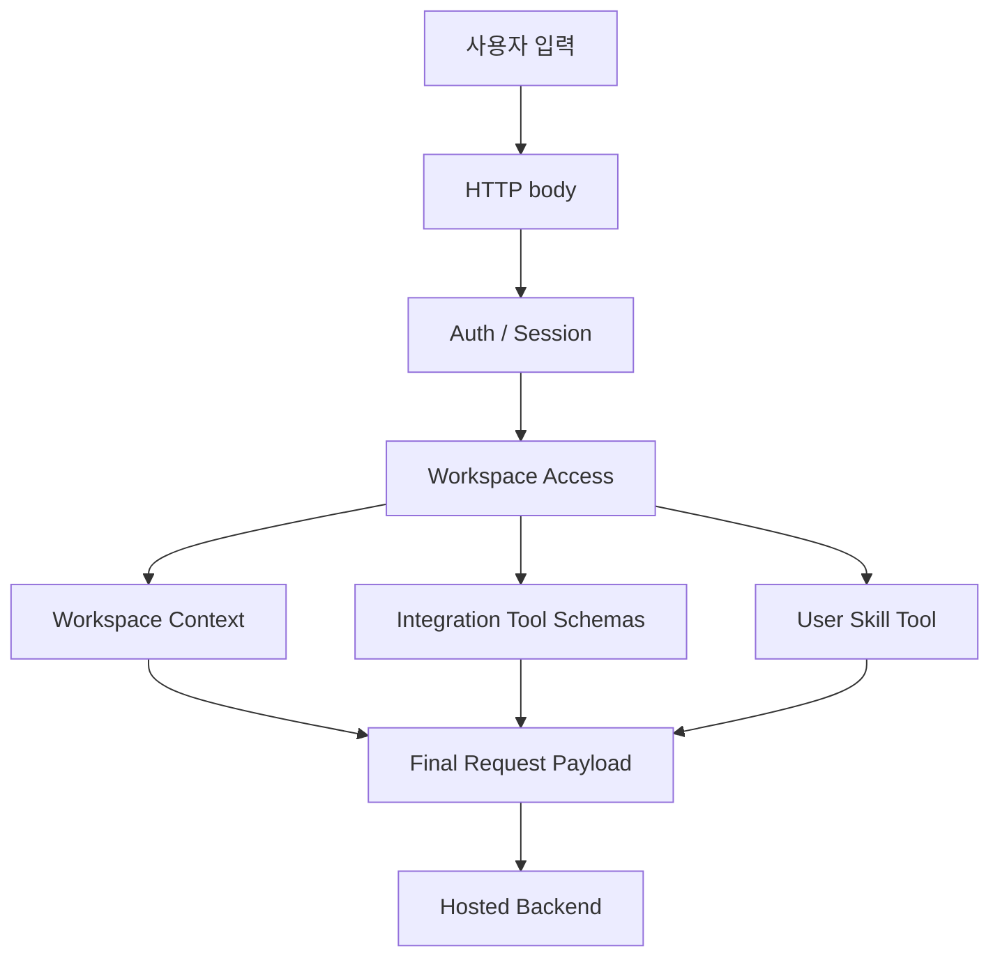
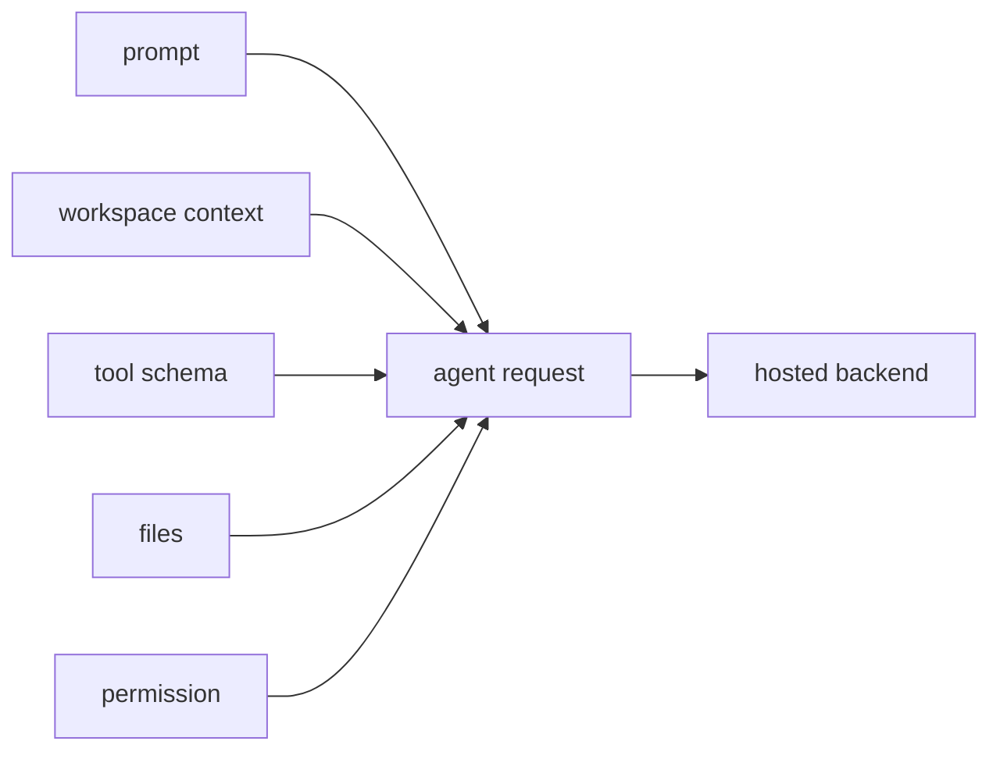

# 3. 요청 계약

요청 계약은 "사용자가 무엇을 말했는가"만 담지 않습니다. workspace, chat, user, file, context, permission, tool schema까지 함께 묶습니다.

## 두 가지 큰 입구

| 입구 | 용도 | 코드 |
| --- | --- | --- |
| Interactive chat | 브라우저 Mothership 대화 | [`/api/mothership/chat/route.ts`](https://github.com/nfbs2000/speaky-sim/blob/db47da58d/apps/sim/app/api/mothership/chat/route.ts) |
| Headless execute | workflow 안의 Mothership block 실행 | [`/api/mothership/execute/route.ts`](https://github.com/nfbs2000/speaky-sim/blob/db47da58d/apps/sim/app/api/mothership/execute/route.ts) |

## Interactive Chat 흐름

관련 코드:

- [`apps/sim/app/api/mothership/chat/route.ts`](https://github.com/nfbs2000/speaky-sim/blob/db47da58d/apps/sim/app/api/mothership/chat/route.ts)
- [`apps/sim/lib/copilot/chat/post.ts`](https://github.com/nfbs2000/speaky-sim/blob/db47da58d/apps/sim/lib/copilot/chat/post.ts)
- [`apps/sim/lib/copilot/chat/payload.ts`](https://github.com/nfbs2000/speaky-sim/blob/db47da58d/apps/sim/lib/copilot/chat/payload.ts)

## Headless Execute 흐름

Workflow 안에서 Mothership block을 실행하면 브라우저가 아니라 executor가 내부 인증으로 `/api/mothership/execute`를 호출합니다.

관련 코드:

- [`apps/sim/executor/handlers/mothership/mothership-handler.ts`](https://github.com/nfbs2000/speaky-sim/blob/db47da58d/apps/sim/executor/handlers/mothership/mothership-handler.ts)
- [`apps/sim/app/api/mothership/execute/route.ts`](https://github.com/nfbs2000/speaky-sim/blob/db47da58d/apps/sim/app/api/mothership/execute/route.ts)

## 요청 payload에 들어가는 대표 정보

| 정보 | 왜 필요한가 |
| --- | --- |
| `message` 또는 `messages` | 사용자의 실제 요청 |
| `workspaceId` | 어떤 workspace 권한과 데이터를 쓸지 결정 |
| `userId` | 비용, 권한, tool 실행 주체 |
| `chatId` | 대화 이어가기와 저장 위치 |
| `messageId` | stream id, replay, 중복 방지 |
| `workspaceContext` | workflow, table, file 등 workspace snapshot |
| `contexts` | 사용자가 명시적으로 붙인 resource context |
| `fileAttachments` | 업로드 파일, base64/file metadata |
| `integrationTools` | 실행 가능한 Sim tool schema |
| `mothershipTools` | workspace user skill tool |
| `userPermission` | adapter가 backend에 넘기는 권한 projection |

## 요청 계약 다이어그램

## 중요한 해석

Mothership request는 단순한 LLM prompt가 아닙니다. workspace-aware agent request입니다. 즉 backend는 사용자의 문장뿐 아니라, Sim adapter가 정리해 준 workspace 상태와 사용 가능한 tool 목록을 함께 받습니다.

