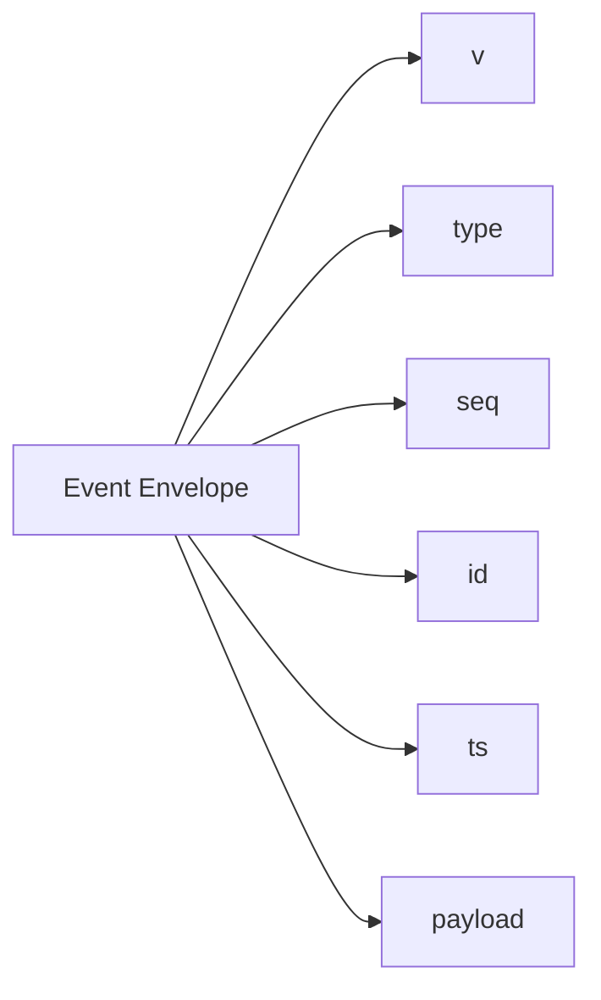
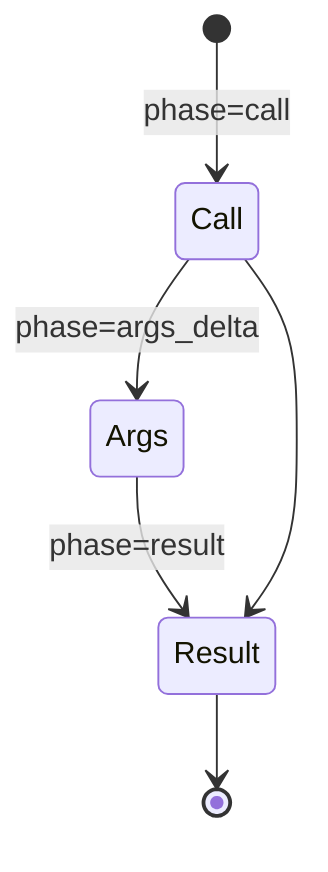
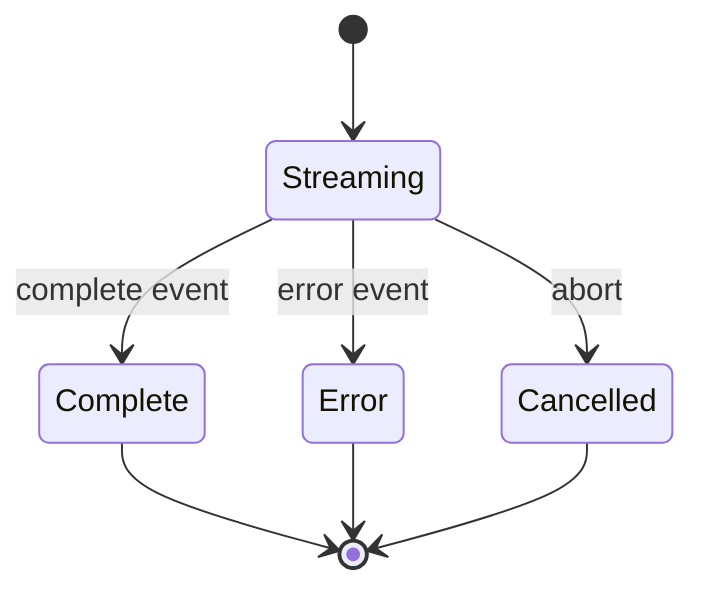

# 3. Stream v1

Generated stream types define the event vocabulary used by the adapter. The core files are [`mothership-stream-v1.ts`](https://github.com/nfbs2000/speaky-sim/blob/db47da58d/apps/sim/lib/copilot/generated/mothership-stream-v1.ts) and [`mothership-stream-v1-schema.ts`](https://github.com/nfbs2000/speaky-sim/blob/db47da58d/apps/sim/lib/copilot/generated/mothership-stream-v1-schema.ts).

## Envelope



## Event Types

[`MothershipStreamV1EventType`](https://github.com/nfbs2000/speaky-sim/blob/db47da58d/apps/sim/lib/copilot/generated/mothership-stream-v1.ts#L441) contains:

| Type | Meaning in adapter |
| --- | --- |
| `session` | trace/chat/title/start metadata |
| `text` | assistant or thinking text |
| `tool` | tool call, args delta, result |
| `span` | subagent or structured result span |
| `resource` | resource upsert/remove |
| `run` | run status, usage, output |
| `error` | error event |
| `complete` | terminal event |

## Read Loop

[`processSSEStream`](https://github.com/nfbs2000/speaky-sim/blob/db47da58d/apps/sim/lib/copilot/request/go/parser.ts) reads SSE lines. [`runStreamLoop`](https://github.com/nfbs2000/speaky-sim/blob/db47da58d/apps/sim/lib/copilot/request/go/stream.ts) fetches, parses, normalizes, routes, and dispatches events.

```mermaid
sequenceDiagram
  participant Fetch as fetchGo
  participant Parser as processSSEStream
  participant Loop as runStreamLoop
  participant Handler as handlers
  participant Projection as projection

  Fetch-->>Parser: SSE data lines
  Parser-->>Loop: JSON event
  Loop->>Loop: normalize and dedupe
  Loop->>Handler: dispatch event
  Handler->>Projection: UI and DB changes
```

## Tool Event Shape



| Field | Values / Role |
| --- | --- |
| `executor` | `go`, `sim`, `client` |
| `mode` | `sync`, `async` |
| `phase` | `call`, `args_delta`, `result` |
| `status` | pending/running/completed/failed/cancelled |
| `outcome` | result classification |

## Terminal Flow



## Parser Tests

[`request/session/contract.test.ts`](https://github.com/nfbs2000/speaky-sim/blob/db47da58d/apps/sim/lib/copilot/request/session/contract.test.ts) accepts known event shapes and rejects invalid JSON, unknown event types, non-object values, and malformed tool events.
