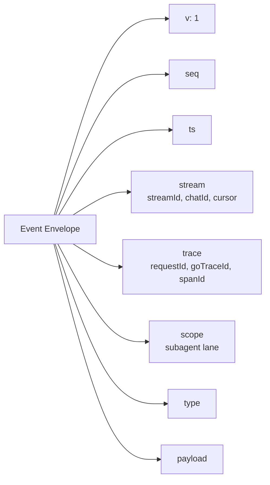
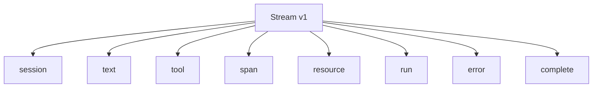
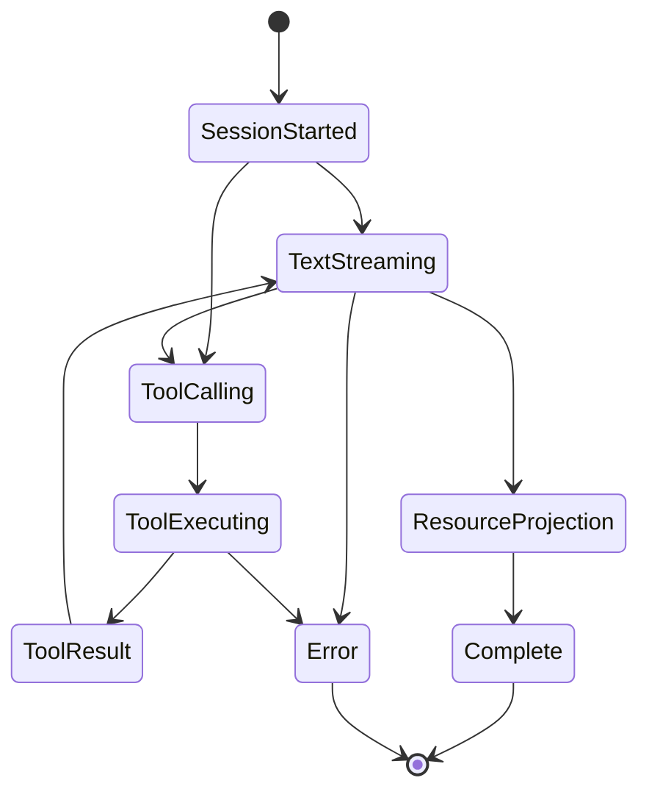
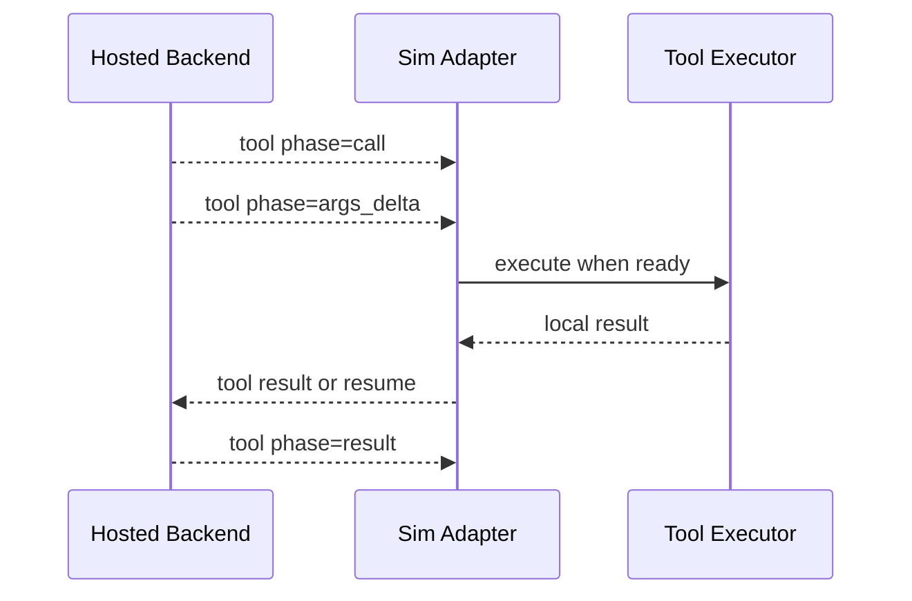
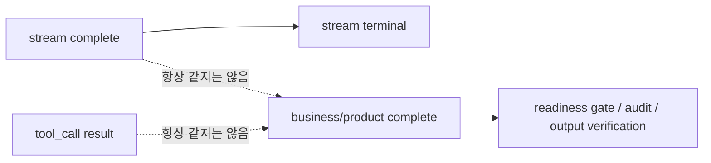
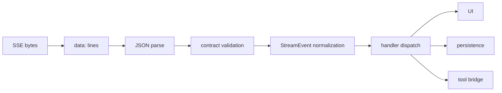

# 4. Stream v1 계약

Stream v1은 hosted backend가 Sim adapter에게 "지금 무슨 일이 일어나고 있는지"를 알려주는 이벤트 언어입니다.

주요 근거:

- [`mothership-stream-v1.ts`](https://github.com/nfbs2000/speaky-sim/blob/db47da58d/apps/sim/lib/copilot/generated/mothership-stream-v1.ts)
- [`mothership-stream-v1-schema.ts`](https://github.com/nfbs2000/speaky-sim/blob/db47da58d/apps/sim/lib/copilot/generated/mothership-stream-v1-schema.ts)
- [`request/go/parser.ts`](https://github.com/nfbs2000/speaky-sim/blob/db47da58d/apps/sim/lib/copilot/request/go/parser.ts)
- [`request/go/stream.ts`](https://github.com/nfbs2000/speaky-sim/blob/db47da58d/apps/sim/lib/copilot/request/go/stream.ts)

## Event Envelope

모든 contract event는 공통 envelope를 가집니다.

## Event Type

generated contract에서 확인되는 top-level event type입니다.

| type | 일반적인 의미 |
| --- | --- |
| `session` | chat/session/title/trace 같은 세션 메타데이터 |
| `text` | assistant 또는 thinking text |
| `tool` | tool call, args delta, result |
| `span` | subagent와 structured result span |
| `resource` | workspace resource 생성/갱신/삭제 projection |
| `run` | checkpoint, resume, compaction 같은 run 상태 |
| `error` | 오류 이벤트 |
| `complete` | stream terminal event |

## Stream Lifecycle

## Tool Event Phase

tool event는 하나의 덩어리가 아니라 단계별로 옵니다.

Contract에서 확인되는 tool 축:

| 축 | 값 |
| --- | --- |
| executor | `go`, `sim`, `client` |
| mode | `sync`, `async` |
| phase | `call`, `args_delta`, `result` |
| status | `generating`, `executing`, `success`, `error`, `cancelled`, `skipped`, `rejected` |

## Complete는 business complete가 아니다

`complete` event는 stream이 terminal 상태에 도달했다는 뜻입니다. 하지만 이것이 제품 관점의 모든 작업 완료를 항상 의미하지는 않습니다.

이 구분이 중요합니다. 예를 들어 tool result가 왔다고 해서 사용자가 원하는 보고서, 파일, workflow, billing artifact가 모두 준비됐다고 단정하면 안 됩니다.

## Parser의 의미

[`processSSEStream`](https://github.com/nfbs2000/speaky-sim/blob/db47da58d/apps/sim/lib/copilot/request/go/parser.ts)는 `data: ...` SSE line을 읽고 JSON으로 파싱합니다. [`runStreamLoop`](https://github.com/nfbs2000/speaky-sim/blob/db47da58d/apps/sim/lib/copilot/request/go/stream.ts)는 이 raw event를 contract event로 검증하고 handler로 넘깁니다.

