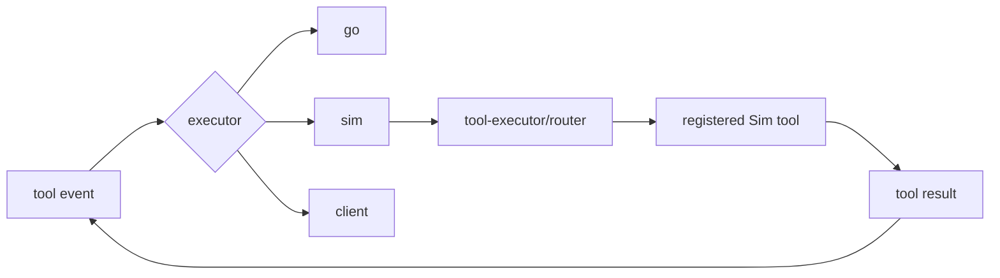
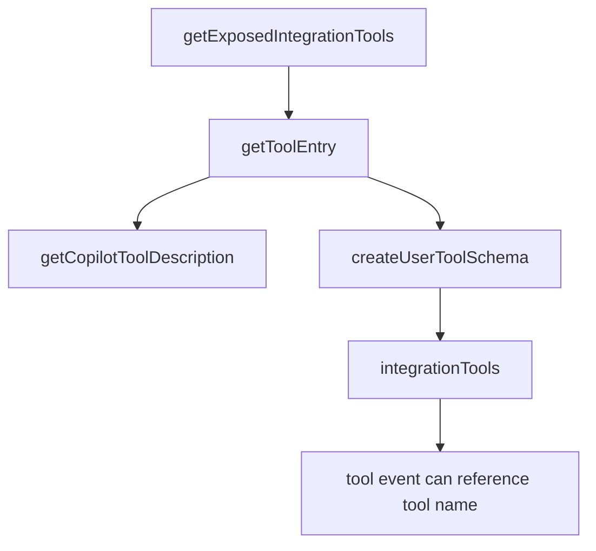
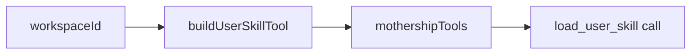

# 4. Tool Execution Bridge

Tool execution is the bridge between stream events and Sim-side capabilities. The stream event says what tool is requested; Sim code decides how to execute it in the current workspace context.

## Bridge Diagram



## Tool Schema Source

Tool schemas are built before the request starts.



Relevant code:

- [`buildIntegrationToolSchemas`](https://github.com/nfbs2000/speaky-sim/blob/db47da58d/apps/sim/lib/copilot/chat/payload.ts#L75)
- [`getExposedIntegrationTools`](https://github.com/nfbs2000/speaky-sim/blob/db47da58d/apps/sim/lib/copilot/integration-tools.ts)
- [`tool-executor/router`](https://github.com/nfbs2000/speaky-sim/tree/db47da58d/apps/sim/lib/copilot/tool-executor)

## Schema Fields

| Field | Role |
| --- | --- |
| `name` | tool id |
| `description` | tool description sent with payload |
| `input_schema` | accepted arguments |
| `defer_loading` | lazily load details |
| `executeLocally` | client-capable execution |
| `service` | owning integration |
| `oauth` | connection requirement |

## Workspace Skill Tool

[`buildUserSkillTool`](https://github.com/nfbs2000/speaky-sim/blob/db47da58d/apps/sim/lib/mothership/skills.ts) can add a `mothershipTools` entry for workspace user skills.



## Execution Lifecycle

```mermaid
sequenceDiagram
  participant Loop as Stream Loop
  participant Handler as Tool Handler
  participant Router as Tool Router
  participant Tool as Sim Tool
  participant Store as Run State

  Loop->>Handler: tool call event
  Handler->>Router: tool name and args
  Router->>Tool: execute
  Tool-->>Router: result or error
  Router-->>Handler: normalized tool result
  Handler->>Store: tool metadata projection
```

## What Tests Cover

[`mothership-handler.test.ts`](https://github.com/nfbs2000/speaky-sim/blob/db47da58d/apps/sim/executor/handlers/mothership/mothership-handler.test.ts) checks failed tool call metadata, streaming errors, chunk forwarding, file attachment payloads, and cancellation propagation.
