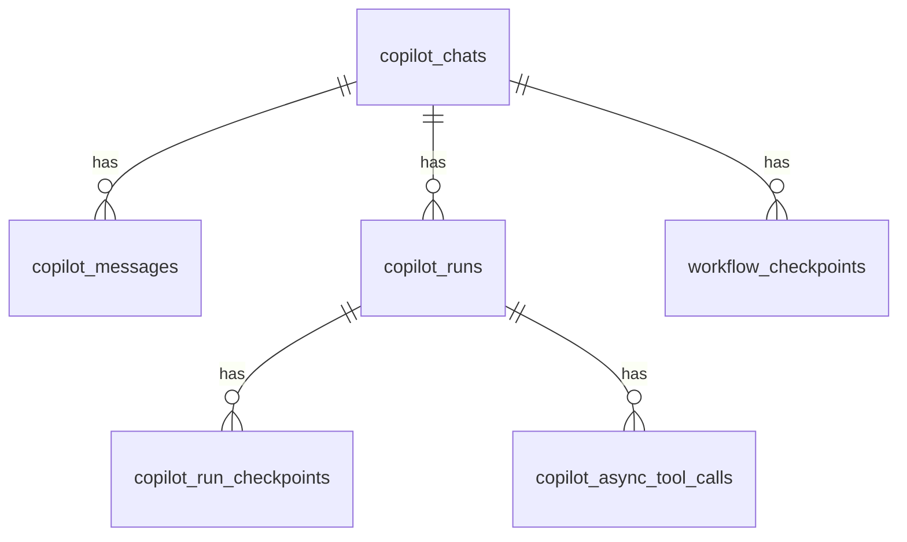
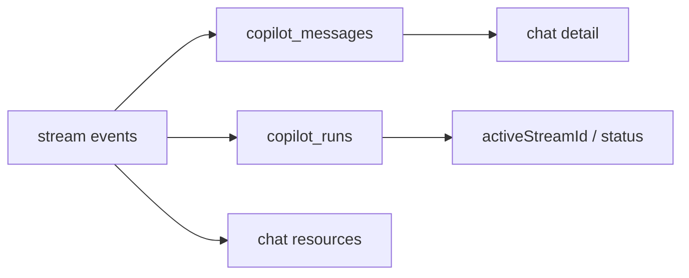
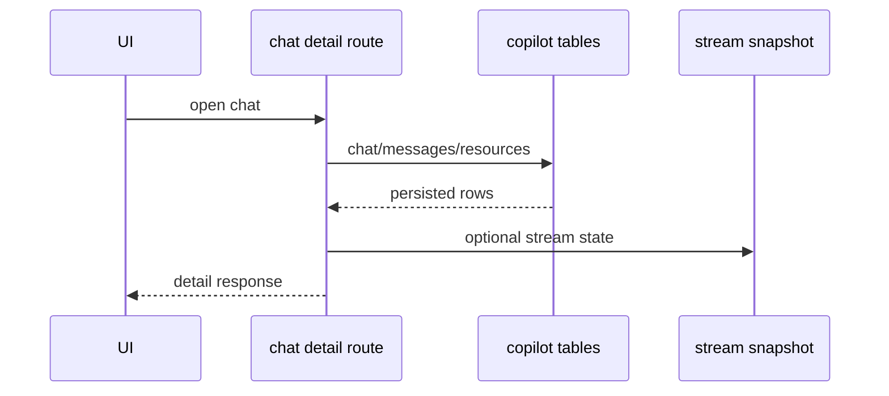
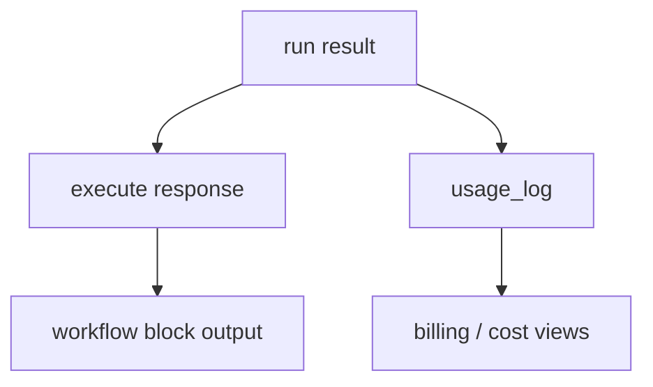

# 5. Persistence Projection

Projection means converting stream/runtime state into stored data and client-readable state. In this repo, Mothership uses existing `copilot_*` tables with `chat_type = 'mothership'`.

## DB Tables

Relevant schema lives in [`packages/db/schema.ts`](https://github.com/nfbs2000/speaky-sim/blob/db47da58d/packages/db/schema.ts).

## Table Roles

| Table | Role |
| --- | --- |
| `copilot_chats` | chat container, `type`, title, workspace, resources, read state |
| `copilot_messages` | message content, role, stream id, token counts |
| `copilot_runs` | execution/run lifecycle, status, provider/model, request context |
| `copilot_run_checkpoints` | pause/resume state for pending tool calls |
| `copilot_async_tool_calls` | async tool status, args, result, error |
| `workflow_checkpoints` | workflow state snapshots tied to chat/message |
| `usage_log` | cost ledger source including `mothership_block` |

## Chat Projection

[`mothershipChatSchema`](https://github.com/nfbs2000/speaky-sim/blob/db47da58d/apps/sim/lib/api/contracts/mothership-chats.ts#L217) exposes the chat list shape:

| Field | Role |
| --- | --- |
| `id` | chat id |
| `title` | display title |
| `updatedAt` | ordering and freshness |
| `activeStreamId` | current stream marker |
| `lastSeenAt` | read marker |
| `pinned` | pinned state |

## Replay And Detail View

[`getMothershipChatResponseSchema`](https://github.com/nfbs2000/speaky-sim/blob/db47da58d/apps/sim/lib/api/contracts/mothership-chats.ts#L313) returns messages, active stream id, resources, timestamps, and optional stream snapshot.

## Cost Projection

`usage_log` contains source values including `copilot`, `mcp_copilot`, and `mothership_block`. Workflow block output can also carry `tokens` and `cost` fields through execute response and block handler normalization.

