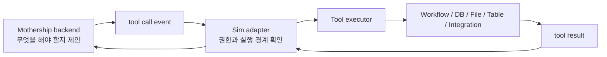
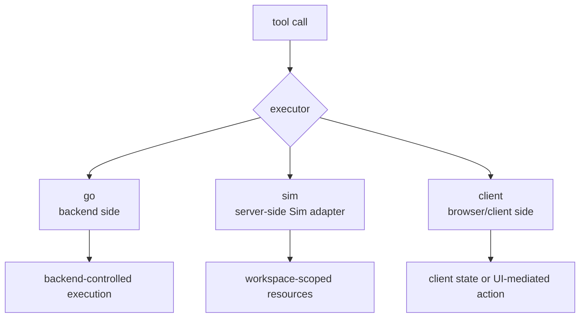
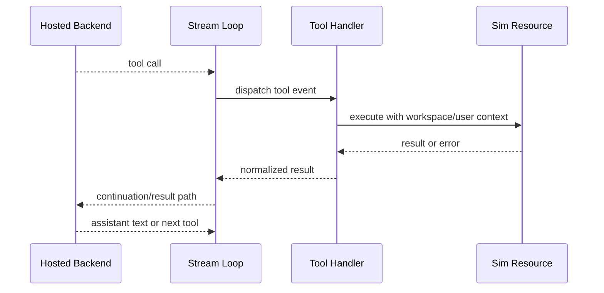
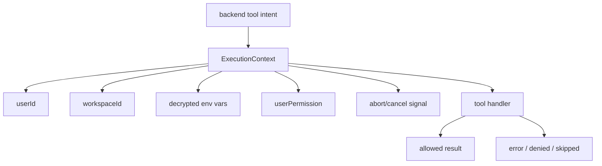

# 5. Tool Execution Bridge

Mothership backend가 모든 일을 혼자 처리하는 구조가 아닙니다. 공개 adapter 코드는 backend가 tool call을 stream으로 내보내고, Sim-side adapter가 일부 tool을 workspace 권한 안에서 실행하는 구조를 보여줍니다.

## 일반인을 위한 설명

Mothership이 "이 파일을 읽어야겠다", "이 workflow를 실행해야겠다", "이 table을 조회해야겠다"고 판단하면, 실제 workspace 접근은 Sim 쪽에서 권한을 확인하고 실행합니다.

## Tool Bridge 핵심 코드

| 역할 | 코드 |
| --- | --- |
| tool executor fallback | [`tool-executor/executor.ts`](https://github.com/nfbs2000/speaky-sim/blob/db47da58d/apps/sim/lib/copilot/tool-executor/executor.ts) |
| request tool execution | [`request/tools/executor.ts`](https://github.com/nfbs2000/speaky-sim/blob/db47da58d/apps/sim/lib/copilot/request/tools/executor.ts) |
| event handlers | [`request/handlers`](https://github.com/nfbs2000/speaky-sim/tree/db47da58d/apps/sim/lib/copilot/request/handlers) |
| tool handlers | [`tools/handlers`](https://github.com/nfbs2000/speaky-sim/tree/db47da58d/apps/sim/lib/copilot/tools/handlers) |
| integration tool schemas | [`chat/payload.ts`](https://github.com/nfbs2000/speaky-sim/blob/db47da58d/apps/sim/lib/copilot/chat/payload.ts) |

## Executor 종류

## Tool Result Loop

## 권한 경계

Tool Bridge의 핵심은 "AI가 말했으니 실행"이 아닙니다. Sim adapter가 user/workspace context를 들고 실행하고, route와 handler가 권한 경계를 갖습니다.

## 중요한 해석

이 구조는 hosted backend 내부를 몰라도 adapter contract를 읽을 수 있게 합니다. backend가 어떤 판단으로 tool을 골랐는지는 비공개입니다. 하지만 공개 code는 다음을 보여줍니다.

- 어떤 tool schema가 backend에 노출되는지
- tool call이 어떤 phase/status로 stream 되는지
- 어떤 executor가 어디에서 실행되는지
- 결과가 UI와 persistence에 어떻게 반영되는지
- abort, duplicate, skipped, hidden tool이 어떻게 처리되는지

관련 테스트:

- [`request/handlers/handlers.test.ts`](https://github.com/nfbs2000/speaky-sim/blob/db47da58d/apps/sim/lib/copilot/request/handlers/handlers.test.ts)
- [`tool-executor/executor.test.ts`](https://github.com/nfbs2000/speaky-sim/blob/db47da58d/apps/sim/lib/copilot/tool-executor/executor.test.ts)
- [`tools/client/run-tool-execution.test.ts`](https://github.com/nfbs2000/speaky-sim/blob/db47da58d/apps/sim/lib/copilot/tools/client/run-tool-execution.test.ts)
