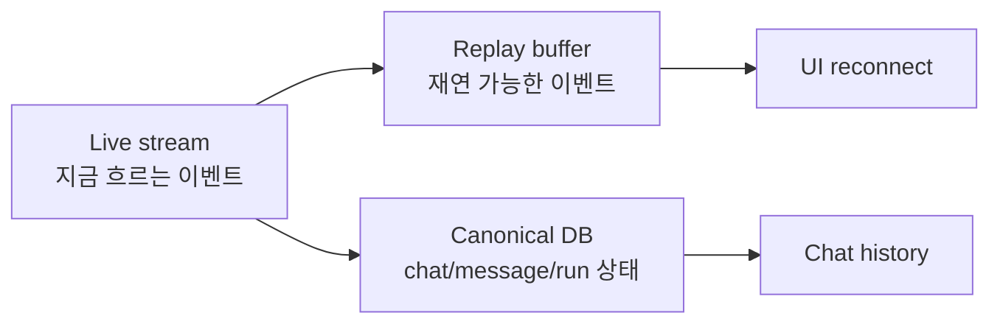
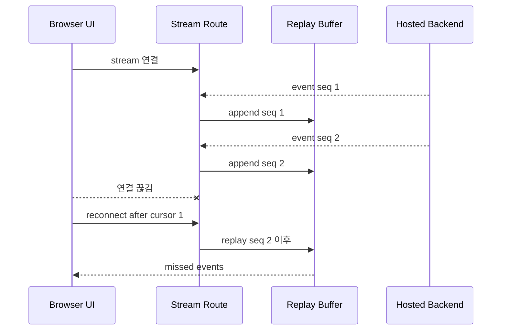
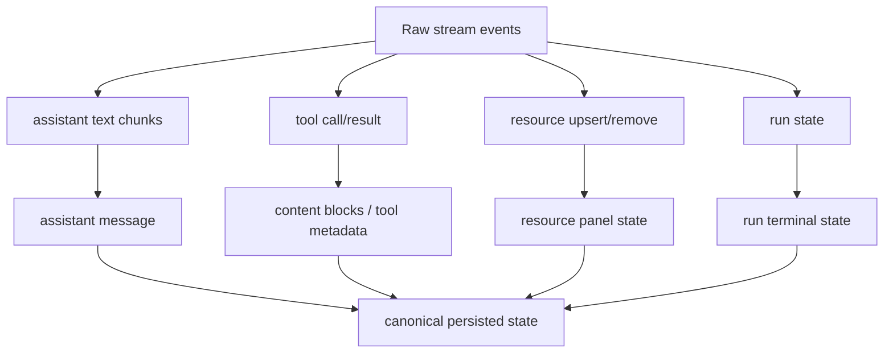
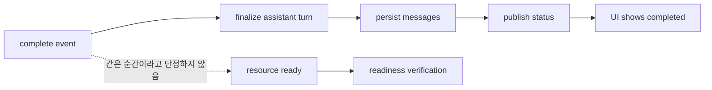
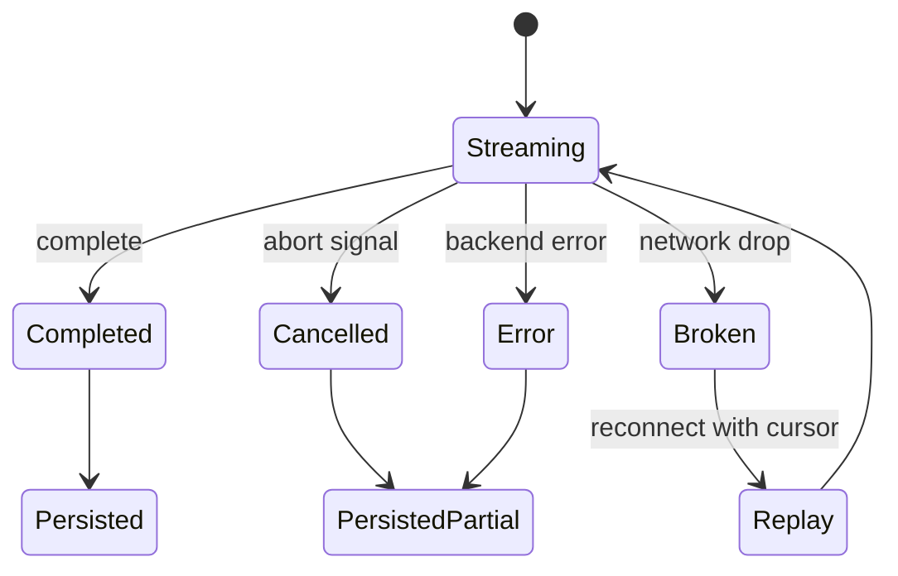

# 6. 저장과 재생

Stream은 지나가는 이벤트입니다. 사용자가 새로고침하거나, 연결이 끊기거나, 나중에 chat history를 열 때는 stream을 다시 볼 수 있어야 합니다. 그래서 adapter는 stream event를 저장 가능한 상태로 투영합니다.

## 세 가지 상태

## 관련 코드

| 역할 | 코드 |
| --- | --- |
| stream session index | [`request/session/index.ts`](https://github.com/nfbs2000/speaky-sim/blob/db47da58d/apps/sim/lib/copilot/request/session/index.ts) |
| writer | [`request/session/writer.ts`](https://github.com/nfbs2000/speaky-sim/blob/db47da58d/apps/sim/lib/copilot/request/session/writer.ts) |
| buffer | [`request/session/buffer.ts`](https://github.com/nfbs2000/speaky-sim/blob/db47da58d/apps/sim/lib/copilot/request/session/buffer.ts) |
| recovery | [`request/session/recovery.ts`](https://github.com/nfbs2000/speaky-sim/blob/db47da58d/apps/sim/lib/copilot/request/session/recovery.ts) |
| messages store | [`chat/messages-store.ts`](https://github.com/nfbs2000/speaky-sim/blob/db47da58d/apps/sim/lib/copilot/chat/messages-store.ts) |
| terminal state | [`chat/terminal-state.ts`](https://github.com/nfbs2000/speaky-sim/blob/db47da58d/apps/sim/lib/copilot/chat/terminal-state.ts) |

## Replay가 필요한 이유

## Canonical DB와 Raw Stream의 차이

Raw stream은 시간순 사건입니다. Canonical DB는 제품이 다시 읽기 좋은 상태입니다.

## 왜 complete만 믿으면 안 되나

stream `complete`는 stream이 끝났다는 신호입니다. 하지만 저장, UI projection, resource readiness는 별도 단계입니다.

## 실패와 복구

Stream 처리에서 중요한 것은 성공 경로만이 아닙니다.

관련 테스트:

- [`request/session/buffer.test.ts`](https://github.com/nfbs2000/speaky-sim/blob/db47da58d/apps/sim/lib/copilot/request/session/buffer.test.ts)
- [`request/session/writer.test.ts`](https://github.com/nfbs2000/speaky-sim/blob/db47da58d/apps/sim/lib/copilot/request/session/writer.test.ts)
- [`request/session/recovery.test.ts`](https://github.com/nfbs2000/speaky-sim/blob/db47da58d/apps/sim/lib/copilot/request/session/recovery.test.ts)
- [`chat/messages-store.test.ts`](https://github.com/nfbs2000/speaky-sim/blob/db47da58d/apps/sim/lib/copilot/chat/messages-store.test.ts)
- [`chat/terminal-state.test.ts`](https://github.com/nfbs2000/speaky-sim/blob/db47da58d/apps/sim/lib/copilot/chat/terminal-state.test.ts)
