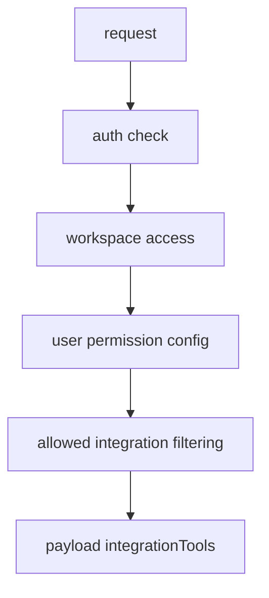
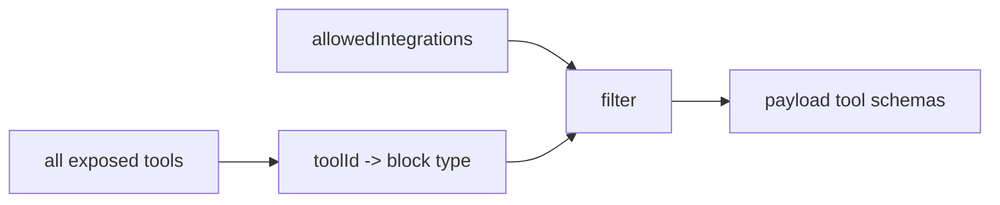
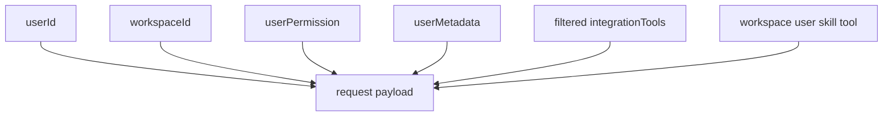

# 6. Role / Permission Projection

The code projects user and workspace context into the request before execution. The clearest signals are workspace access checks, permission config, tool filtering, and user permission payload fields.

## Permission Points

## Execute Route Checks

[`/api/mothership/execute`](https://github.com/nfbs2000/speaky-sim/blob/db47da58d/apps/sim/app/api/mothership/execute/route.ts) performs these steps:

| Step | Code behavior |
| --- | --- |
| internal auth | `checkInternalAuth(req, { requireWorkflowId: false })` |
| body validation | `parseRequest(mothershipExecuteContract, req, {})` |
| actor binding | token user id must match body user id when present |
| workspace check | `assertActiveWorkspaceAccess(workspaceId, userId)` |
| permission payload | `getUserEntityPermissions(...)` result can enter `userPermission` |

## Tool Permission Filtering

[`buildIntegrationToolSchemas`](https://github.com/nfbs2000/speaky-sim/blob/db47da58d/apps/sim/lib/copilot/chat/payload.ts#L75) loads permission config and skips tools whose owning block is not allowed.

## Projection Into Payload

## Client State

[`hooks/queries/mothership-chats.ts`](https://github.com/nfbs2000/speaky-sim/blob/db47da58d/apps/sim/hooks/queries/mothership-chats.ts) projects server responses into client cache keys:

| Key factory | Role |
| --- | --- |
| `mothershipChatKeys.all` | root cache namespace |
| `lists()` | all chat lists |
| `list(workspaceId)` | workspace chat list |
| `details()` | all detail queries |
| `detail(chatId)` | single chat |

## Code-Based Takeaway

The adapter does not treat tools as globally available. It builds the request with user, workspace, permission, and filtered tool schema context, then routes execution through Sim-side code.
