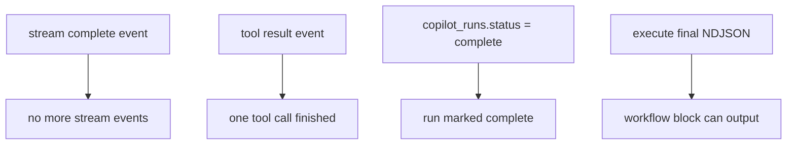
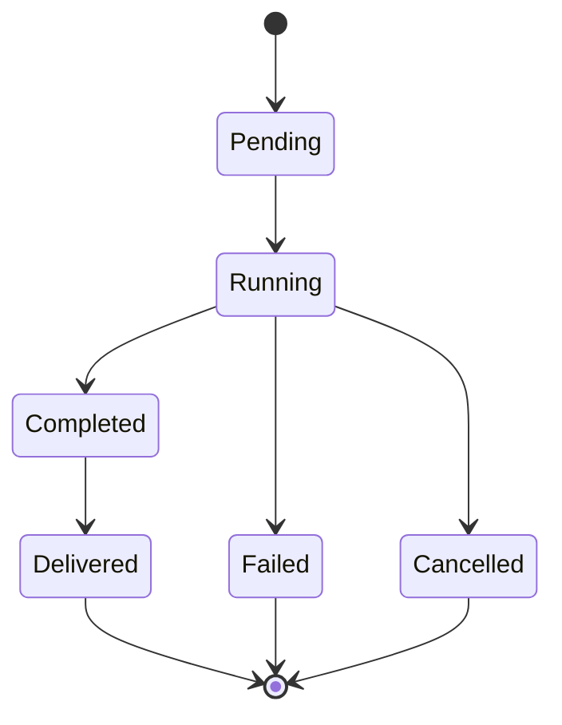
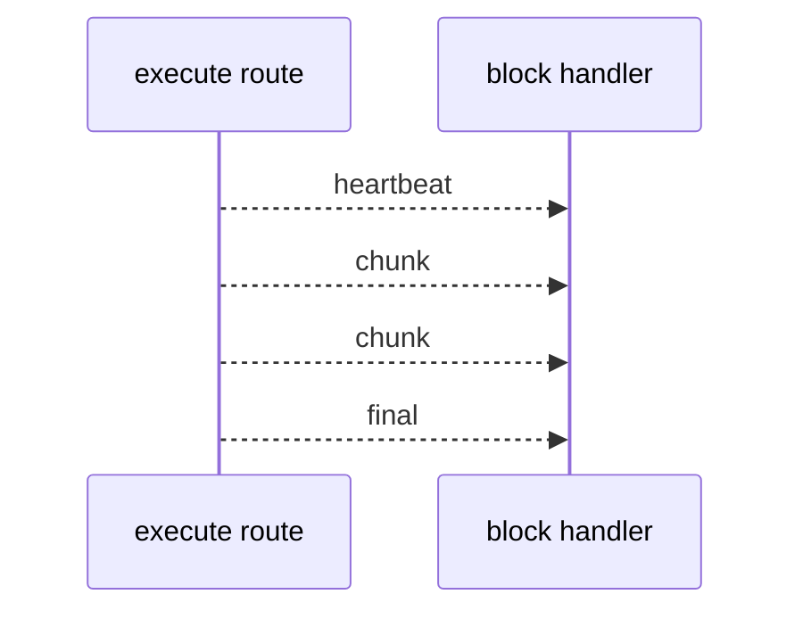
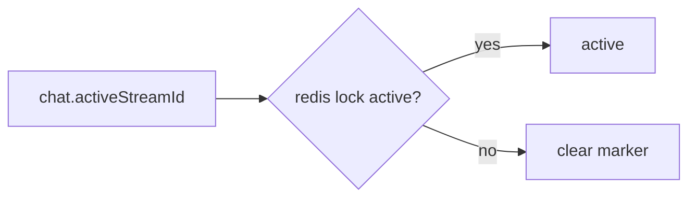

# 7. Completion Gaps

There are several "done" signals in this code path. They do not all mean the same thing.

## Completion Signals

## Stream Complete

Stream completion is an event-level terminal signal. It tells the adapter the event stream ended. It does not by itself describe whether every outside business process reached a useful final state.

## Tool Complete

Tool completion belongs to one tool call. The schema also supports async tool statuses through [`copilot_async_tool_calls`](https://github.com/nfbs2000/speaky-sim/blob/db47da58d/packages/db/schema.ts#L2126), so a tool lifecycle can involve pending/running/completed/failed/cancelled/delivered states.

## Execute Final

The workflow execute route can return normal JSON or NDJSON. In streaming mode it sends:

| Event | Meaning |
| --- | --- |
| `heartbeat` | keep connection alive |
| `chunk` | assistant content delta |
| `final` | final block result |
| `error` | execution error |

## Active Stream Marker Gap

`activeStreamId` is used as a running marker, but tests also check Redis lock state so stale markers do not leave old chats looking active.

Relevant tests:

- [`apps/sim/app/api/mothership/chats/route.test.ts`](https://github.com/nfbs2000/speaky-sim/blob/db47da58d/apps/sim/app/api/mothership/chats/route.test.ts)
- [`apps/sim/app/api/mothership/chats/[chatId]/route.test.ts`](https://github.com/nfbs2000/speaky-sim/blob/db47da58d/apps/sim/app/api/mothership/chats/%5BchatId%5D/route.test.ts)

## Practical Reading

When reading this code, treat completion as layered:

1. stream transport ended
2. run state persisted
3. tool calls settled
4. workflow block returned final output
5. UI cache/replay state refreshed
