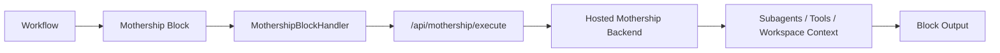
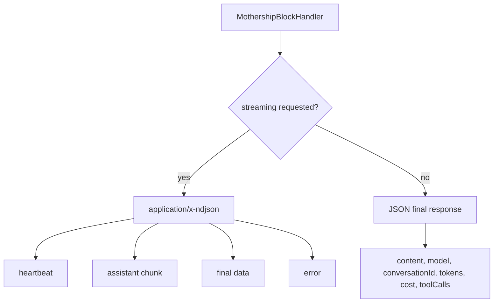
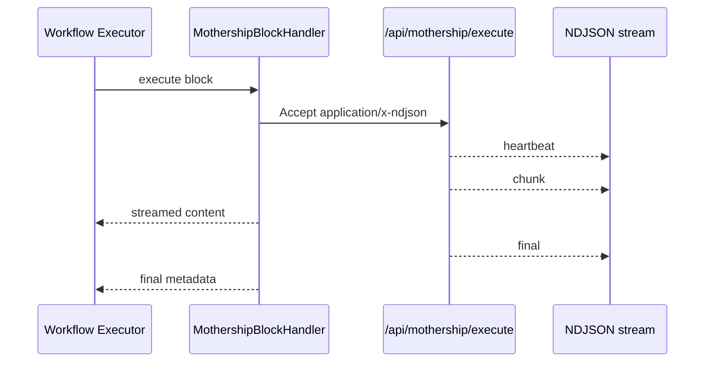
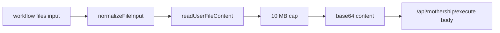

# 7. Workflow Block 계약

Mothership은 UI chat으로만 존재하지 않습니다. Workflow 안에서는 하나의 block으로 실행됩니다.

관련 코드:

- [`apps/sim/blocks/blocks/mothership.ts`](https://github.com/nfbs2000/speaky-sim/blob/db47da58d/apps/sim/blocks/blocks/mothership.ts)
- [`apps/sim/executor/handlers/mothership/mothership-handler.ts`](https://github.com/nfbs2000/speaky-sim/blob/db47da58d/apps/sim/executor/handlers/mothership/mothership-handler.ts)

## Block의 의미

일반 Agent block은 특정 LLM provider 호출에 가깝습니다. Mothership block은 Sim의 전체 Mothership infrastructure에 위임합니다.

## 입력 계약

| input | 설명 |
| --- | --- |
| `prompt` | Mothership에 보낼 사용자 요청 |
| `conversationId` | 기존 대화를 이어갈 chat id, 없으면 생성 |
| `files` | block 입력으로 전달되는 첨부 파일 |

## 출력 계약

| output | 설명 |
| --- | --- |
| `content` | assistant 최종 응답 |
| `model` | `mothership` |
| `conversationId` | 사용된 chat id |
| `tokens` | token usage |
| `toolCalls` | 실행된 tool call 목록과 count |
| `cost` | 실행 비용 metadata |

## Execute Route 응답

`/api/mothership/execute`는 일반 JSON 응답과 NDJSON streaming 응답을 모두 다룹니다.

## Streaming selected output

Workflow에서 특정 output이 streaming 대상으로 선택되면, block handler는 assistant chunk를 workflow stream으로 흘려보내고 final metadata를 보존합니다.

## 파일 첨부 제한

Block handler는 file input을 Mothership file attachment로 바꾸며, attachment byte cap을 둡니다. 이 경계는 contract와 운영 안정성 모두에 중요합니다.

관련 테스트:

- [`mothership-handler.test.ts`](https://github.com/nfbs2000/speaky-sim/blob/db47da58d/apps/sim/executor/handlers/mothership/mothership-handler.test.ts)
