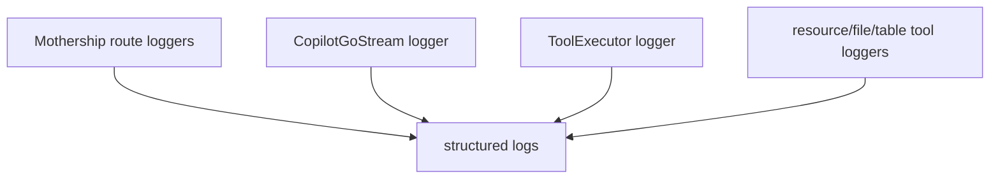
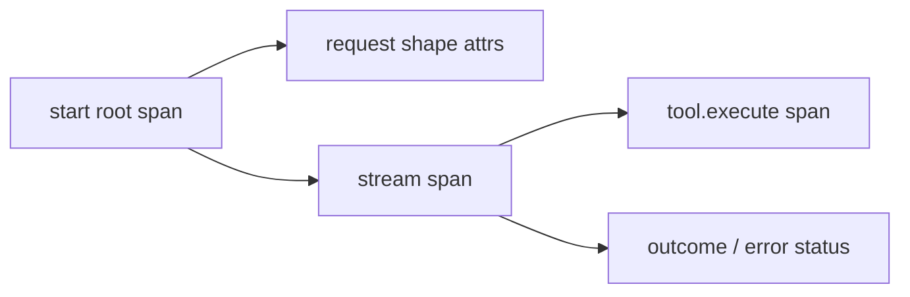
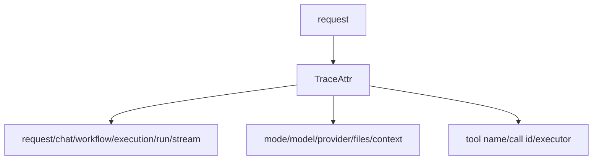
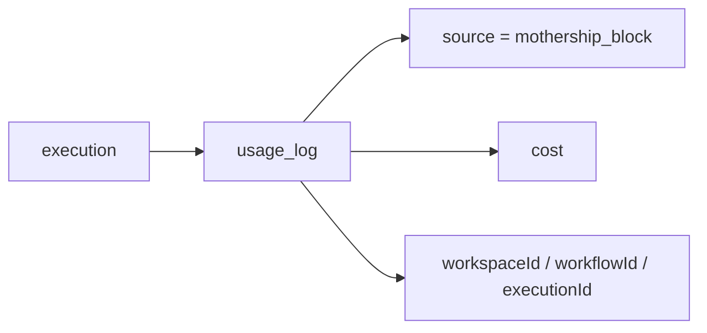

# 8. Audit / Observability

The adapter has several observability paths: structured loggers, OTel spans, generated trace attributes, run state, and usage ledger rows.

## Logger Locations

Examples:

| Code | Logger name |
| --- | --- |
| [`execute/route.ts`](https://github.com/nfbs2000/speaky-sim/blob/db47da58d/apps/sim/app/api/mothership/execute/route.ts) | `MothershipExecuteAPI` |
| [`chats/route.ts`](https://github.com/nfbs2000/speaky-sim/blob/db47da58d/apps/sim/app/api/mothership/chats/route.ts) | `MothershipChatsAPI` |
| [`request/go/stream.ts`](https://github.com/nfbs2000/speaky-sim/blob/db47da58d/apps/sim/lib/copilot/request/go/stream.ts) | `CopilotGoStream` |
| [`tool-executor/executor.ts`](https://github.com/nfbs2000/speaky-sim/blob/db47da58d/apps/sim/lib/copilot/tool-executor/executor.ts) | `ToolExecutor` |

## OTel Path

[`request/otel.ts`](https://github.com/nfbs2000/speaky-sim/blob/db47da58d/apps/sim/lib/copilot/request/otel.ts) defines span helpers for lifecycle and tool work.

Key helpers:

| Helper | Role |
| --- | --- |
| `getCopilotTracer` | tracer name/version |
| `withIncomingGoSpan` | parent inbound Go-called handler spans |
| `withCopilotSpan` | lifecycle operation span |
| `withCopilotToolSpan` | Sim-side tool work span |
| `markSpanForError` | error status/exception recording |
| `isActionableErrorStatus` | alert-worthy HTTP status filtering |

## Trace Attributes

The code stamps attributes such as request id, chat id, workflow id, execution id, run id, stream id, route, transport, model/provider, and tool names.

## Usage Ledger

[`usage_log`](https://github.com/nfbs2000/speaky-sim/blob/db47da58d/packages/db/schema.ts#L2659) has a `source` enum containing `mothership_block`. This is the ledger-like cost path; stream events and traces are observability data, while `usage_log` is the durable cost attribution table.

## Reading Rule

Use logs and traces for debugging the runtime. Use persisted run/message rows for replay. Use `usage_log` for cost attribution.
