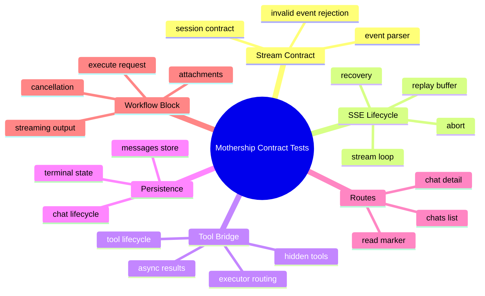
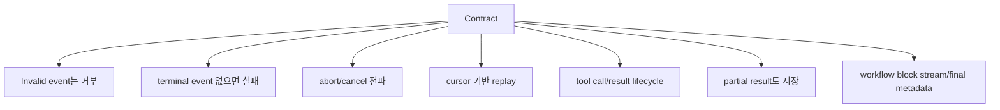
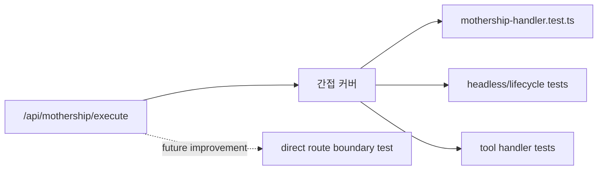

# 8. 테스트 매트릭스

테스트는 contract 문서에서 중요한 증거입니다. 코드가 "이런 구조일 것이다"가 아니라 "이 동작을 지키려고 테스트하고 있다"를 보여주기 때문입니다.

## 테스트가 덮는 큰 영역



## 대표 테스트 파일

| 영역 | 테스트 |
| --- | --- |
| stream contract parser | [`request/session/contract.test.ts`](https://github.com/nfbs2000/speaky-sim/blob/db47da58d/apps/sim/lib/copilot/request/session/contract.test.ts) |
| stream event creation | [`request/session/event.test.ts`](https://github.com/nfbs2000/speaky-sim/blob/db47da58d/apps/sim/lib/copilot/request/session/event.test.ts) |
| Go stream loop | [`request/go/stream.test.ts`](https://github.com/nfbs2000/speaky-sim/blob/db47da58d/apps/sim/lib/copilot/request/go/stream.test.ts) |
| stream writer | [`request/session/writer.test.ts`](https://github.com/nfbs2000/speaky-sim/blob/db47da58d/apps/sim/lib/copilot/request/session/writer.test.ts) |
| replay buffer | [`request/session/buffer.test.ts`](https://github.com/nfbs2000/speaky-sim/blob/db47da58d/apps/sim/lib/copilot/request/session/buffer.test.ts) |
| replay recovery | [`request/session/recovery.test.ts`](https://github.com/nfbs2000/speaky-sim/blob/db47da58d/apps/sim/lib/copilot/request/session/recovery.test.ts) |
| tool event handlers | [`request/handlers/handlers.test.ts`](https://github.com/nfbs2000/speaky-sim/blob/db47da58d/apps/sim/lib/copilot/request/handlers/handlers.test.ts) |
| tool executor | [`tool-executor/executor.test.ts`](https://github.com/nfbs2000/speaky-sim/blob/db47da58d/apps/sim/lib/copilot/tool-executor/executor.test.ts) |
| chat persistence | [`chat/messages-store.test.ts`](https://github.com/nfbs2000/speaky-sim/blob/db47da58d/apps/sim/lib/copilot/chat/messages-store.test.ts) |
| terminal state | [`chat/terminal-state.test.ts`](https://github.com/nfbs2000/speaky-sim/blob/db47da58d/apps/sim/lib/copilot/chat/terminal-state.test.ts) |
| Mothership chat list route | [`app/api/mothership/chats/route.test.ts`](https://github.com/nfbs2000/speaky-sim/blob/db47da58d/apps/sim/app/api/mothership/chats/route.test.ts) |
| Mothership chat detail route | [`app/api/mothership/chats/[chatId]/route.test.ts`](https://github.com/nfbs2000/speaky-sim/blob/db47da58d/apps/sim/app/api/mothership/chats/%5BchatId%5D/route.test.ts) |
| Mothership read marker route | [`app/api/mothership/chats/read/route.test.ts`](https://github.com/nfbs2000/speaky-sim/blob/db47da58d/apps/sim/app/api/mothership/chats/read/route.test.ts) |
| Mothership block handler | [`executor/handlers/mothership/mothership-handler.test.ts`](https://github.com/nfbs2000/speaky-sim/blob/db47da58d/apps/sim/executor/handlers/mothership/mothership-handler.test.ts) |
| client boundary parsing | [`hooks/queries/mothership-chats.test.ts`](https://github.com/nfbs2000/speaky-sim/blob/db47da58d/apps/sim/hooks/queries/mothership-chats.test.ts) |

## 테스트가 말해주는 contract 보장



## 확인 명령

문서 업데이트 전에 최소한 다음을 확인합니다.

```bash
bun run mship:check
bun run check:api-validation
bun test apps/sim/lib/copilot/request/session/contract.test.ts
bun test apps/sim/lib/copilot/request/go/stream.test.ts
bun test apps/sim/lib/copilot/request/handlers/handlers.test.ts
bun test apps/sim/executor/handlers/mothership/mothership-handler.test.ts
```

## 관찰된 테스트 gap

이 snapshot에서는 `/api/mothership/execute/route.ts`를 직접 겨냥한 별도 `route.test.ts`를 확인하지 못했습니다. 다만 execute behavior는 Mothership block handler, headless lifecycle, tool lifecycle 테스트로 상당 부분 간접 검증됩니다.

문서에서는 이 gap을 숨기지 않는 편이 좋습니다.


