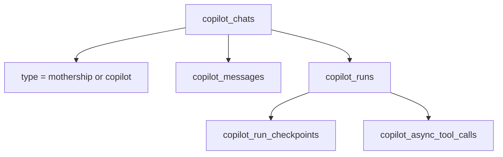
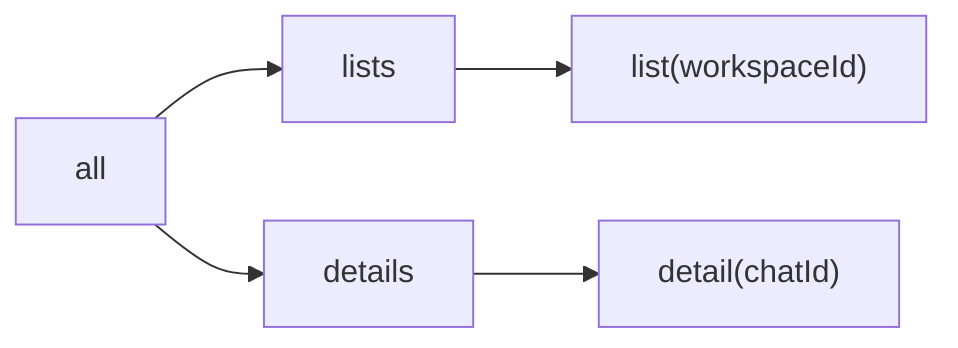
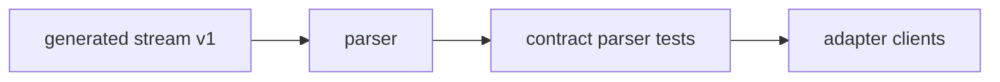

# 9. Compatibility Matrix

This page summarizes fields that clients and adapter code depend on. It is not exhaustive; it is a code-reading matrix for the current snapshot.

## Route Matrix

| Route | Input | Output |
| --- | --- | --- |
| `GET /api/mothership/chats` | `workspaceId` query | `{ success, data: chats[] }` |
| `POST /api/mothership/chats` | `{ workspaceId }` | `{ success, id }` |
| `GET /api/mothership/chats/[chatId]` | `chatId` param | `{ success, chat }` |
| `PATCH /api/mothership/chats/[chatId]` | title/read/pinned body | `{ success }` |
| `DELETE /api/mothership/chats/[chatId]` | `chatId` param | `{ success }` |
| `POST /api/mothership/chats/[chatId]/fork` | `upToMessageId` | `{ success, id }` |
| `POST /api/mothership/chats/read` | `chatId` | `{ success }` |
| `POST /api/mothership/execute` | execute body | execute response |

## Execute Response

[`mothershipExecuteResponseSchema`](https://github.com/nfbs2000/speaky-sim/blob/db47da58d/apps/sim/lib/api/contracts/mothership-chats.ts#L283) contains:

| Field | Required | Notes |
| --- | --- | --- |
| `content` | no | generated content |
| `model` | yes | literal `mothership` |
| `conversationId` | yes | chat/conversation id |
| `tokens` | yes | prompt/completion/total optional inside |
| `cost` | no | passthrough cost object |
| `toolCalls` | no | array passthrough |

## Stream Event Matrix

| Event | Required idea | Compatibility concern |
| --- | --- | --- |
| `session` | session metadata | consumers should tolerate kind variants |
| `text` | channel + text | assistant/thinking channels differ |
| `tool` | phase + id/name/executor | args can arrive as deltas |
| `span` | lifecycle or payload | subagent spans need routing |
| `resource` | op + resource payload | resource shape can vary |
| `run` | run status/update | usage/cost may be partial |
| `error` | error payload | should terminate cleanly |
| `complete` | terminal marker | should close stream state |

## DB Compatibility

The code keeps Mothership chats in `copilot_chats` with a type enum. This means client code often has to handle older copilot-shaped data and newer mothership-typed data in the same storage family.

## Client Cache Compatibility

[`mothershipChatKeys`](https://github.com/nfbs2000/speaky-sim/blob/db47da58d/apps/sim/hooks/queries/mothership-chats.ts#L55) keeps list/detail invalidation stable.

## Versioning Reading

Compatibility in this snapshot is maintained by generated stream types, runtime schemas, route contracts, parser tests, and client response parsing.
