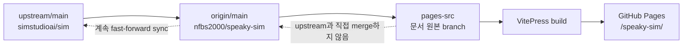
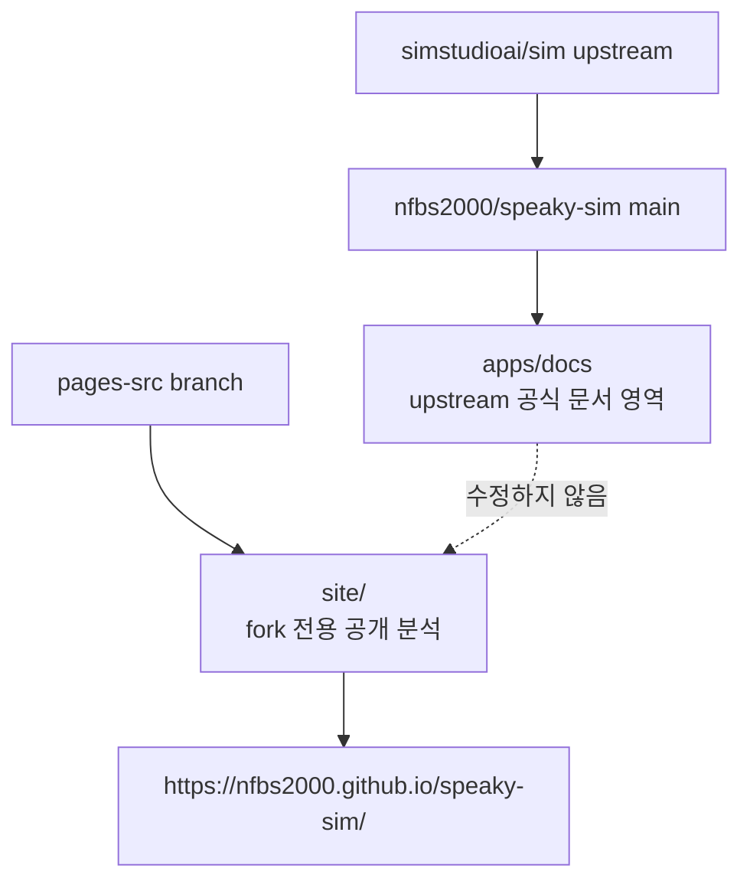
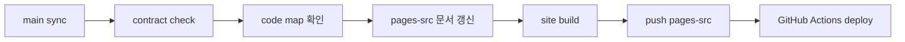
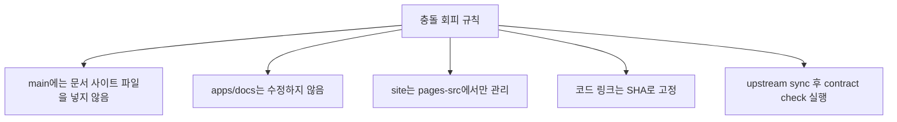

# 9. Upstream Sync 운영 방식

이 문서 사이트는 `nfbs2000/speaky-sim` fork repo에 붙지만, upstream sync와 충돌하지 않도록 `main`이 아니라 `pages-src` branch에서 관리합니다.

## Branch 구조



권장 운영:

| branch | 역할 |
| --- | --- |
| `main` | upstream/main을 계속 따라가는 fork code branch |
| `pages-src` | GitHub Pages 문서 원본과 배포 workflow |
| GitHub Pages artifact | Actions가 빌드해서 Pages에 배포 |

## 왜 main에 넣지 않는가

`apps/docs`는 upstream이 관리하는 공식 문서 앱입니다. 이곳을 수정하면 upstream 문서 변경과 충돌할 수 있습니다.



## Upstream Sync 루틴

`main`은 최대한 깨끗하게 유지합니다.

```bash
git switch main
git fetch upstream
git merge --ff-only upstream/main
git push origin main
```

문서 branch는 별도로 관리합니다.

```bash
git switch pages-src
cd site
bun install
bun run dev
```

## 문서 업데이트 루틴



추천 명령:

```bash
git switch main
git fetch upstream
git merge --ff-only upstream/main
git push origin main

bun run mship:check
bun run check:api-validation

git switch pages-src
cd site
bun run build
git add site .github/workflows/pages.yml
git commit -m "docs: update mothership contract notes"
git push origin pages-src
```

## GitHub Pages 설정

GitHub repo에서 다음처럼 설정합니다.

```text
Settings
  Pages
    Build and deployment
      Source: GitHub Actions
```

그 뒤 `pages-src` branch가 push되면 `.github/workflows/pages.yml`이 site를 빌드하고 Pages에 배포합니다.

## 링크 정책

문서 링크는 두 종류를 같이 씁니다.

| 링크 종류 | 용도 |
| --- | --- |
| commit SHA 링크 | 문서가 분석한 정확한 snapshot 고정 |
| main 링크 | 최신 코드 흐름 확인 |

예:

```text
고정 분석:
https://github.com/nfbs2000/speaky-sim/blob/db47da58d/apps/sim/lib/copilot/generated/mothership-stream-v1.ts

최신 main:
https://github.com/nfbs2000/speaky-sim/blob/main/apps/sim/lib/copilot/generated/mothership-stream-v1.ts
```

## 충돌 회피 규칙


