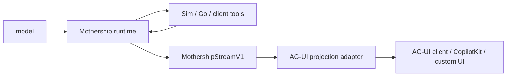
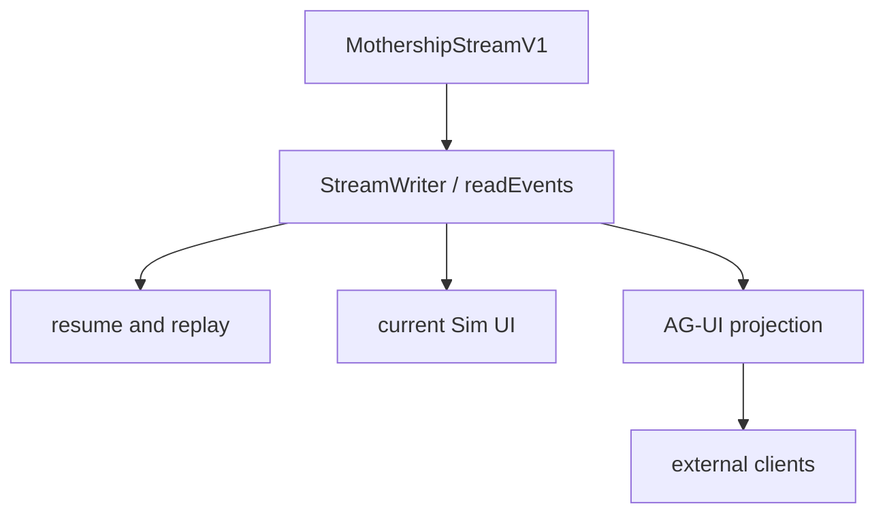

# 10. AG-UI Positioning

AG-UI should be added as a projection layer, not as the owner of the Mothership runtime.

The runtime contract in this repo is still [`MothershipStreamV1`](https://github.com/nfbs2000/speaky-sim/blob/db47da58d/apps/sim/lib/copilot/generated/mothership-stream-v1.ts). AG-UI is useful because it gives outside clients a standard way to render agent runs, tool calls, state updates, activity, and human-in-the-loop pauses.

## Protocol Roles

| Layer | Owns | Should not own |
| --- | --- | --- |
| model | choosing tool calls and producing text | UI state, browser rendering, durable tool result persistence |
| Mothership runtime | run loop, checkpoint, resume, tool result ownership | visual component layout |
| Sim tool executor | Sim-side tool execution and normalized result reporting | model planning |
| AG-UI projection | UI-facing event shape and client interoperability | canonical runtime state |
| CopilotKit or custom UI | rendering, input capture, optional frontend interaction | swallowing tool results before Mothership can resume |

## Why AG-UI Fits

AG-UI describes itself as a lightweight event-based protocol for connecting agents to user-facing applications. Its standard event families include lifecycle, text messages, tool calls, state management, activity, raw, and custom events.

Relevant references:

- [AG-UI README](https://github.com/ag-ui-protocol/ag-ui)
- [AG-UI Core architecture](https://docs.ag-ui.com/concepts/architecture.md)
- [AG-UI Events](https://docs.ag-ui.com/concepts/events.md)
- [AG-UI Interrupts](https://docs.ag-ui.com/concepts/interrupts.md)

That maps well to Mothership because the existing stream already has stable event families:

| Mothership event | Existing meaning |
| --- | --- |
| `session` | start, chat id, title, trace metadata |
| `text` | assistant or thinking text |
| `tool` | tool call, streamed args, result |
| `span` | subagent lifecycle or structured result |
| `resource` | resource upsert/remove |
| `run` | checkpoint pause, resume, compaction events |
| `error` | terminal error data |
| `complete` | terminal completion data |

## Boundary Rule

The canonical stream should remain MothershipStreamV1.

The adapter can emit AG-UI events, but it should preserve `rawEvent` or equivalent metadata so a client can trace every AG-UI event back to the original Mothership envelope.

## CopilotKit Position

CopilotKit can be one AG-UI client. It should not become the runtime boundary.

The safe positioning is:

1. Mothership decides and runs.
2. Sim executes Sim-owned tools and records results.
3. AG-UI translates the stream into standard UI events.
4. CopilotKit or another client renders those events.

This keeps the agent loop intact while allowing existing UI to become interactive.

## Practical Test

If removing AG-UI still lets Mothership run, resume, persist, and replay correctly, the boundary is healthy.

If removing AG-UI breaks tool result delivery, checkpoint resume, or run completion, AG-UI has been placed too deep in the runtime.
