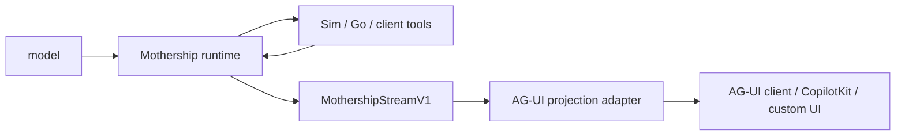
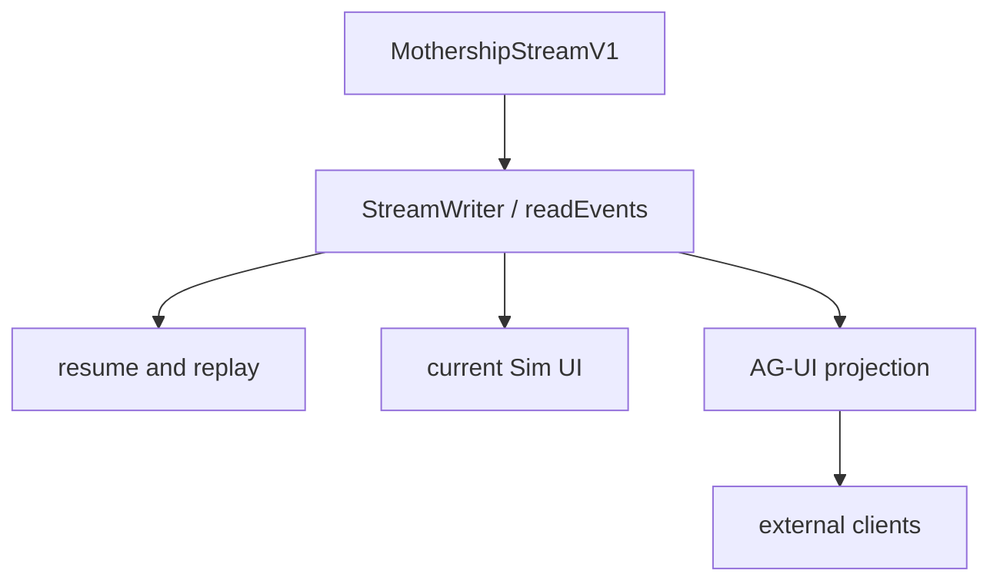

# 10. AG-UI 포지셔닝

AG-UI는 Mothership runtime의 주인이 아니라 projection layer로 붙어야 합니다.

이 repo의 canonical runtime contract는 여전히 [`MothershipStreamV1`](https://github.com/nfbs2000/speaky-sim/blob/db47da58d/apps/sim/lib/copilot/generated/mothership-stream-v1.ts)입니다. AG-UI가 유용한 이유는 agent run, tool call, state update, activity, human-in-the-loop pause를 외부 client가 표준 방식으로 렌더링할 수 있게 해주기 때문입니다.

## 프로토콜 역할

| 계층 | 책임지는 것 | 책임지면 안 되는 것 |
| --- | --- | --- |
| model | tool call 선택, assistant text 생성 | UI state, browser rendering, durable tool result persistence |
| Mothership runtime | run loop, checkpoint, resume, tool result ownership | visual component layout |
| Sim tool executor | Sim-side tool 실행, normalized result reporting | model planning |
| AG-UI projection | UI-facing event shape, client interoperability | canonical runtime state |
| CopilotKit 또는 custom UI | rendering, input capture, 선택적 frontend interaction | Mothership이 resume하기 전에 tool result를 삼키는 것 |

## 왜 AG-UI가 맞는가

AG-UI는 agent와 user-facing application을 연결하기 위한 lightweight event-based protocol입니다. 표준 event family는 lifecycle, text message, tool call, state management, activity, raw, custom event를 포함합니다.

관련 근거:

- [AG-UI README](https://github.com/ag-ui-protocol/ag-ui)
- [AG-UI Core architecture](https://docs.ag-ui.com/concepts/architecture.md)
- [AG-UI Events](https://docs.ag-ui.com/concepts/events.md)
- [AG-UI Interrupts](https://docs.ag-ui.com/concepts/interrupts.md)

이 구조는 Mothership과 잘 맞습니다. 기존 stream에 이미 안정적인 event family가 있기 때문입니다.

| Mothership event | 기존 의미 |
| --- | --- |
| `session` | start, chat id, title, trace metadata |
| `text` | assistant or thinking text |
| `tool` | tool call, streamed args, result |
| `span` | subagent lifecycle or structured result |
| `resource` | resource upsert/remove |
| `run` | checkpoint pause, resume, compaction events |
| `error` | terminal error data |
| `complete` | terminal completion data |

## 경계 규칙

canonical stream은 `MothershipStreamV1`로 유지해야 합니다.

adapter는 AG-UI event를 emit할 수 있습니다. 다만 모든 AG-UI event가 원본 Mothership envelope로 되돌아갈 수 있도록 `rawEvent` 또는 동등한 metadata를 보존해야 합니다.

## CopilotKit의 위치

CopilotKit은 AG-UI client 중 하나가 될 수 있습니다. 하지만 runtime boundary가 되면 안 됩니다.

안전한 배치는 다음 순서입니다.

1. Mothership이 판단하고 실행합니다.
2. Sim이 Sim-owned tool을 실행하고 result를 기록합니다.
3. AG-UI가 stream을 표준 UI event로 번역합니다.
4. CopilotKit 또는 다른 client가 그 event를 렌더링합니다.

이 구조는 agent loop를 보존하면서 기존 UI를 interactive하게 만들 수 있습니다.

## 실전 판별법

AG-UI를 제거해도 Mothership이 run, resume, persist, replay를 정상 수행한다면 경계가 건강한 것입니다.

AG-UI를 제거했을 때 tool result delivery, checkpoint resume, run completion이 깨진다면 AG-UI가 runtime 내부에 너무 깊게 들어간 것입니다.
