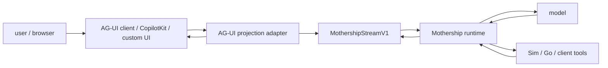
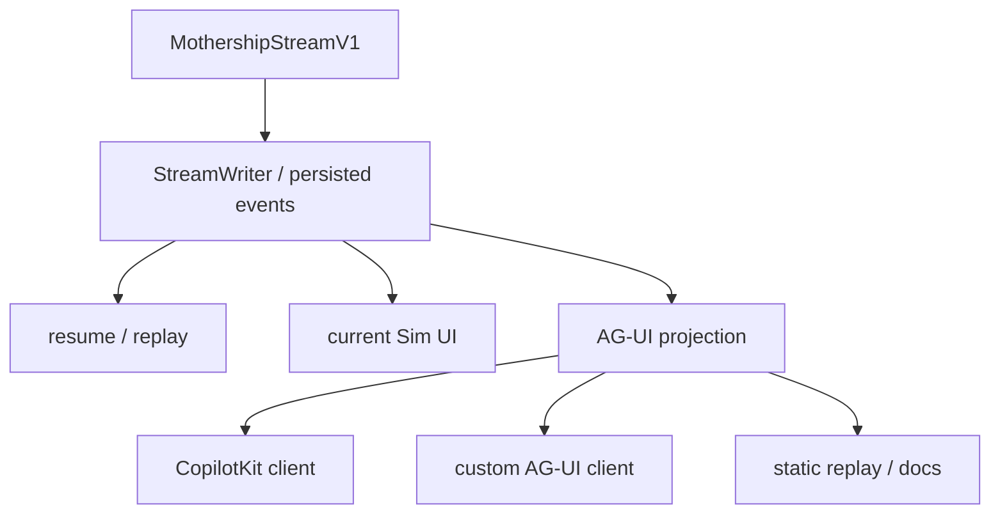
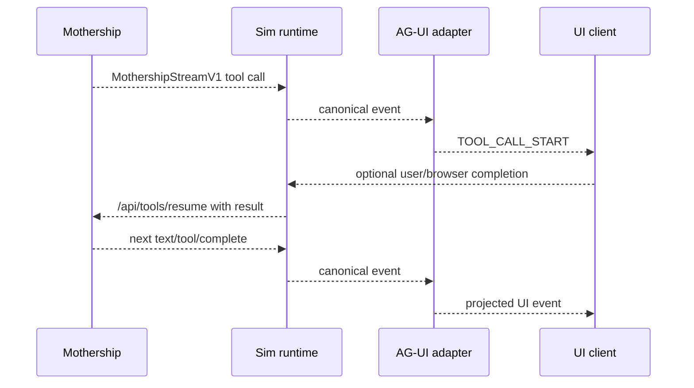
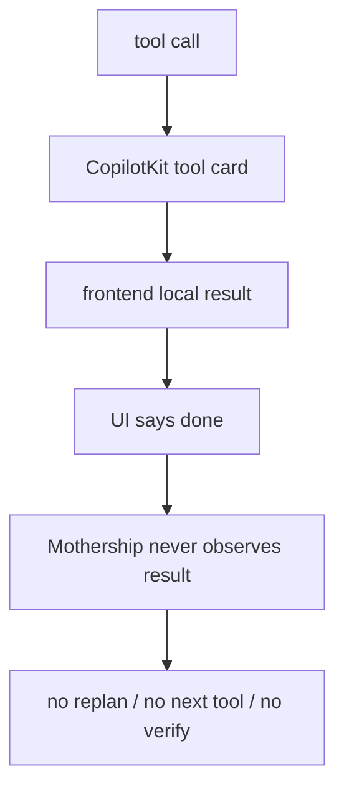
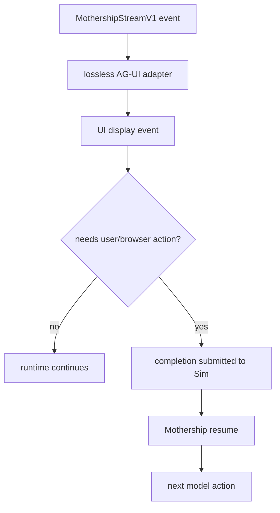

# 10. AG-UI 포지셔닝

AG-UI는 Mothership runtime의 주인이 아니라 projection layer로 붙어야 합니다.

이 repo의 canonical runtime contract는 여전히 [`MothershipStreamV1`](https://github.com/nfbs2000/speaky-sim/blob/db47da58d/apps/sim/lib/copilot/generated/mothership-stream-v1.ts)입니다. AG-UI가 들어와도 이 사실이 바뀌면 안 됩니다. AG-UI는 agent run, text, tool call, state update, activity, human-in-the-loop pause를 UI와 외부 client가 이해할 수 있는 표준 event shape로 바꾸는 역할을 맡아야 합니다.

## 결론

Mothership과 AG-UI의 관계는 다음처럼 잡는 것이 맞습니다.

| 질문 | 답 |
| --- | --- |
| 모델이 CopilotKit을 통제하는가? | 아닙니다. 모델은 tool call을 선택하고 observation을 받아 다음 행동을 고릅니다. |
| CopilotKit이 모델을 통제하는가? | 아닙니다. CopilotKit은 client surface 또는 AG-UI client가 될 수 있습니다. |
| Mothership이 무엇을 통제하는가? | run loop, checkpoint, resume, tool result ownership을 통제합니다. |
| AG-UI가 무엇을 통제하는가? | runtime event를 UI가 렌더링할 수 있는 표준 event로 투영합니다. |
| UI가 tool result를 먹고 끝내도 되는가? | 안 됩니다. result는 반드시 Mothership loop로 돌아가야 합니다. |

따라서 AG-UI의 위치는 “agent runtime 위에 얹는 display/control protocol”이지, “agent loop를 대체하는 orchestration layer”가 아닙니다.

## 프로토콜 역할

| 계층 | 책임지는 것 | 책임지면 안 되는 것 |
| --- | --- | --- |
| model | tool call 선택, assistant text 생성, tool result observation 이후 다음 action 결정 | UI state, browser rendering, durable persistence |
| Go Mothership | provider/model run, checkpoint, `/api/tools/resume` continuation | Sim 내부 UI component layout |
| Sim runtime | stream loop, tool dispatch, result normalize, persistence projection | model planning 자체 |
| Sim tool executor | Sim-owned tool 실행, client-owned tool completion 대기 | UI가 최종 완료를 판단하도록 위임 |
| AG-UI projection | `MothershipStreamV1`을 AG-UI event로 변환 | canonical runtime state, checkpoint ownership |
| CopilotKit/custom UI | 렌더링, user input capture, approval/confirmation 전달 | tool result를 삼키고 agent loop를 종료 |

## 왜 AG-UI가 맞는가

AG-UI는 agent와 user-facing application을 연결하기 위한 event-based protocol입니다. 표준 event family는 lifecycle, text message, tool call, state, activity, raw/custom event를 포함합니다. 이 방향은 Mothership과 잘 맞습니다. Mothership stream에도 이미 다음 event family가 있기 때문입니다.

| Mothership event | 기존 의미 | AG-UI에서의 위치 |
| --- | --- | --- |
| `session` | start, chat id, title, trace metadata | run/thread state |
| `text` | assistant or thinking text | message/activity stream |
| `tool` | tool call, args delta, result | tool call lifecycle |
| `span` | subagent lifecycle, structured result | step/activity grouping |
| `resource` | resource upsert/remove | state/resource panel update |
| `run` | checkpoint pause, resume, compaction | lifecycle/activity/interrupt |
| `error` | terminal error data | run error |
| `complete` | terminal completion data | run finished |

관련 근거:

- [AG-UI README](https://github.com/ag-ui-protocol/ag-ui)
- [AG-UI Core architecture](https://docs.ag-ui.com/concepts/architecture.md)
- [AG-UI Events](https://docs.ag-ui.com/concepts/events.md)
- [AG-UI Interrupts](https://docs.ag-ui.com/concepts/interrupts.md)
- [`MothershipStreamV1EventEnvelope`](https://github.com/nfbs2000/speaky-sim/blob/db47da58d/apps/sim/lib/copilot/generated/mothership-stream-v1.ts)

## 경계 규칙

canonical stream은 `MothershipStreamV1`로 유지해야 합니다.

AG-UI adapter는 event를 변환할 수 있지만 원본을 잃으면 안 됩니다. 모든 AG-UI event는 아래 중 하나를 가져야 합니다.

| 필드 | 목적 |
| --- | --- |
| `rawEvent` | debugging과 replay를 위해 원본 Mothership envelope를 그대로 보존 |
| `rawEventRef` | `{ streamId, seq, cursor }`처럼 원본 event를 다시 찾을 수 있는 reference |
| `metadata.mothership` | `streamId`, `chatId`, `toolCallId`, `checkpointId`, `scope` 같은 최소 identity |

이 규칙이 없으면 AG-UI client에서 보이는 화면과 실제 runtime state가 갈라집니다. 특히 tool result, checkpoint resume, subagent span은 나중에 원인을 추적해야 하는 경우가 많습니다.

## CopilotKit의 위치

CopilotKit은 AG-UI client 중 하나가 될 수 있습니다. 하지만 Mothership runtime boundary가 되면 안 됩니다.

안전한 배치는 다음 순서입니다.

1. Mothership이 model run을 진행합니다.
2. Go가 tool call 또는 checkpoint를 stream합니다.
3. Sim이 tool call을 route합니다.
4. Sim-owned tool은 Sim에서 실행합니다.
5. client-owned tool은 UI에서 completion을 받아 Sim으로 돌려보냅니다.
6. Sim이 normalized tool result를 모읍니다.
7. Mothership loop가 `/api/tools/resume`으로 result를 관찰합니다.
8. AG-UI는 이 과정을 UI event로 보여줍니다.

## 잘못된 배치

가장 위험한 설계는 CopilotKit 또는 frontend tool card가 tool result를 최종 응답처럼 처리하는 것입니다.

이 구조는 단일 버튼 demo에서는 좋아 보일 수 있지만 Mothership에는 맞지 않습니다. Mothership은 “도구 하나 성공”이 아니라 “목표 달성까지 이어지는 loop”가 중요합니다. read 결과를 보고 다음 write를 해야 하고, write 뒤에는 verify/run/deploy가 이어져야 할 수 있습니다.

## 올바른 배치

AG-UI는 “보여주고 입력을 받는 통로”입니다. Mothership이 result를 관찰하고 다음 action을 결정하는 구조를 유지해야 합니다.

## 판단 기준

AG-UI integration이 올바른지 판단하는 빠른 기준은 다음과 같습니다.

| 테스트 | 통과 기준 |
| --- | --- |
| AG-UI adapter를 제거해도 run이 되는가? | Mothership run, checkpoint, resume, persistence가 그대로 동작해야 합니다. |
| UI가 tool result를 숨겨도 runtime이 result를 받는가? | tool result는 UI display와 무관하게 Mothership으로 돌아가야 합니다. |
| replay가 가능한가? | persisted `MothershipStreamV1` event만으로 AG-UI 화면을 다시 만들 수 있어야 합니다. |
| checkpoint가 정확한가? | user input이 필요한 pause만 AG-UI interrupt가 되어야 합니다. |
| subagent/tool/resource가 추적 가능한가? | AG-UI event에서 원본 `streamId`, `seq`, `toolCallId`, `scope`로 돌아갈 수 있어야 합니다. |

## 이 문서의 설계 원칙

1. Mothership runtime을 먼저 보존합니다.
2. AG-UI는 lossless projection으로 시작합니다.
3. CopilotKit은 client 선택지이지 runtime 주인이 아닙니다.
4. tool result ownership은 Mothership loop에 둡니다.
5. read-only projection을 먼저 만들고, 그 다음 AG-UI run endpoint를 붙입니다.
