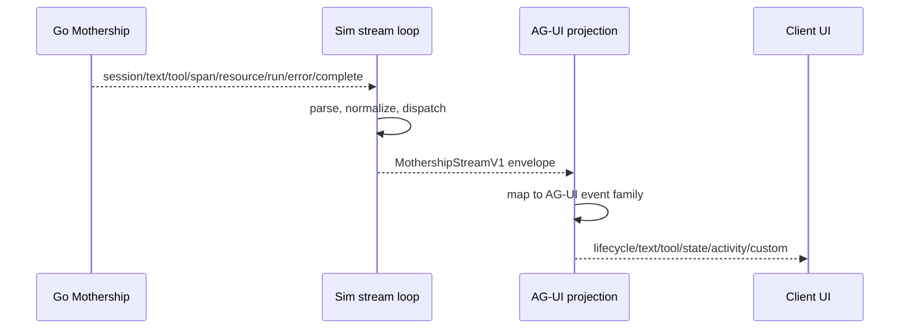
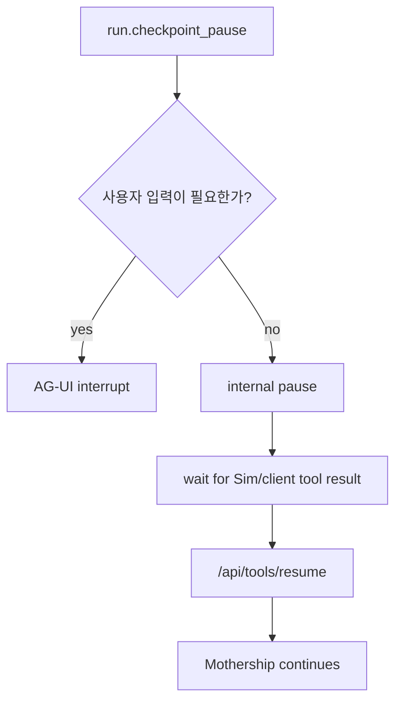

# 11. AG-UI 이벤트 매핑

이 페이지는 `MothershipStreamV1` event를 AG-UI event로 매핑하는 기준입니다. 핵심은 “변환은 가능하지만 원본을 잃지 않는다”입니다. AG-UI event는 UI client가 보기 좋은 shape이고, 원본 Mothership event는 runtime truth입니다.

## 전체 흐름



Sim 쪽 stream loop는 [`runStreamLoop`](https://github.com/nfbs2000/speaky-sim/blob/db47da58d/apps/sim/lib/copilot/request/go/stream.ts)를 통해 Go backend의 SSE를 읽고, normalized event를 handler에 dispatch합니다. AG-UI projection은 이 dispatch 이후 또는 persisted stream replay 단계에서 붙는 것이 안전합니다.

## 공통 Envelope 매핑

모든 Mothership event는 아래 공통 field를 가집니다.

| Mothership field | 의미 | AG-UI metadata |
| --- | --- | --- |
| `v` | stream contract version | `metadata.mothership.version` |
| `type` | `session`, `text`, `tool`, `span`, `resource`, `run`, `error`, `complete` | event family 선택 |
| `seq` | stream 내 ordering | `metadata.mothership.seq` |
| `ts` | event timestamp | AG-UI event timestamp 또는 metadata |
| `stream.streamId` | stream identity | `runId` fallback 또는 raw reference |
| `stream.chatId` | chat/thread identity | `threadId` |
| `stream.cursor` | replay cursor | `rawEventRef.cursor` |
| `scope` | subagent lane, parent tool/span | step nesting metadata |
| `trace` | request/span trace | diagnostics metadata |

권장 metadata shape:

```ts
type MothershipAguiMetadata = {
  mothership: {
    streamId: string
    chatId?: string
    cursor?: string
    seq: number
    type: string
    toolCallId?: string
    checkpointId?: string
    scope?: {
      lane?: 'subagent'
      parentToolCallId?: string
      spanId?: string
      parentSpanId?: string
    }
  }
}
```

## Event Matrix

| Mothership event | AG-UI event | Projection rule |
| --- | --- | --- |
| `session.kind=start` | `RUN_STARTED` | 더 강한 run id가 없으면 `stream.streamId`를 `runId`로 사용해 AG-UI run을 시작합니다. |
| `session.kind=chat` | `STATE_SNAPSHOT` 또는 `CUSTOM` | `chatId`와 thread identity를 바인딩합니다. |
| `session.kind=title` | `STATE_DELTA` 또는 `CUSTOM` | 화면에 보이는 chat title을 갱신합니다. |
| `session.kind=trace` | `CUSTOM` | visible UX가 아니라 debugging용 trace id를 보존합니다. |
| `text.channel=assistant` | `TEXT_MESSAGE_START`, `TEXT_MESSAGE_CONTENT`, `TEXT_MESSAGE_END` | 안정적인 `messageId` 아래 assistant delta를 stream합니다. |
| `text.channel=thinking` | `ACTIVITY_*`, `REASONING_*`, hidden `CUSTOM` | private chain-of-thought를 노출하지 않습니다. 승인된 summary/progress만 렌더링합니다. |
| `tool.phase=call` | `TOOL_CALL_START`, optional `TOOL_CALL_ARGS` | `toolCallId`, `toolName`, arguments, executor, mode, UI flag를 보존합니다. |
| `tool.phase=args_delta` | `TOOL_CALL_ARGS` | argument delta를 순서대로 append합니다. |
| `tool.phase=result` | `TOOL_CALL_RESULT` | result는 렌더링하되 result ownership은 Mothership에 둡니다. |
| `span.kind=subagent` + `event=start` | `STEP_STARTED` 또는 `ACTIVITY_START` | subagent lane을 step으로 엽니다. |
| `span.kind=subagent` + `event=end` | `STEP_FINISHED` 또는 `ACTIVITY_END` | subagent step을 닫습니다. |
| `span.kind=structured_result` | `ACTIVITY_SNAPSHOT` 또는 `CUSTOM` | plain chat text가 아니라 structured UI data로 취급합니다. |
| `span.kind=subagent_result` | `ACTIVITY_SNAPSHOT` 또는 `CUSTOM` | parent tool/subagent group에 연결합니다. |
| `resource.op=upsert` | `STATE_DELTA` 또는 `CUSTOM` | resource panel state를 추가하거나 갱신합니다. |
| `resource.op=remove` | `STATE_DELTA` 또는 `CUSTOM` | resource panel state를 제거합니다. |
| `run.kind=checkpoint_pause` | internal pause 또는 `RUN_FINISHED outcome=interrupt` | 사용자 입력이 필요할 때만 AG-UI interrupt로 투영합니다. |
| `run.kind=resumed` | `CUSTOM` 또는 `ACTIVITY_DELTA` | checkpoint continuation을 diagnostics/activity로 표시합니다. |
| `run.kind=compaction_start` | `ACTIVITY_START` 또는 `ACTIVITY_SNAPSHOT` | context compaction을 visible activity로 보여줄 수 있습니다. |
| `run.kind=compaction_done` | `ACTIVITY_END` 또는 `ACTIVITY_SNAPSHOT` | compaction activity를 완료 처리합니다. |
| `error` | `RUN_ERROR` | terminal error projection입니다. |
| `complete.status=complete` | `RUN_FINISHED outcome=success` | terminal success projection입니다. |
| `complete.status=cancelled` | `RUN_FINISHED` 또는 `RUN_ERROR` | cancellation reason을 보존합니다. |
| `complete.status=error` | `RUN_ERROR` | 이전에 error가 emit되지 않았다면 terminal error로 투영합니다. |

## Assistant Text 매핑

Mothership text event는 delta입니다.

```ts
{
  type: 'text',
  payload: {
    channel: 'assistant',
    text: '다음 작업을 진행하겠습니다.'
  }
}
```

AG-UI text event는 message lifecycle을 요구합니다. 따라서 projection adapter는 stream별로 message state를 가져야 합니다.

| 상황 | 처리 |
| --- | --- |
| 첫 assistant delta | `TEXT_MESSAGE_START`를 먼저 emit |
| delta 추가 | `TEXT_MESSAGE_CONTENT` emit |
| terminal complete/error/cancel | open message가 있으면 `TEXT_MESSAGE_END` emit |
| reconnect/replay | persisted message id를 우선 사용 |

권장 identity:

| AG-UI id | Source |
| --- | --- |
| `threadId` | `stream.chatId`가 있으면 그것을 사용하고, 없으면 workspace-scoped chat id |
| `runId` | Mothership run id가 있으면 그것을 사용하고, 없으면 `stream.streamId` |
| `messageId` | persisted assistant message id가 있으면 그것을 사용하고, 없으면 `${streamId}:assistant` |

## Thinking 매핑

`text.channel=thinking`은 그대로 노출하면 안 됩니다. private chain-of-thought를 UI에 뿌리는 구조가 되기 때문입니다.

가능한 정책은 세 가지입니다.

| 정책 | 설명 | 추천 상황 |
| --- | --- | --- |
| hidden custom | 원본은 metadata/raw로만 보존하고 UI에는 보이지 않음 | 기본값 |
| activity summary | “파일을 읽는 중”, “workflow를 검증 중” 같은 승인된 progress만 표시 | product UI |
| developer diagnostics | 내부 debug panel에서만 제한적으로 표시 | admin/dev mode |

## Tool Call 매핑

Mothership tool event는 세 phase를 가집니다.

| phase | 의미 | 중요한 field |
| --- | --- | --- |
| `call` | tool call descriptor | `toolCallId`, `toolName`, `arguments`, `executor`, `mode`, `ui` |
| `args_delta` | streamed args fragment | `argumentsDelta`, `toolCallId` |
| `result` | normalized result | `success`, `status`, `output`, `error` |

예시:

```ts
{
  type: 'tool',
  payload: {
    phase: 'call',
    toolCallId: 'toolu_123',
    toolName: 'read',
    executor: 'sim',
    mode: 'async',
    arguments: { path: 'apps/sim/...' },
    ui: { title: '파일 읽기' }
  }
}
```

Projection rule:

1. `phase=call`에서 `TOOL_CALL_START`를 emit합니다.
2. `arguments`가 있으면 같은 turn에 `TOOL_CALL_ARGS`를 emit할 수 있습니다.
3. `phase=args_delta`는 동일 `toolCallId`에 append합니다.
4. `phase=result`는 `TOOL_CALL_RESULT`로 렌더링합니다.
5. result를 AG-UI에 보낸 뒤에도 Mothership resume path는 유지합니다.

## Resource 매핑

`resource` event는 chat text가 아닙니다. file preview, workflow preview, generated artifact, external resource tab처럼 별도 panel에 들어갈 수 있는 state입니다.

| Mothership | AG-UI |
| --- | --- |
| `resource.op=upsert` | resource collection에 item add/update |
| `resource.op=remove` | resource collection에서 item remove |
| `resource.id` | stable resource id |
| `resource.type` | renderer selection key |
| `resource.title` | UI label |

권장 state shape:

```ts
{
  resources: {
    [resourceId]: {
      id: string
      type: string
      title?: string
      updatedAtSeq: number
    }
  }
}
```

## Checkpoint와 Interrupt의 차이

Mothership의 `checkpoint_pause`가 항상 AG-UI interrupt인 것은 아닙니다.



AG-UI interrupt로 올려야 하는 경우:

| 경우 | 이유 |
| --- | --- |
| user approval이 필요한 tool | 사용자가 명시적으로 승인/거절해야 함 |
| browser action이 필요한 client tool | UI가 completion을 제출해야 함 |
| policy decision을 사용자가 골라야 함 | runtime이 자동으로 결정하면 안 됨 |

internal pause로 남겨야 하는 경우:

| 경우 | 이유 |
| --- | --- |
| Sim-owned tool 실행 대기 | 사용자에게 run이 끝난 것처럼 보이면 안 됨 |
| background workflow execution | result가 돌아온 뒤 model이 다음 action을 정해야 함 |
| retry 가능한 resume leg | UI interrupt가 아니라 runtime retry 문제 |

## Ordering과 Dedupe

AG-UI projection은 Mothership event ordering을 깨면 안 됩니다.

| 규칙 | 설명 |
| --- | --- |
| `seq` 기준 정렬 | replay 또는 reconnect 시 `seq`가 기본 ordering입니다. |
| `toolCallId` 기준 merge | 같은 tool의 call/args/result를 하나의 lifecycle로 묶습니다. |
| `scope.parentToolCallId` 보존 | subagent tool을 parent tool 아래에 표시합니다. |
| terminal event idempotency | `complete` 또는 `error`가 중복 replay되어도 UI terminal은 한 번만 닫습니다. |

## 손실 없는 Projection

모든 AG-UI event는 아래 중 하나를 가지고 있어야 합니다.

1. `rawEvent`: Mothership envelope 원본.
2. `rawEventRef`: `{ streamId, seq, cursor }`.
3. `metadata.mothership`: 최소한의 Mothership identity field.

generic AG-UI client가 단순화된 view를 렌더링하더라도, 이 정보를 보존하면 debugging, replay, audit이 가능합니다.
