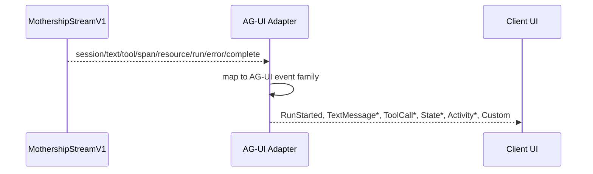
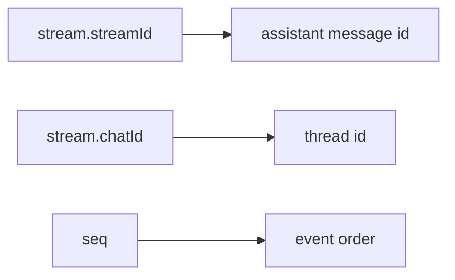
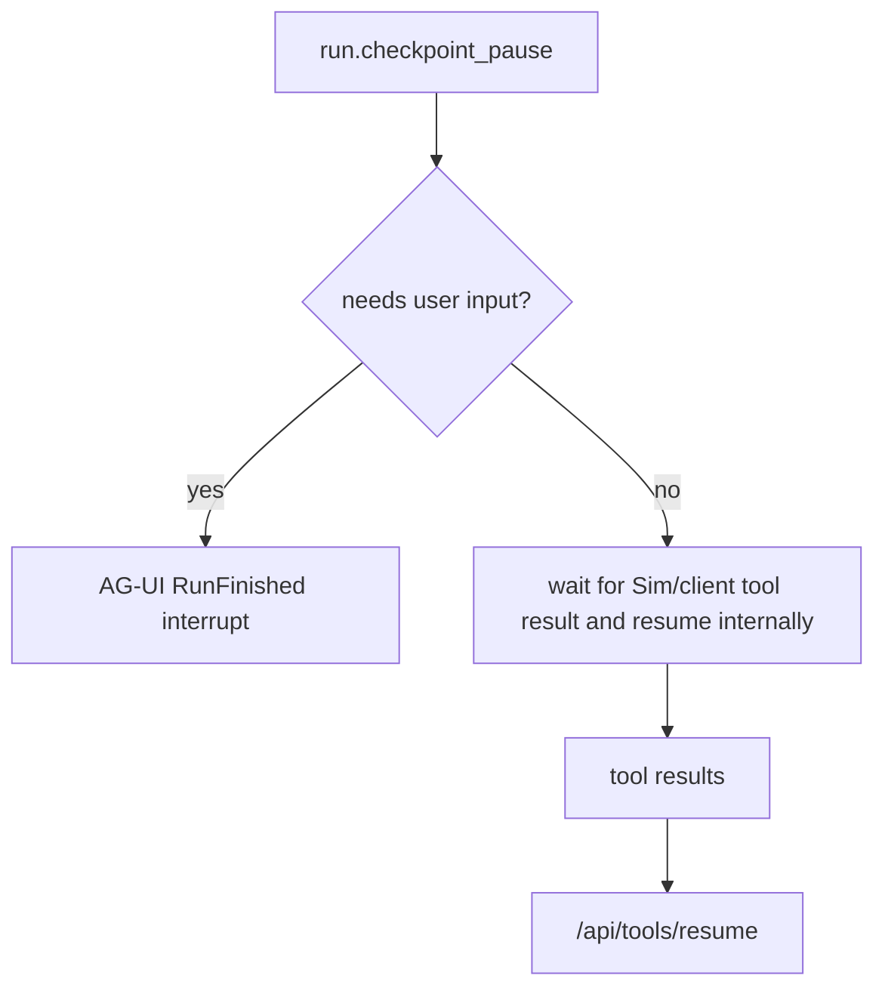

# 11. AG-UI 이벤트 매핑

이 페이지는 `MothershipStreamV1` event를 AG-UI event로 매핑합니다. 이 매핑은 projection이므로 원본 Mothership event가 source of truth로 남아야 합니다.

## 전체 흐름

## 이벤트 매트릭스

| Mothership event | AG-UI event | Projection rule |
| --- | --- | --- |
| `session.kind=start` | `RUN_STARTED` | 더 강한 run id가 없으면 `stream.streamId`를 `runId`로 사용해 AG-UI run을 시작합니다. |
| `session.kind=chat` | `STATE_SNAPSHOT` 또는 `CUSTOM` | `chatId`와 thread identity를 바인딩합니다. |
| `session.kind=title` | `STATE_DELTA` 또는 `CUSTOM` | 화면에 보이는 chat title을 갱신합니다. |
| `session.kind=trace` | `CUSTOM` | visible UX가 아니라 debugging용 trace id를 보존합니다. |
| `text.channel=assistant` | `TEXT_MESSAGE_START`, `TEXT_MESSAGE_CONTENT`, `TEXT_MESSAGE_END` | 안정적인 `messageId` 아래 assistant delta를 stream합니다. |
| `text.channel=thinking` | `ACTIVITY_*`, `REASONING_*`, 또는 hidden `CUSTOM` | private chain-of-thought를 노출하지 않습니다. 승인된 summary나 progress만 렌더링합니다. |
| `tool.phase=call` | `TOOL_CALL_START`와 선택적 `TOOL_CALL_ARGS` | `toolCallId`, `toolName`, arguments, executor, mode, UI flag를 보존합니다. |
| `tool.phase=args_delta` | `TOOL_CALL_ARGS` | argument delta를 순서대로 append합니다. |
| `tool.phase=result` | `TOOL_CALL_RESULT` | result는 렌더링하되 result ownership은 Mothership에 둡니다. |
| `span.kind=subagent` | `STEP_STARTED` / `STEP_FINISHED` 또는 `ACTIVITY_*` | span identity와 parent tool id로 subagent 작업을 그룹화합니다. |
| `span.kind=structured_result` | `ACTIVITY_SNAPSHOT` 또는 `CUSTOM` | plain chat text가 아니라 structured UI data로 취급합니다. |
| `resource.op=upsert` | `STATE_DELTA` 또는 `CUSTOM` | resource panel state를 추가하거나 갱신합니다. |
| `resource.op=remove` | `STATE_DELTA` 또는 `CUSTOM` | resource panel state를 제거합니다. |
| `run.kind=checkpoint_pause` | internal pause 또는 `RUN_FINISHED outcome=interrupt` | 사용자 입력이 필요할 때만 AG-UI interrupt로 투영합니다. |
| `run.kind=resumed` | `CUSTOM` | checkpoint continuation을 diagnostics용으로 표시합니다. |
| `run.kind=compaction_start` | `ACTIVITY_SNAPSHOT` | visible한 경우 context compaction을 activity로 보여줍니다. |
| `run.kind=compaction_done` | `ACTIVITY_DELTA` 또는 `ACTIVITY_SNAPSHOT` | compaction activity를 완료 처리합니다. |
| `error` | `RUN_ERROR` | terminal error projection입니다. |
| `complete.status=complete` | `RUN_FINISHED outcome=success` | terminal success projection입니다. |
| `complete.status=cancelled` | client semantics에 따라 `RUN_FINISHED` 또는 `RUN_ERROR` | cancellation reason을 보존합니다. |
| `complete.status=error` | `RUN_ERROR` | 이전에 error가 emit되지 않았다면 terminal error로 투영합니다. |

## 메시지 식별자

Mothership text event는 delta입니다. AG-UI text event에는 안정적인 `messageId`가 필요합니다.

권장 identity rule:

| AG-UI id | Source |
| --- | --- |
| `threadId` | `stream.chatId`가 있으면 그것을 사용하고, 없으면 workspace-scoped chat id를 사용합니다. |
| `runId` | Mothership run id가 있으면 그것을 사용하고, 없으면 `stream.streamId`를 사용합니다. |
| `messageId` | persisted assistant message id가 있으면 그것을 사용하고, 없으면 `${streamId}:assistant`를 사용합니다. |
| `toolCallId` | `payload.toolCallId` |

## Checkpoint와 Interrupt의 차이

Mothership의 `checkpoint_pause`가 항상 AG-UI interrupt인 것은 아닙니다.

AG-UI interrupt는 approval, structured user input, user-visible policy decision에 적합합니다. Sim-side tool execution pause는 내부 pause로 유지해야 합니다. 그래야 user-facing run이 잘못 완료된 것처럼 보이지 않습니다.

## 손실 없는 Projection

모든 AG-UI event는 아래 중 하나를 가지고 있어야 합니다.

1. `rawEvent`: Mothership envelope 원본.
2. `rawEventRef`: `{ streamId, seq, cursor }`.
3. `metadata.mothership`: 최소한의 Mothership identity field.

generic AG-UI client가 단순화된 view를 렌더링하더라도, 이 정보를 보존하면 debugging이 가능합니다.
