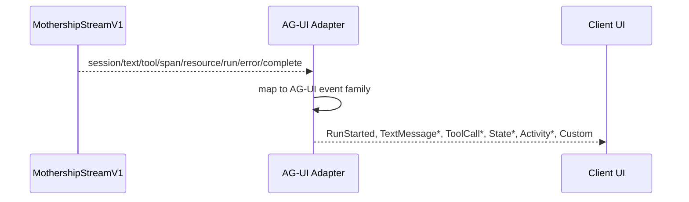
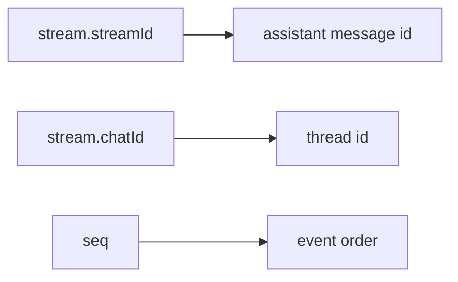
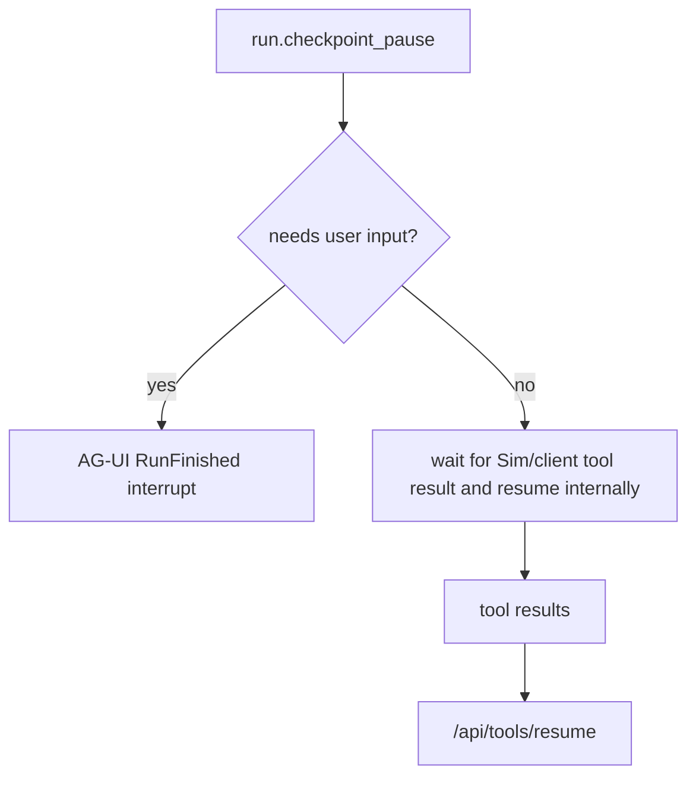

# 11. AG-UI Event Mapping

This page maps MothershipStreamV1 events to AG-UI events. The mapping is a projection, so the original Mothership event should remain the source of truth.

## High-Level Flow

## Event Matrix

| Mothership event | AG-UI event | Projection rule |
| --- | --- | --- |
| `session.kind=start` | `RUN_STARTED` | Start the AG-UI run using `stream.streamId` as `runId` when no stronger run id is available. |
| `session.kind=chat` | `STATE_SNAPSHOT` or `CUSTOM` | Bind `chatId` and thread identity. |
| `session.kind=title` | `STATE_DELTA` or `CUSTOM` | Update visible chat title. |
| `session.kind=trace` | `CUSTOM` | Preserve trace ids for debugging, not visible UX. |
| `text.channel=assistant` | `TEXT_MESSAGE_START`, `TEXT_MESSAGE_CONTENT`, `TEXT_MESSAGE_END` | Stream assistant deltas under a stable message id. |
| `text.channel=thinking` | `ACTIVITY_*`, `REASONING_*`, or hidden `CUSTOM` | Do not expose private chain-of-thought. Render only approved summaries or progress. |
| `tool.phase=call` | `TOOL_CALL_START` plus optional `TOOL_CALL_ARGS` | Preserve `toolCallId`, `toolName`, arguments, executor, mode, and UI flags. |
| `tool.phase=args_delta` | `TOOL_CALL_ARGS` | Append argument deltas in order. |
| `tool.phase=result` | `TOOL_CALL_RESULT` | Render result, but keep result ownership with Mothership. |
| `span.kind=subagent` | `STEP_STARTED` / `STEP_FINISHED` or `ACTIVITY_*` | Use span identity and parent tool id to group subagent work. |
| `span.kind=structured_result` | `ACTIVITY_SNAPSHOT` or `CUSTOM` | Treat as structured UI data, not plain chat text. |
| `resource.op=upsert` | `STATE_DELTA` or `CUSTOM` | Add or update resource panel state. |
| `resource.op=remove` | `STATE_DELTA` or `CUSTOM` | Remove resource panel state. |
| `run.kind=checkpoint_pause` | internal pause or `RUN_FINISHED outcome=interrupt` | Use AG-UI interrupt only when user input is required. |
| `run.kind=resumed` | `CUSTOM` | Mark checkpoint continuation for diagnostics. |
| `run.kind=compaction_start` | `ACTIVITY_SNAPSHOT` | Show context compaction as activity if visible. |
| `run.kind=compaction_done` | `ACTIVITY_DELTA` or `ACTIVITY_SNAPSHOT` | Complete the compaction activity. |
| `error` | `RUN_ERROR` | Terminal error projection. |
| `complete.status=complete` | `RUN_FINISHED outcome=success` | Terminal success projection. |
| `complete.status=cancelled` | `RUN_FINISHED` or `RUN_ERROR` depending client semantics | Preserve cancellation reason. |
| `complete.status=error` | `RUN_ERROR` | Terminal error projection if no prior error was emitted. |

## Message Identity

Mothership text events are deltas. AG-UI text events require a stable `messageId`.

Suggested identity rules:

| AG-UI id | Source |
| --- | --- |
| `threadId` | `stream.chatId` when present, otherwise workspace scoped chat id |
| `runId` | Mothership run id when available, otherwise `stream.streamId` |
| `messageId` | persisted assistant message id when available, otherwise `${streamId}:assistant` |
| `toolCallId` | `payload.toolCallId` |

## Checkpoint vs Interrupt

Mothership `checkpoint_pause` is not always an AG-UI interrupt.

AG-UI interrupts are appropriate for approvals, structured user input, or user-visible policy decisions. Sim-side tool execution pauses should stay internal so the user-facing run does not appear falsely complete.

## Lossless Projection

Every AG-UI event should carry one of these:

1. `rawEvent`: the Mothership envelope.
2. `rawEventRef`: `{ streamId, seq, cursor }`.
3. `metadata.mothership`: minimal Mothership identity fields.

This keeps debugging possible when a generic AG-UI client renders a simplified view.
