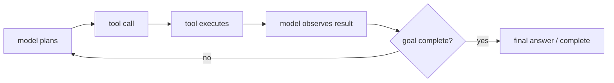
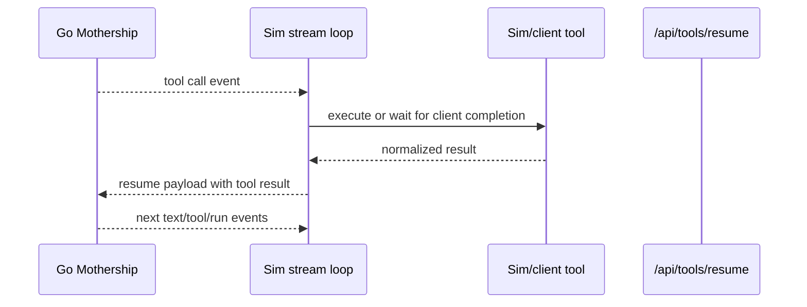
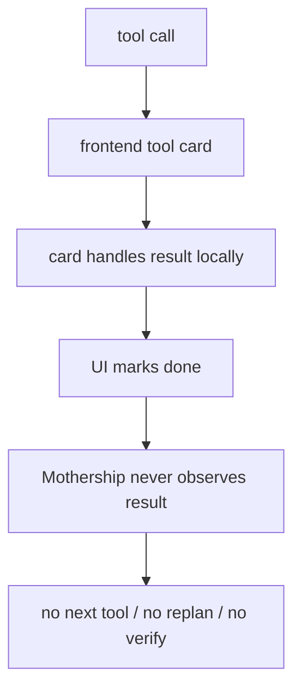
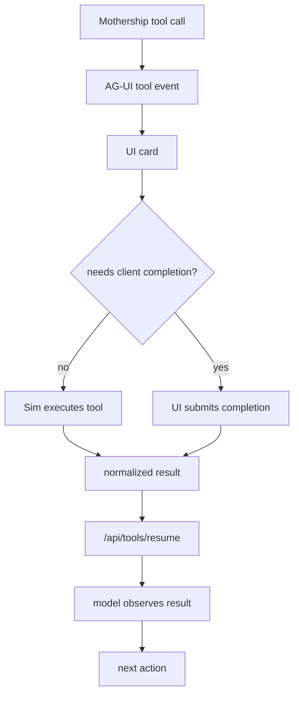
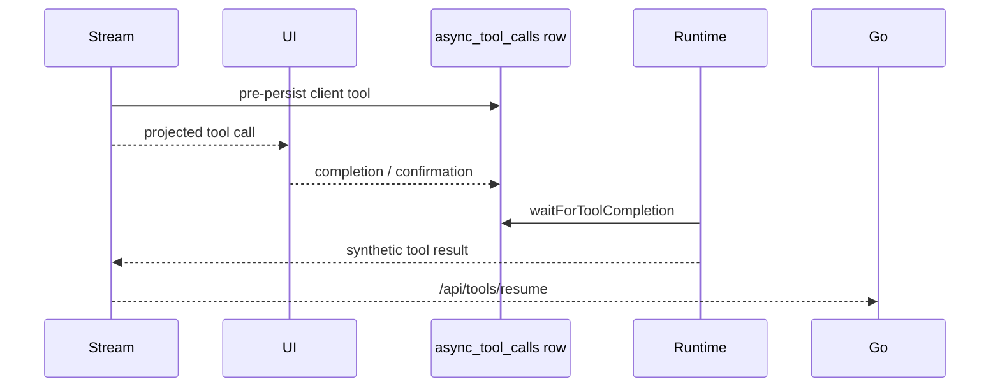

# 12. Tool Result 소유권

tool result의 주인은 Mothership run loop입니다. UI는 result를 렌더링할 수 있지만, 최종 소유자처럼 result를 소비하면 안 됩니다.

이 규칙이 Mothership을 AG-UI 또는 CopilotKit과 연결할 때 가장 중요한 경계입니다. “tool card가 성공했다”와 “사용자 목표가 끝났다”는 같은 말이 아닙니다.

## 핵심 원칙

Mothership은 다음 loop를 전제로 움직입니다.

UI가 tool result를 가로채면 `Observe` 단계가 사라집니다. 그 순간 agent는 다음 tool을 고르거나, 실패를 repair하거나, deploy 후 verify하는 판단을 할 수 없습니다.

## 현재 Runtime 구조

관련 code path:

- [`runCheckpointLoop`](https://github.com/nfbs2000/speaky-sim/blob/db47da58d/apps/sim/lib/copilot/request/lifecycle/run.ts#L238)이 checkpoint와 resume을 소유합니다.
- [`handleRunEvent`](https://github.com/nfbs2000/speaky-sim/blob/db47da58d/apps/sim/lib/copilot/request/handlers/run.ts#L11)이 `checkpoint_pause`를 기록합니다.
- [`handleToolEvent`](https://github.com/nfbs2000/speaky-sim/blob/db47da58d/apps/sim/lib/copilot/request/handlers/tool.ts#L117)이 tool call을 기록하고 dispatch합니다.
- [`dispatchToolExecution`](https://github.com/nfbs2000/speaky-sim/blob/db47da58d/apps/sim/lib/copilot/request/handlers/tool.ts#L442)이 Sim execution과 client completion 중 어떤 경로를 쓸지 선택합니다.
- [`runCheckpointLoop`의 resume payload assembly](https://github.com/nfbs2000/speaky-sim/blob/db47da58d/apps/sim/lib/copilot/request/lifecycle/run.ts#L530)가 result를 `/api/tools/resume`으로 다시 loop 안에 넣습니다.

## Ownership 분리

| Actor | Responsibility | 절대 하면 안 되는 일 |
| --- | --- | --- |
| model | tool call을 제안하고 result를 observation으로 본 뒤 계속 진행 | UI card 성공 여부만 보고 목표 완료로 간주 |
| Go Mothership | checkpoint를 만들고 result 이후 run을 이어감 | frontend-local state를 canonical result로 신뢰 |
| Sim runtime | Sim-owned tool 실행, client-owned tool 대기, result normalize | result를 UI 렌더링 전용으로 소비 |
| AG-UI adapter | call/result를 UI event로 노출 | `TOOL_CALL_RESULT`를 terminal completion으로 오해 |
| UI | card 렌더링, input capture, completion 제출 | Mothership resume 없이 result를 삼킴 |

tool card 하나가 성공했다고 해서 UI가 사용자 목표 전체가 완료됐다고 판단하면 안 됩니다.

## 나쁜 패턴

이 패턴은 multi-step 작업을 깨뜨립니다.

- read result를 보고 다음 tool을 골라야 합니다.
- write result 뒤에는 verify/run/deploy가 이어져야 합니다.
- workflow 생성 뒤에는 execution, log inspection, repair, rerun, deployment가 이어질 수 있습니다.
- OpenCode-style agent는 tool output을 observation으로 보고 replan해야 합니다.
- LangGraph-style graph도 node output을 다음 edge 판단에 사용합니다.

## 좋은 패턴

AG-UI의 `TOOL_CALL_RESULT`는 canonical tool result의 display projection으로 취급해야 합니다. agent loop의 끝으로 취급하면 안 됩니다.

## 현재 코드가 이미 잡고 있는 경계

`handleToolEvent`는 tool event를 받으면 main/subagent scope를 구분하고, call phase와 result phase를 다르게 처리합니다.

| 코드 위치 | 하는 일 |
| --- | --- |
| `prePersistClientExecutableToolCall` | client-executable tool을 UI가 confirm하기 전에 async row로 먼저 persist합니다. |
| `handleCallPhase` | tool call을 `context.toolCalls`와 content block에 등록합니다. |
| `dispatchToolExecution` | Sim 실행, client completion 대기, auto execute 여부를 결정합니다. |
| `handleResultPhase` | result를 terminal tool state로 기록하고 `markToolResultSeen` 처리합니다. |
| `runCheckpointLoop` | pending tool promise를 기다리고, result를 모아 `/api/tools/resume`으로 보냅니다. |

이 구조에서 AG-UI adapter가 들어갈 자리는 “보여주는 곳”입니다. 실행과 resume ownership을 가져가면 현재 runtime 구조와 충돌합니다.

## Client-Executable Tool

일부 tool call은 client-executable일 수 있습니다. 현재 code는 async tool row를 먼저 persist하고 completion을 기다리는 방식으로 이를 처리합니다.

AG-UI는 browser interaction을 운반할 수 있습니다. 하지만 completion은 반드시 runtime으로 돌아와야 합니다.

## Follow-Up Rule

후속 작업이 필요한 Mothership step을 terminal UI action으로 바꾸면 안 됩니다.

반드시 loop를 계속 이어가야 하는 경우:

| Case | 이유 | 예시 |
| --- | --- | --- |
| tool result를 보고 다음 tool을 골라야 하는 경우 | model에게 observation이 필요합니다. | `glob` 결과를 보고 `read` 선택 |
| read evidence를 보고 write/run/deploy action으로 이어지는 경우 | read 자체가 사용자 목표가 아닙니다. | 파일 읽기 뒤 patch 적용 |
| OpenCode 또는 LangGraph가 tool output으로 replan하는 경우 | result가 agent에게 보여야 합니다. | failing test output 기반 수정 |
| workflow 생성, 실행, 로그 검사, repair, rerun, deploy | 서로 이어진 chained operation입니다. | workflow build 뒤 execution log 확인 |
| Mothership read/write tool 하나가 성공한 경우 | tool 하나의 성공은 전체 목표 완료가 아닙니다. | write 성공 뒤 build/test 필요 |
| subagent가 structured result를 반환한 경우 | parent agent가 result를 해석해야 합니다. | research subagent 결과를 main plan에 반영 |

`followUp: false` 또는 동등한 terminal flag는 pure UI command나 진짜 최종 one-shot action에만 남겨야 합니다.

## `followUp: false`를 써도 되는 경우

| 경우 | 이유 |
| --- | --- |
| UI panel open/close | agent observation이 필요하지 않은 local UI state |
| theme toggle | runtime goal과 무관한 pure client command |
| 이미 final answer가 생성된 뒤의 copy action | model이 다음 action을 고를 필요 없음 |
| telemetry-only acknowledgement | tool result가 planning input이 아님 |

## `followUp: false`를 쓰면 안 되는 경우

| 경우 | 이유 |
| --- | --- |
| tool result를 보고 다음 tool을 골라야 함 | loop가 끊기면 agent가 observation을 못 봄 |
| read evidence를 보고 write/run/deploy로 이어져야 함 | read 결과는 중간 상태 |
| OpenCode나 LangGraph가 replan해야 함 | planner가 result를 봐야 함 |
| workflow create/execute/log/repair/rerun/deploy chain | 한 step 성공은 전체 성공이 아님 |
| Mothership read/write tool 성공 | global completion과 다름 |

## AG-UI Contract Rule

AG-UI integration에서는 다음 규칙을 지킵니다.

1. 투명성을 위해 `TOOL_CALL_START`와 `TOOL_CALL_ARGS`를 emit합니다.
2. 유용하다면 card를 렌더링합니다.
3. browser action이나 approval이 필요하면 그것을 수집합니다.
4. completion을 Sim/Mothership으로 돌려보냅니다.
5. `TOOL_CALL_RESULT`를 projection으로 emit합니다.
6. checkpoint 상태라면 Mothership loop를 resume합니다.

Mothership이 result를 계속 볼 수 있고 다음 action을 결정할 수 있을 때만 adapter가 올바른 것입니다.

## 구현자가 확인해야 할 Invariant

| Invariant | 깨졌을 때 증상 |
| --- | --- |
| 모든 pending tool은 terminal result 또는 error를 가져야 함 | checkpoint resume이 missing result로 실패 |
| client completion은 async row를 통해 runtime에 도착해야 함 | UI는 성공했지만 model이 result를 모름 |
| `TOOL_CALL_RESULT`는 display projection이어야 함 | AG-UI client가 run을 조기 종료 |
| subagent tool result는 parent scope를 보존해야 함 | subagent work가 main tool처럼 섞임 |
| failed tool도 observation으로 돌아가야 함 | agent가 repair할 기회를 잃음 |

## Acceptance Criteria

AG-UI tool integration은 아래 조건을 만족해야 합니다.

- UI에서 tool card가 보인다.
- tool result가 AG-UI client에 렌더링된다.
- 같은 result가 Mothership resume payload에 들어간다.
- model이 result 이후 다음 text/tool/complete를 생성한다.
- replay 시 같은 tool lifecycle을 다시 볼 수 있다.
- frontend-only success가 run completion으로 오인되지 않는다.
