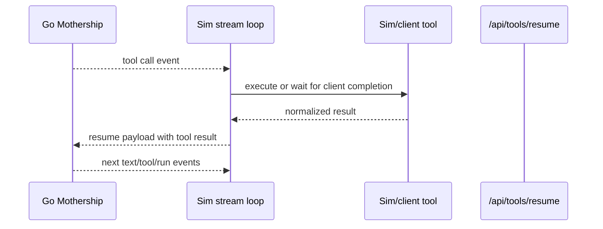
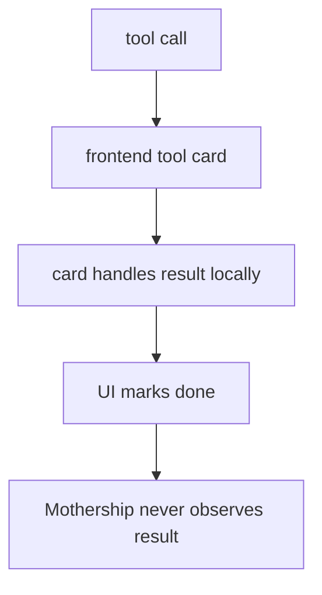
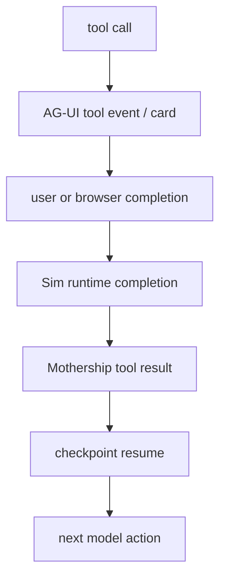
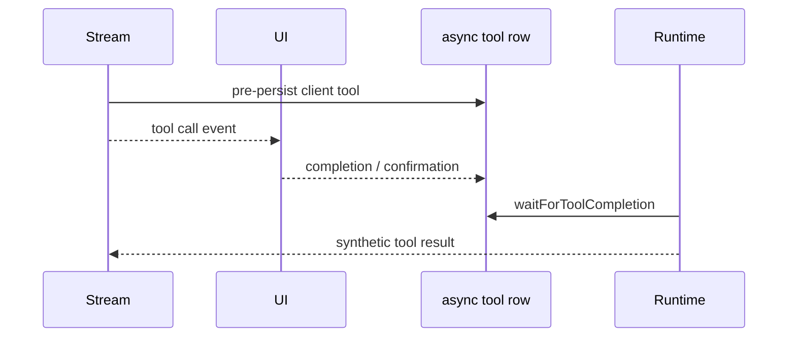

# 12. Tool Result Ownership

The tool result belongs to the Mothership run loop. The UI may render it, but it must not consume it as the final owner.

This is the key rule for connecting Mothership to AG-UI or CopilotKit.

## Current Runtime Shape

The relevant code path:

- [`runCheckpointLoop`](https://github.com/nfbs2000/speaky-sim/blob/db47da58d/apps/sim/lib/copilot/request/lifecycle/run.ts#L238) owns checkpoint and resume.
- [`handleRunEvent`](https://github.com/nfbs2000/speaky-sim/blob/db47da58d/apps/sim/lib/copilot/request/handlers/run.ts#L11) records `checkpoint_pause`.
- [`handleToolEvent`](https://github.com/nfbs2000/speaky-sim/blob/db47da58d/apps/sim/lib/copilot/request/handlers/tool.ts#L117) records and dispatches tool calls.
- [`dispatchToolExecution`](https://github.com/nfbs2000/speaky-sim/blob/db47da58d/apps/sim/lib/copilot/request/handlers/tool.ts#L442) chooses Sim execution or client completion.
- [`/api/tools/resume` payload assembly](https://github.com/nfbs2000/speaky-sim/blob/db47da58d/apps/sim/lib/copilot/request/lifecycle/run.ts#L530) sends results back into the loop.

## Ownership Split

| Actor | Responsibility |
| --- | --- |
| model | propose a tool call and continue after observing result |
| Go Mothership | checkpoint and continue the run |
| Sim runtime | execute Sim-owned tools, wait for client-owned tools, normalize result |
| AG-UI adapter | expose call/result as UI events |
| UI | render card, ask for input, submit completion when required |

The UI does not decide that the user goal is complete just because a tool card succeeded.

## Bad Pattern

This breaks multi-step work:

- read result should choose the next tool.
- write result should trigger verify/run/deploy.
- workflow creation should continue into execution, log inspection, repair, rerun, or deployment.
- OpenCode-style agents must observe tool output to replan.

## Good Pattern

AG-UI `TOOL_CALL_RESULT` should be treated as a display projection of the canonical tool result, not as the end of the agent loop.

## Client-Executable Tools

Some tool calls can be client-executable. The code already handles that by pre-persisting the async tool row and waiting for completion.

The implementation should keep this structure. AG-UI can carry the browser interaction, but completion must return to the runtime.

## Follow-Up Rule

Do not turn a Mothership step into a terminal UI action when follow-up work is required.

Cases that must continue the loop:

| Case | Why |
| --- | --- |
| tool result determines the next tool | model needs observation |
| read evidence leads to write/run/deploy | read is not the user goal |
| OpenCode or LangGraph replans from tool output | result must be visible to agent |
| workflow create, execute, inspect logs, repair, rerun, deploy | these are chained operations |
| Mothership read/write tool succeeded | success of one tool is not global completion |

`followUp: false` or equivalent terminal flags should be reserved for pure UI commands or truly final one-shot actions.

## AG-UI Contract Rule

For AG-UI integration:

1. Emit `TOOL_CALL_START` and `TOOL_CALL_ARGS` for transparency.
2. Render a card if useful.
3. If browser action or approval is needed, collect it.
4. Send completion back to Sim/Mothership.
5. Emit `TOOL_CALL_RESULT` as projection.
6. Resume the Mothership loop when checkpointed.

The adapter is correct only if Mothership can still see the result and decide the next action.
