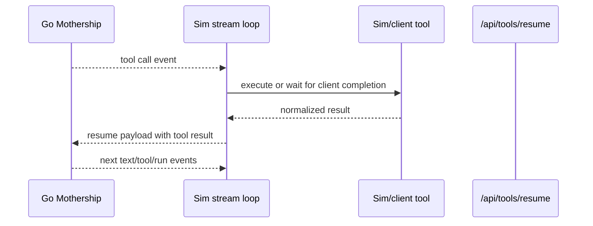
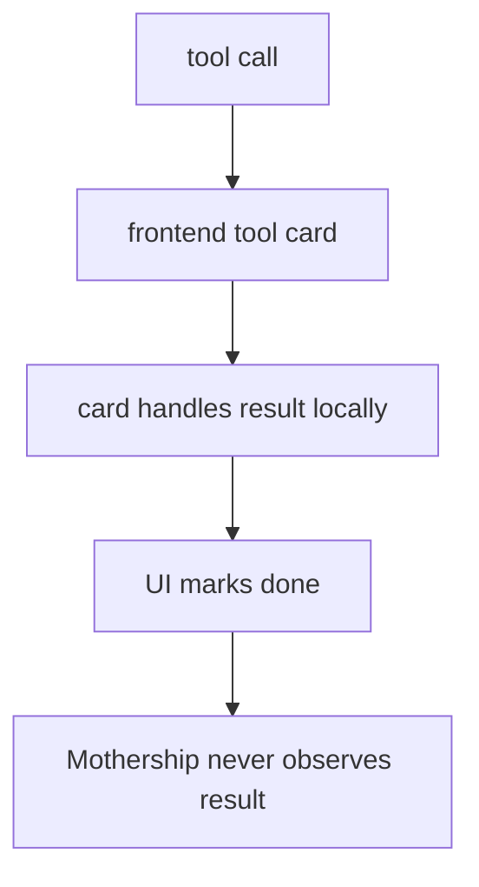
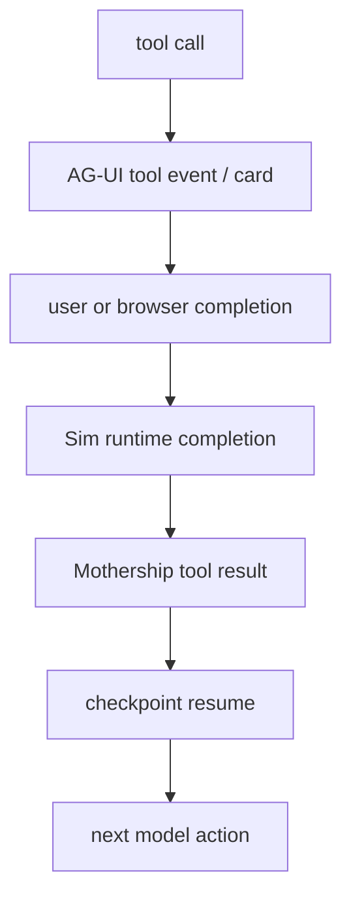
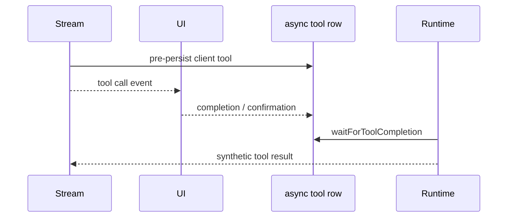

# 12. Tool Result 소유권

tool result의 주인은 Mothership run loop입니다. UI는 result를 렌더링할 수 있지만, 최종 소유자처럼 result를 소비하면 안 됩니다.

이 규칙이 Mothership을 AG-UI 또는 CopilotKit과 연결할 때 가장 중요한 경계입니다.

## 현재 Runtime 구조

관련 code path:

- [`runCheckpointLoop`](https://github.com/nfbs2000/speaky-sim/blob/db47da58d/apps/sim/lib/copilot/request/lifecycle/run.ts#L238)이 checkpoint와 resume을 소유합니다.
- [`handleRunEvent`](https://github.com/nfbs2000/speaky-sim/blob/db47da58d/apps/sim/lib/copilot/request/handlers/run.ts#L11)이 `checkpoint_pause`를 기록합니다.
- [`handleToolEvent`](https://github.com/nfbs2000/speaky-sim/blob/db47da58d/apps/sim/lib/copilot/request/handlers/tool.ts#L117)이 tool call을 기록하고 dispatch합니다.
- [`dispatchToolExecution`](https://github.com/nfbs2000/speaky-sim/blob/db47da58d/apps/sim/lib/copilot/request/handlers/tool.ts#L442)이 Sim execution과 client completion 중 어떤 경로를 쓸지 선택합니다.
- [`/api/tools/resume` payload assembly](https://github.com/nfbs2000/speaky-sim/blob/db47da58d/apps/sim/lib/copilot/request/lifecycle/run.ts#L530)가 result를 다시 loop 안으로 보냅니다.

## Ownership 분리

| Actor | Responsibility |
| --- | --- |
| model | tool call을 제안하고 result를 observation으로 본 뒤 계속 진행합니다. |
| Go Mothership | checkpoint를 만들고 run을 이어갑니다. |
| Sim runtime | Sim-owned tool을 실행하고, client-owned tool을 기다리고, result를 normalize합니다. |
| AG-UI adapter | call/result를 UI event로 노출합니다. |
| UI | card를 렌더링하고, input을 받고, 필요한 경우 completion을 제출합니다. |

tool card 하나가 성공했다고 해서 UI가 사용자 목표 전체가 완료됐다고 판단하면 안 됩니다.

## 나쁜 패턴

이 패턴은 multi-step 작업을 깨뜨립니다.

- read result를 보고 다음 tool을 골라야 합니다.
- write result 뒤에는 verify/run/deploy가 이어져야 합니다.
- workflow 생성 뒤에는 execution, log inspection, repair, rerun, deployment가 이어질 수 있습니다.
- OpenCode-style agent는 tool output을 observation으로 보고 replan해야 합니다.

## 좋은 패턴

AG-UI의 `TOOL_CALL_RESULT`는 canonical tool result의 display projection으로 취급해야 합니다. agent loop의 끝으로 취급하면 안 됩니다.

## Client-Executable Tool

일부 tool call은 client-executable일 수 있습니다. 현재 code는 async tool row를 먼저 persist하고 completion을 기다리는 방식으로 이를 처리합니다.

구현은 이 구조를 유지해야 합니다. AG-UI가 browser interaction을 운반할 수는 있지만, completion은 반드시 runtime으로 돌아와야 합니다.

## Follow-Up Rule

후속 작업이 필요한 Mothership step을 terminal UI action으로 바꾸면 안 됩니다.

반드시 loop를 계속 이어가야 하는 경우:

| Case | 이유 |
| --- | --- |
| tool result를 보고 다음 tool을 골라야 하는 경우 | model에게 observation이 필요합니다. |
| read evidence를 보고 write/run/deploy action으로 이어지는 경우 | read 자체가 사용자 목표가 아닙니다. |
| OpenCode 또는 LangGraph가 tool output으로 replan하는 경우 | result가 agent에게 보여야 합니다. |
| workflow 생성, 실행, 로그 검사, repair, rerun, deploy | 서로 이어진 chained operation입니다. |
| Mothership read/write tool 하나가 성공한 경우 | tool 하나의 성공은 전체 목표 완료가 아닙니다. |

`followUp: false` 또는 동등한 terminal flag는 pure UI command나 진짜 최종 one-shot action에만 남겨야 합니다.

## AG-UI Contract Rule

AG-UI integration에서는 다음 규칙을 지킵니다.

1. 투명성을 위해 `TOOL_CALL_START`와 `TOOL_CALL_ARGS`를 emit합니다.
2. 유용하다면 card를 렌더링합니다.
3. browser action이나 approval이 필요하면 그것을 수집합니다.
4. completion을 Sim/Mothership으로 돌려보냅니다.
5. `TOOL_CALL_RESULT`를 projection으로 emit합니다.
6. checkpoint 상태라면 Mothership loop를 resume합니다.

Mothership이 result를 계속 볼 수 있고 다음 action을 결정할 수 있을 때만 adapter가 올바른 것입니다.
