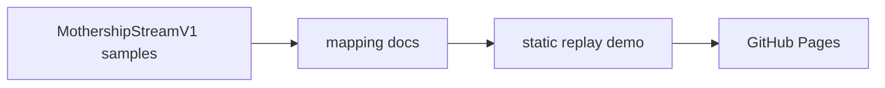
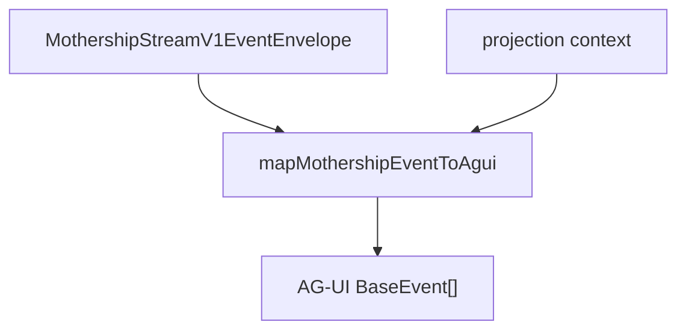
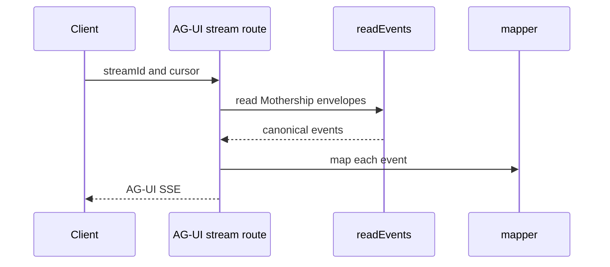
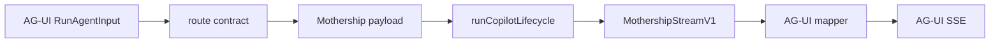

# 13. AG-UI 구현 계획

AG-UI는 layer를 나누어 구현해야 합니다. 처음부터 기존 Mothership stream loop를 대체하면 안 됩니다.

## Phase 1: 정적 Projection 문서

Pages site에 문서와 replay sample을 먼저 추가합니다.



산출물:

| 항목 | Path |
| --- | --- |
| positioning 문서 | `site/docs/mothership-contract/10-agui-positioning.md` |
| event map | `site/docs/mothership-contract/11-agui-event-map.md` |
| tool ownership 문서 | `site/docs/mothership-contract/12-tool-result-ownership.md` |
| implementation plan | `site/docs/mothership-contract/13-agui-implementation-plan.md` |

## Phase 2: Mapper Library

Sim app 안에 pure mapper를 추가합니다. 이 mapper는 side effect가 없어야 하고 tool을 실행하면 안 됩니다.

권장 file:

```text
apps/sim/lib/copilot/agui/types.ts
apps/sim/lib/copilot/agui/mothership-to-agui.ts
apps/sim/lib/copilot/agui/mothership-to-agui.test.ts
```



규칙:

1. input은 Mothership envelope입니다.
2. output은 0개 이상의 AG-UI event입니다.
3. mapping은 ordering을 보존합니다.
4. mapping은 raw event identity를 보존합니다.
5. mapping은 tool을 실행하거나 run state를 mutate하지 않습니다.

## Phase 3: Read-Only AG-UI Stream

기존 stream의 AG-UI projection을 노출합니다.

```text
GET /api/mothership/agui/stream?streamId=...
```

이 endpoint는 기존 stream replay machinery를 재사용해야 합니다.

- `readEvents(streamId, cursor)`
- cursor handling
- keepalive comment
- terminal event handling
- auth check



이 단계가 가장 안전한 runtime addition입니다. execution path를 바꾸지 않기 때문입니다.

## Phase 4: AG-UI Run Endpoint

read-only projection이 안정화된 뒤 true AG-UI server endpoint를 추가합니다.

```text
POST /api/mothership/agui
```

input은 AG-UI `RunAgentInput`이어야 합니다. 내부에서는 이를 기존 Mothership chat payload로 변환하고 normal lifecycle을 그대로 통과시킵니다.



Sim 구현 규칙:

| Area | Rule |
| --- | --- |
| route contract | route-local Zod가 아니라 `apps/sim/lib/api/contracts` 아래 boundary schema를 정의합니다. |
| route handler | route는 `withRouteHandler`로 감쌉니다. |
| auth | 기존 route pattern이 요구하는 곳에서는 untrusted body를 parse하기 전에 authenticate합니다. |
| raw fetch/json | 피할 수 없을 때만 기존 boundary exception을 쓰고 annotation을 남깁니다. |
| tool execution | 기존 `runCheckpointLoop`와 `executeToolAndReport` ownership을 유지합니다. |
| AG-UI output | mapped AG-UI event를 SSE로 encode합니다. |

## Phase 5: UI Integration

endpoint가 안정화된 뒤 UI client를 붙입니다.

선택지:

| Option | Use when |
| --- | --- |
| custom AG-UI client | 기존 resource panel과 workflow UI를 Sim이 정확히 통제해야 할 때 |
| CopilotKit client | ready-made AG-UI client surface가 필요할 때 |
| hybrid | chat shell은 CopilotKit을 쓰고, Mothership resource는 custom renderer로 처리할 때 |

현실적으로는 hybrid path가 가장 낫습니다. Mothership에는 resource tab, workflow preview, file preview, subagent group, checkpoint behavior가 있고, generic chat UI는 custom rendering 없이 이 구조를 제대로 이해하기 어렵습니다.

## Test Plan

| Test | Purpose |
| --- | --- |
| mapper snapshot test | Mothership event 하나가 기대한 AG-UI event sequence로 바뀌는지 확인합니다. |
| tool result ownership test | tool result projection이 resume payload를 억누르지 않는지 확인합니다. |
| checkpoint test | user input이 필요하지 않은 internal checkpoint가 외부 interrupt로 새지 않는지 확인합니다. |
| SSE replay test | cursor, reconnect, terminal, keepalive behavior가 안정적인지 확인합니다. |
| browser smoke test | client가 RunStarted, text, tool, result, RunFinished를 순서대로 받는지 확인합니다. |

## Rollout Rule

AG-UI stream은 먼저 read-only로 ship합니다.

read-only projection이 안정적이면 그 다음 AG-UI client가 run을 시작하도록 허용합니다. 이렇게 해야 mapping이 검증되기 전에 새 UI protocol을 critical path에 넣는 일을 피할 수 있습니다.
