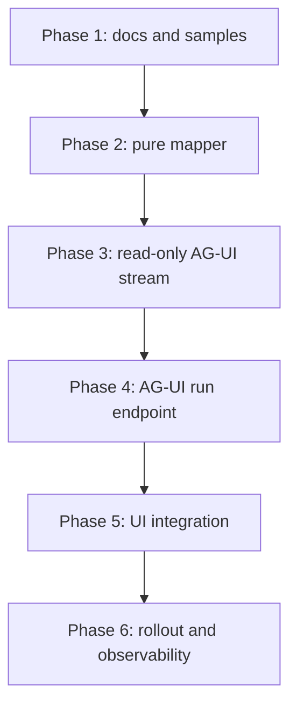
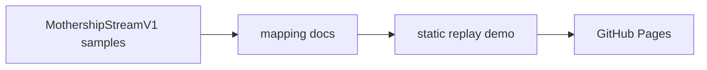
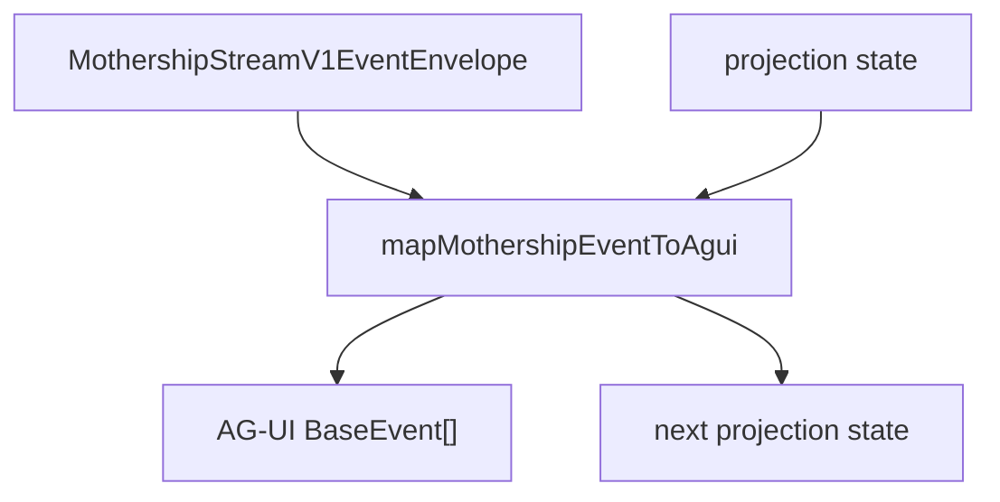
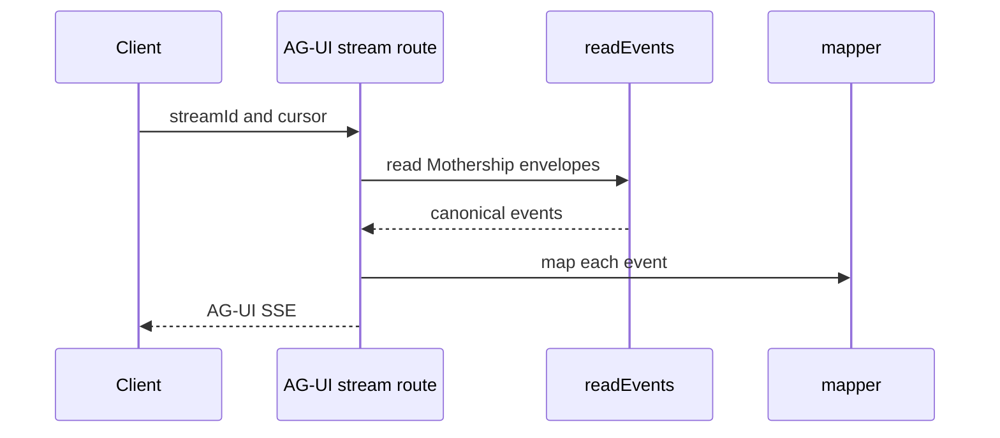
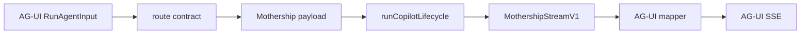
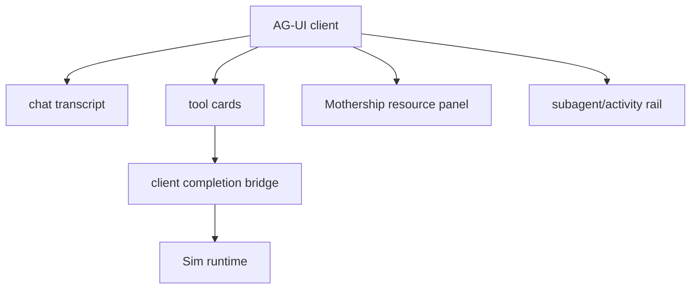

# 13. AG-UI 구현 계획

AG-UI는 layer를 나누어 구현해야 합니다. 처음부터 기존 Mothership stream loop를 대체하면 안 됩니다.

목표는 세 가지입니다.

1. 기존 `MothershipStreamV1` runtime을 보존합니다.
2. AG-UI client가 Mothership run을 표준 event로 볼 수 있게 합니다.
3. tool result, checkpoint, resume ownership을 Sim/Mothership 쪽에 유지합니다.

## 전체 단계



## Phase 1: 정적 Projection 문서

Pages site에 문서와 replay sample을 먼저 추가합니다.



산출물:

| 항목 | Path |
| --- | --- |
| positioning 문서 | `site/docs/mothership-contract/10-agui-positioning.md` |
| event map | `site/docs/mothership-contract/11-agui-event-map.md` |
| tool ownership 문서 | `site/docs/mothership-contract/12-tool-result-ownership.md` |
| implementation plan | `site/docs/mothership-contract/13-agui-implementation-plan.md` |

추가로 만들면 좋은 sample:

| sample | 목적 |
| --- | --- |
| simple assistant text | text delta/message lifecycle 검증 |
| Sim-owned tool call | call/result projection 검증 |
| client-executable tool | interrupt/completion/resume 검증 |
| subagent span | nested activity/step 검증 |
| resource upsert/remove | state/resource panel 검증 |
| checkpoint pause/resume | internal pause와 user interrupt 구분 검증 |

## Phase 2: Mapper Library

Sim app 안에 pure mapper를 추가합니다. 이 mapper는 side effect가 없어야 하고 tool을 실행하면 안 됩니다.

권장 file:

```text
apps/sim/lib/copilot/agui/types.ts
apps/sim/lib/copilot/agui/mothership-to-agui.ts
apps/sim/lib/copilot/agui/mothership-to-agui.test.ts
apps/sim/lib/copilot/agui/projection-state.ts
```



권장 API:

```ts
type MothershipAguiProjectionState = {
  runStarted: boolean
  openAssistantMessageId?: string
  toolArgsByCallId: Record<string, string>
  completedToolCallIds: Set<string>
  terminalEmitted: boolean
}

function mapMothershipEventToAgui(input: {
  event: MothershipStreamV1EventEnvelope
  state: MothershipAguiProjectionState
}): {
  events: BaseEvent[]
  state: MothershipAguiProjectionState
}
```

Mapper 규칙:

1. input은 Mothership envelope입니다.
2. output은 0개 이상의 AG-UI event입니다.
3. mapping은 ordering을 보존합니다.
4. mapping은 raw event identity를 보존합니다.
5. mapping은 tool을 실행하지 않습니다.
6. mapping은 Mothership run state를 mutate하지 않습니다.
7. message/tool lifecycle을 닫기 위한 projection-local state만 가집니다.

## Phase 3: Read-Only AG-UI Stream

기존 stream의 AG-UI projection을 read-only로 노출합니다.

```text
GET /api/mothership/agui/stream?streamId=...
```

이 endpoint는 기존 stream replay machinery를 재사용해야 합니다.

- `readEvents(streamId, cursor)`
- cursor handling
- keepalive comment
- terminal event handling
- auth check
- mapper state per connection



이 단계가 가장 안전한 runtime addition입니다. execution path를 바꾸지 않기 때문입니다.

Sim route 규칙:

| Area | Rule |
| --- | --- |
| route contract | boundary schema는 `apps/sim/lib/api/contracts` 아래 둡니다. |
| route handler | `withRouteHandler`로 감쌉니다. |
| auth | 기존 Mothership stream 접근 권한과 동일하게 확인합니다. |
| response | SSE라면 contract에서 streaming 예외를 명확히 둡니다. |
| raw fetch/json | 불가피한 경우만 annotation을 남깁니다. |

## Phase 4: AG-UI Run Endpoint

read-only projection이 안정화된 뒤 true AG-UI server endpoint를 추가합니다.

```text
POST /api/mothership/agui
```

input은 AG-UI `RunAgentInput`이어야 합니다. 내부에서는 이를 기존 Mothership chat payload로 변환하고 normal lifecycle을 그대로 통과시킵니다.



중요한 점은 `runCopilotLifecycle`과 `runCheckpointLoop`를 우회하지 않는 것입니다. 새 endpoint가 생겨도 checkpoint/resume/tool result ownership은 기존 lifecycle이 가져야 합니다.

입력 변환 기준:

| AG-UI input | Mothership payload |
| --- | --- |
| thread/run id | `chatId`, `messageId`, `runId` |
| user message | Mothership chat message |
| state/context | workspace, workflow, file/context payload |
| tool availability | 기존 Sim tool registry와 permission projection |
| user metadata | request metadata, timezone, permission |

출력 변환 기준:

| Mothership output | AG-UI output |
| --- | --- |
| stream event | mapper output |
| tool result | display projection plus runtime resume |
| checkpoint pause | internal wait or interrupt |
| complete/error | terminal AG-UI event |

## Phase 5: UI Integration

endpoint가 안정화된 뒤 UI client를 붙입니다.

선택지:

| Option | Use when | Risk |
| --- | --- | --- |
| custom AG-UI client | 기존 resource panel과 workflow UI를 Sim이 정확히 통제해야 할 때 | 구현량이 큼 |
| CopilotKit client | ready-made AG-UI client surface가 필요할 때 | generic UI가 Mothership resource를 모를 수 있음 |
| hybrid | chat shell은 CopilotKit, Mothership resource는 custom renderer | boundary 설계가 필요 |

현실적으로는 hybrid path가 가장 낫습니다. Mothership에는 resource tab, workflow preview, file preview, subagent group, checkpoint behavior가 있고, generic chat UI는 custom rendering 없이 이 구조를 제대로 이해하기 어렵습니다.

권장 UI 구조:



## Phase 6: Rollout과 Observability

처음부터 모든 user traffic을 AG-UI로 보내면 안 됩니다.

| 단계 | 기준 |
| --- | --- |
| local replay | sample event가 예상 AG-UI event로 변환됨 |
| read-only dogfood | 기존 run을 AG-UI client에서 보기만 함 |
| hidden beta | selected workspace/user만 AG-UI endpoint 사용 |
| partial production | chat display만 AG-UI, tool resume은 기존 path |
| full production | AG-UI run endpoint까지 허용 |

필수 metric:

| Metric | 보는 이유 |
| --- | --- |
| mapped event count by type | 특정 event family가 누락되는지 확인 |
| unmapped event count | schema drift 감지 |
| tool call start/result balance | result 누락 감지 |
| checkpoint pause/resume latency | client completion 병목 감지 |
| terminal event duplication | reconnect/replay idempotency 확인 |
| rawEventRef lookup failure | debugging reference 손실 감지 |

## Test Plan

| Test | Purpose |
| --- | --- |
| mapper snapshot test | Mothership event 하나가 기대한 AG-UI event sequence로 바뀌는지 확인합니다. |
| text lifecycle test | assistant delta가 start/content/end 순서로 닫히는지 확인합니다. |
| tool result ownership test | tool result projection이 resume payload를 억누르지 않는지 확인합니다. |
| checkpoint test | user input이 필요하지 않은 internal checkpoint가 외부 interrupt로 새지 않는지 확인합니다. |
| client tool completion test | UI completion이 async row와 runtime resume으로 이어지는지 확인합니다. |
| subagent scope test | parentToolCallId/spanId가 projection metadata에 남는지 확인합니다. |
| resource state test | upsert/remove가 state delta로 안정적으로 반영되는지 확인합니다. |
| SSE replay test | cursor, reconnect, terminal, keepalive behavior가 안정적인지 확인합니다. |
| browser smoke test | client가 RunStarted, text, tool, result, RunFinished를 순서대로 받는지 확인합니다. |

## Failure Mode

| Failure | 원인 | 대응 |
| --- | --- | --- |
| UI는 tool 성공으로 보이지만 agent가 멈춤 | result가 Mothership resume으로 안 돌아감 | completion bridge와 resume payload 확인 |
| 같은 tool card가 중복 표시됨 | replay/reconnect idempotency 부족 | `toolCallId` dedupe |
| assistant message가 끝나지 않음 | terminal에서 `TEXT_MESSAGE_END` 누락 | projection state에 open message 관리 |
| checkpoint가 interrupt로 너무 많이 보임 | internal pause와 user input pause를 구분하지 않음 | interrupt policy 분리 |
| subagent 결과가 main tool처럼 보임 | `scope.parentToolCallId` 손실 | metadata 보존 |
| AG-UI 제거 시 runtime이 깨짐 | adapter가 runtime state를 소유 | adapter를 read-only projection으로 되돌림 |

## Rollout Rule

AG-UI stream은 먼저 read-only로 ship합니다.

read-only projection이 안정적이면 그 다음 AG-UI client가 run을 시작하도록 허용합니다. 이렇게 해야 mapping이 검증되기 전에 새 UI protocol을 critical path에 넣는 일을 피할 수 있습니다.

## Done Definition

AG-UI integration이 완료됐다고 말하려면 다음을 만족해야 합니다.

- 기존 Mothership UI가 계속 동작합니다.
- 같은 run을 AG-UI stream으로 replay할 수 있습니다.
- tool call/result가 AG-UI client에 보입니다.
- tool result가 Mothership resume payload에 들어갑니다.
- checkpoint pause가 internal/user interrupt로 구분됩니다.
- reconnect해도 duplicate terminal event가 없습니다.
- mapper test가 schema drift를 잡습니다.
- AG-UI adapter를 꺼도 runtime이 깨지지 않습니다.
