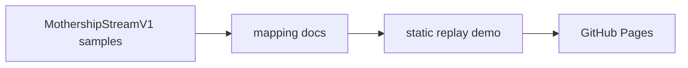
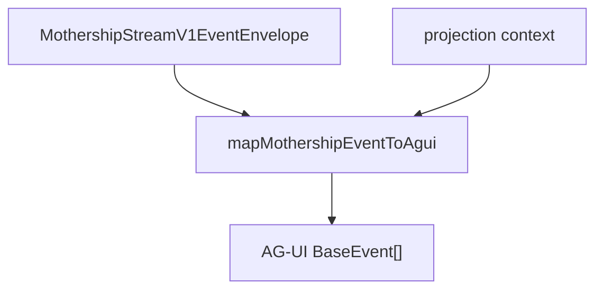
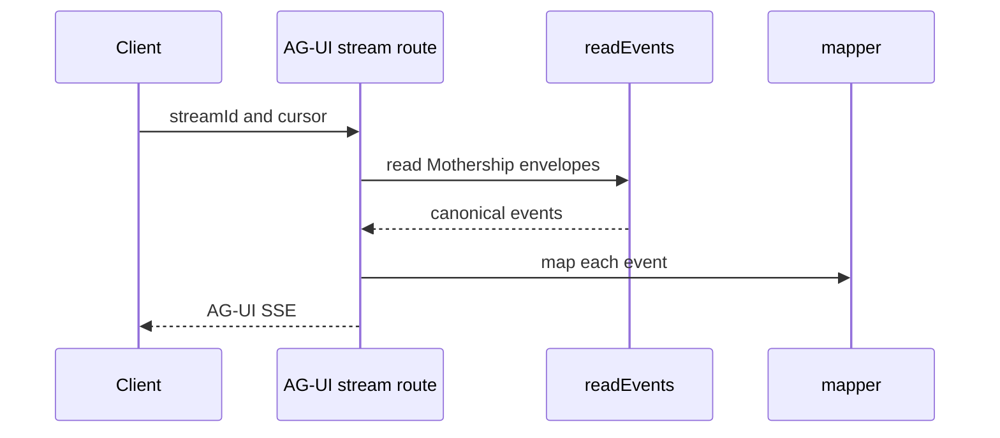
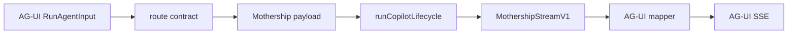

# 13. AG-UI Implementation Plan

Implement AG-UI in layers. Do not replace the existing Mothership stream loop first.

## Phase 1: Static Projection Docs

Add documentation and replay samples to the Pages site.



Deliverables:

| Item | Path |
| --- | --- |
| positioning doc | `site/docs/mothership-contract/10-agui-positioning.md` |
| event map | `site/docs/mothership-contract/11-agui-event-map.md` |
| tool ownership doc | `site/docs/mothership-contract/12-tool-result-ownership.md` |
| implementation plan | `site/docs/mothership-contract/13-agui-implementation-plan.md` |

## Phase 2: Mapper Library

Add a pure mapper in the Sim app. It should have no side effects and should not execute tools.

Suggested files:

```text
apps/sim/lib/copilot/agui/types.ts
apps/sim/lib/copilot/agui/mothership-to-agui.ts
apps/sim/lib/copilot/agui/mothership-to-agui.test.ts
```



Rules:

1. Input is a Mothership envelope.
2. Output is zero or more AG-UI events.
3. Mapping preserves ordering.
4. Mapping preserves raw event identity.
5. Mapping never executes tools or mutates run state.

## Phase 3: Read-Only AG-UI Stream

Expose an AG-UI projection of an existing stream.

```text
GET /api/mothership/agui/stream?streamId=...
```

This endpoint should reuse existing stream replay machinery:

- `readEvents(streamId, cursor)`
- cursor handling
- keepalive comments
- terminal event handling
- auth checks



This is the safest runtime addition because it does not change execution.

## Phase 4: AG-UI Run Endpoint

After read-only projection works, add a true AG-UI server endpoint.

```text
POST /api/mothership/agui
```

Input should be AG-UI `RunAgentInput`. Internally, convert it to the existing Mothership chat payload and run through the normal lifecycle.



Implementation rules for Sim:

| Area | Rule |
| --- | --- |
| route contract | Define boundary schema under `apps/sim/lib/api/contracts`, not route-local Zod. |
| route handler | Wrap route with `withRouteHandler`. |
| auth | Authenticate before parsing untrusted body where existing route pattern requires it. |
| raw fetch/json | Use existing boundary exceptions only when unavoidable and annotated. |
| tool execution | Keep existing `runCheckpointLoop` and `executeToolAndReport` ownership. |
| AG-UI output | Encode mapped AG-UI events over SSE. |

## Phase 5: UI Integration

Only after the endpoint is stable should a UI client be attached.

Options:

| Option | Use when |
| --- | --- |
| custom AG-UI client | Sim wants exact control over the existing resource panel and workflow UI |
| CopilotKit client | Sim wants a ready-made AG-UI client surface |
| hybrid | CopilotKit for chat shell, custom renderers for Mothership resources |

The hybrid path is likely best. Mothership has resource tabs, workflow previews, file previews, subagent groups, and checkpoint behavior that generic chat UI will not understand without custom rendering.

## Test Plan

| Test | Purpose |
| --- | --- |
| mapper snapshot tests | one Mothership event becomes expected AG-UI event sequence |
| tool result ownership tests | tool result projection does not suppress resume payload |
| checkpoint tests | internal checkpoint remains internal unless user input is required |
| SSE replay tests | cursor, reconnect, terminal, and keepalive behavior remains stable |
| browser smoke test | client receives RunStarted, text, tool, result, RunFinished in order |

## Rollout Rule

Ship the AG-UI stream as read-only first.

If read-only projection is stable, then allow AG-UI clients to start runs. This avoids putting a new UI protocol in the critical path before the mapping is proven.
