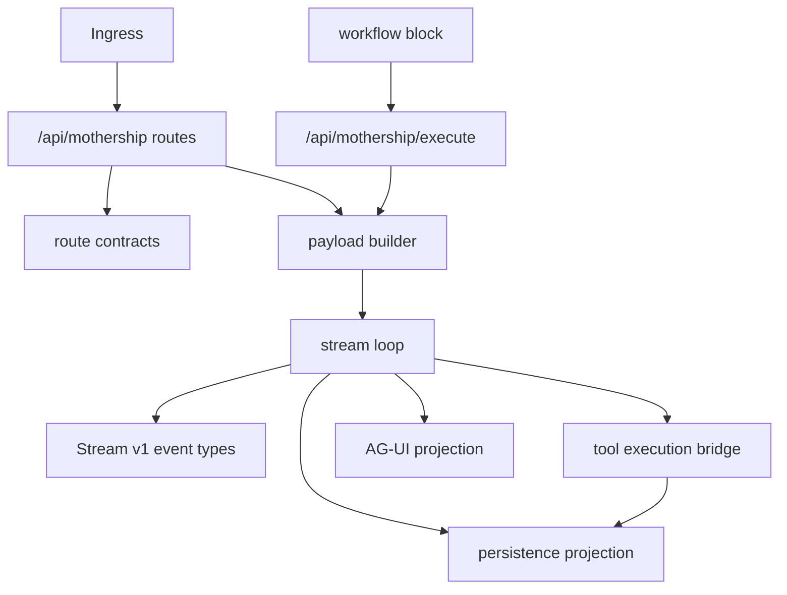
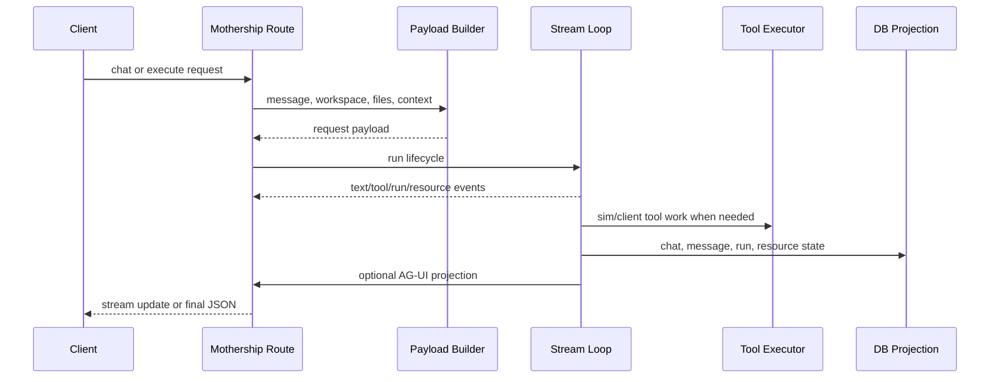

# Mothership Adapter 지도

코드에서 보이는 Mothership은 하나의 함수가 아니라 adapter 묶음입니다. route, payload builder, generated stream type, stream loop, tool executor, DB projection, workflow block handler가 연결됩니다.

AG-UI는 이 runtime을 대체하지 않고, `MothershipStreamV1`을 user-facing protocol로 투영하는 계층으로 붙이는 것이 맞습니다.

## Adapter Stack

## 주요 파일

| Layer | Code |
| --- | --- |
| route contracts | [`apps/sim/lib/api/contracts/mothership-chats.ts`](https://github.com/nfbs2000/speaky-sim/blob/db47da58d/apps/sim/lib/api/contracts/mothership-chats.ts) |
| chat routes | [`apps/sim/app/api/mothership`](https://github.com/nfbs2000/speaky-sim/tree/db47da58d/apps/sim/app/api/mothership) |
| payload builder | [`apps/sim/lib/copilot/chat/payload.ts`](https://github.com/nfbs2000/speaky-sim/blob/db47da58d/apps/sim/lib/copilot/chat/payload.ts) |
| stream types | [`apps/sim/lib/copilot/generated/mothership-stream-v1.ts`](https://github.com/nfbs2000/speaky-sim/blob/db47da58d/apps/sim/lib/copilot/generated/mothership-stream-v1.ts) |
| stream schema | [`apps/sim/lib/copilot/generated/mothership-stream-v1-schema.ts`](https://github.com/nfbs2000/speaky-sim/blob/db47da58d/apps/sim/lib/copilot/generated/mothership-stream-v1-schema.ts) |
| stream loop | [`apps/sim/lib/copilot/request/go/stream.ts`](https://github.com/nfbs2000/speaky-sim/blob/db47da58d/apps/sim/lib/copilot/request/go/stream.ts) |
| SSE parser | [`apps/sim/lib/copilot/request/go/parser.ts`](https://github.com/nfbs2000/speaky-sim/blob/db47da58d/apps/sim/lib/copilot/request/go/parser.ts) |
| stream writer | [`apps/sim/lib/copilot/request/session/writer.ts`](https://github.com/nfbs2000/speaky-sim/blob/db47da58d/apps/sim/lib/copilot/request/session/writer.ts) |
| checkpoint loop | [`apps/sim/lib/copilot/request/lifecycle/run.ts`](https://github.com/nfbs2000/speaky-sim/blob/db47da58d/apps/sim/lib/copilot/request/lifecycle/run.ts) |
| tool executor | [`apps/sim/lib/copilot/tool-executor`](https://github.com/nfbs2000/speaky-sim/tree/db47da58d/apps/sim/lib/copilot/tool-executor) |
| workflow block | [`apps/sim/blocks/blocks/mothership.ts`](https://github.com/nfbs2000/speaky-sim/blob/db47da58d/apps/sim/blocks/blocks/mothership.ts) |
| block handler | [`apps/sim/executor/handlers/mothership/mothership-handler.ts`](https://github.com/nfbs2000/speaky-sim/blob/db47da58d/apps/sim/executor/handlers/mothership/mothership-handler.ts) |
| DB tables | [`packages/db/schema.ts`](https://github.com/nfbs2000/speaky-sim/blob/db47da58d/packages/db/schema.ts) |

## Request에서 Projection까지

## 읽는 순서

```mermaid
flowchart LR
  A["1. Identity"] --> B["2. Request"]
  B --> C["3. Stream"]
  C --> D["4. Tool Bridge"]
  D --> E["5. Persistence"]
  E --> F["6. Role / Permission"]
  F --> G["7. Completion"]
  G --> H["8. Observability"]
  H --> I["9. Compatibility"]
  I --> J["10. AG-UI Positioning"]
  J --> K["11. AG-UI Event Map"]
  K --> L["12. Tool Result Ownership"]
  L --> M["13. Implementation Plan"]
```

## AG-UI Projection 페이지

- [10. AG-UI 포지셔닝](/mothership-contract/10-agui-positioning)
- [11. AG-UI 이벤트 매핑](/mothership-contract/11-agui-event-map)
- [12. Tool Result 소유권](/mothership-contract/12-tool-result-ownership)
- [13. AG-UI 구현 계획](/mothership-contract/13-agui-implementation-plan)
