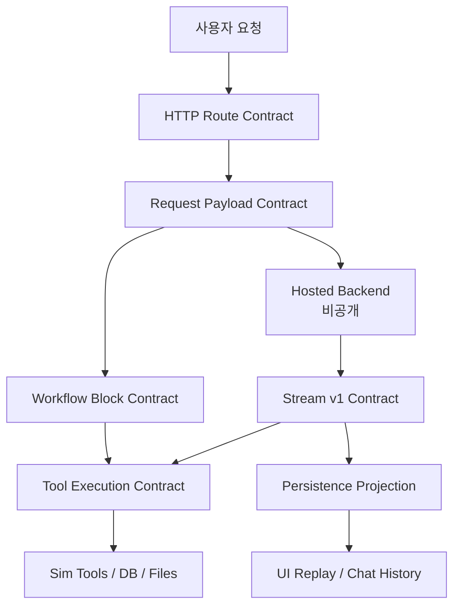
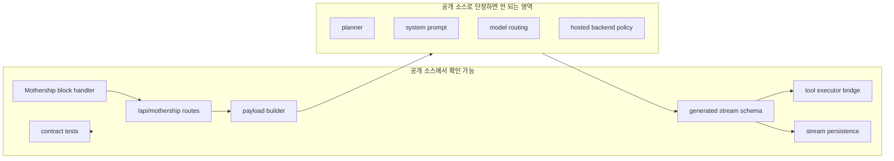
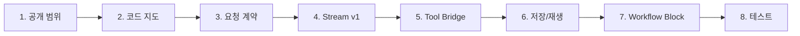

# 전체 개요

Mothership contract는 하나의 파일이 아닙니다. 여러 경계가 합쳐진 계약입니다.

1. 브라우저와 Sim route 사이의 HTTP 계약
2. Sim adapter와 hosted backend 사이의 request payload 계약
3. hosted backend가 다시 보내는 Stream v1 event 계약
4. tool call을 Sim 내부 tool executor로 연결하는 실행 계약
5. stream을 DB, replay buffer, UI 상태로 바꾸는 projection 계약
6. workflow 안에서 Mothership block으로 호출되는 block 입출력 계약

## 왜 contract가 중요한가

Mothership backend 내부 planner, system prompt, model routing은 공개 코드에 없습니다. 하지만 adapter contract는 공개 코드에 있습니다. 이것만으로도 다음을 알 수 있습니다.

| 질문 | 공개 contract로 알 수 있는 것 |
| --- | --- |
| 무엇을 요청할 수 있나 | message, workspaceId, chatId, context, file attachments, tool schema |
| 어떤 이벤트가 흘러오나 | session, text, tool, span, resource, run, error, complete |
| tool은 어디서 실행되나 | go, sim, client executor 경계 |
| 결과는 어디에 남나 | copilot chat/message/run 상태, replay buffer, UI stream |
| workflow에서는 어떻게 보이나 | Mothership block의 prompt/files 입력과 content/toolCalls/cost 출력 |

## Contract Stack

## Public Adapter가 드러내는 범위

## 핵심 코드 링크

| 영역 | 코드 |
| --- | --- |
| Stream v1 타입 | [`mothership-stream-v1.ts`](https://github.com/nfbs2000/speaky-sim/blob/db47da58d/apps/sim/lib/copilot/generated/mothership-stream-v1.ts) |
| Stream v1 runtime schema | [`mothership-stream-v1-schema.ts`](https://github.com/nfbs2000/speaky-sim/blob/db47da58d/apps/sim/lib/copilot/generated/mothership-stream-v1-schema.ts) |
| Mothership API contract | [`mothership-chats.ts`](https://github.com/nfbs2000/speaky-sim/blob/db47da58d/apps/sim/lib/api/contracts/mothership-chats.ts) |
| Unified chat route | [`chat/post.ts`](https://github.com/nfbs2000/speaky-sim/blob/db47da58d/apps/sim/lib/copilot/chat/post.ts) |
| Payload builder | [`payload.ts`](https://github.com/nfbs2000/speaky-sim/blob/db47da58d/apps/sim/lib/copilot/chat/payload.ts) |
| Go stream loop | [`request/go/stream.ts`](https://github.com/nfbs2000/speaky-sim/blob/db47da58d/apps/sim/lib/copilot/request/go/stream.ts) |
| Mothership block | [`blocks/mothership.ts`](https://github.com/nfbs2000/speaky-sim/blob/db47da58d/apps/sim/blocks/blocks/mothership.ts) |
| Mothership block handler | [`mothership-handler.ts`](https://github.com/nfbs2000/speaky-sim/blob/db47da58d/apps/sim/executor/handlers/mothership/mothership-handler.ts) |

## 읽는 순서

처음 보는 사람은 이 순서가 가장 쉽습니다.

